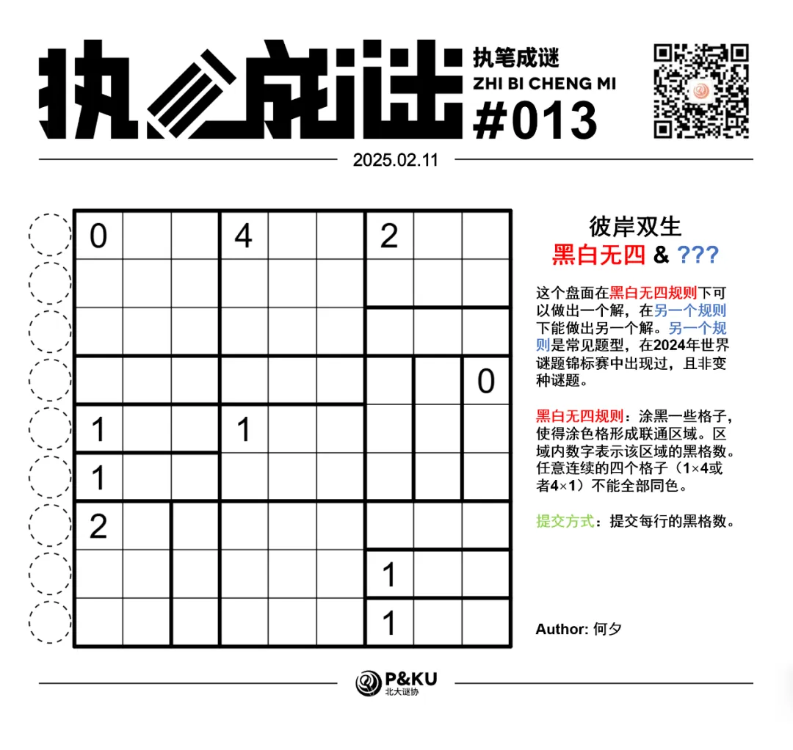
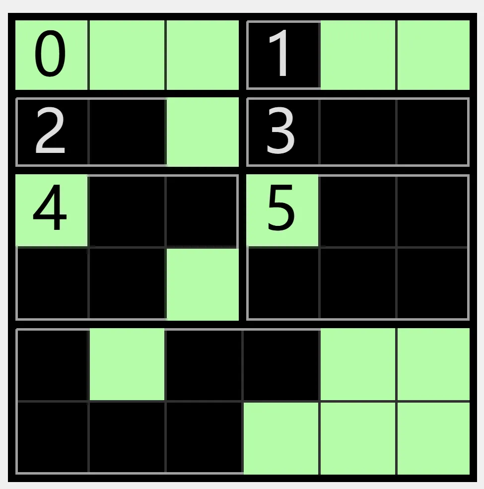
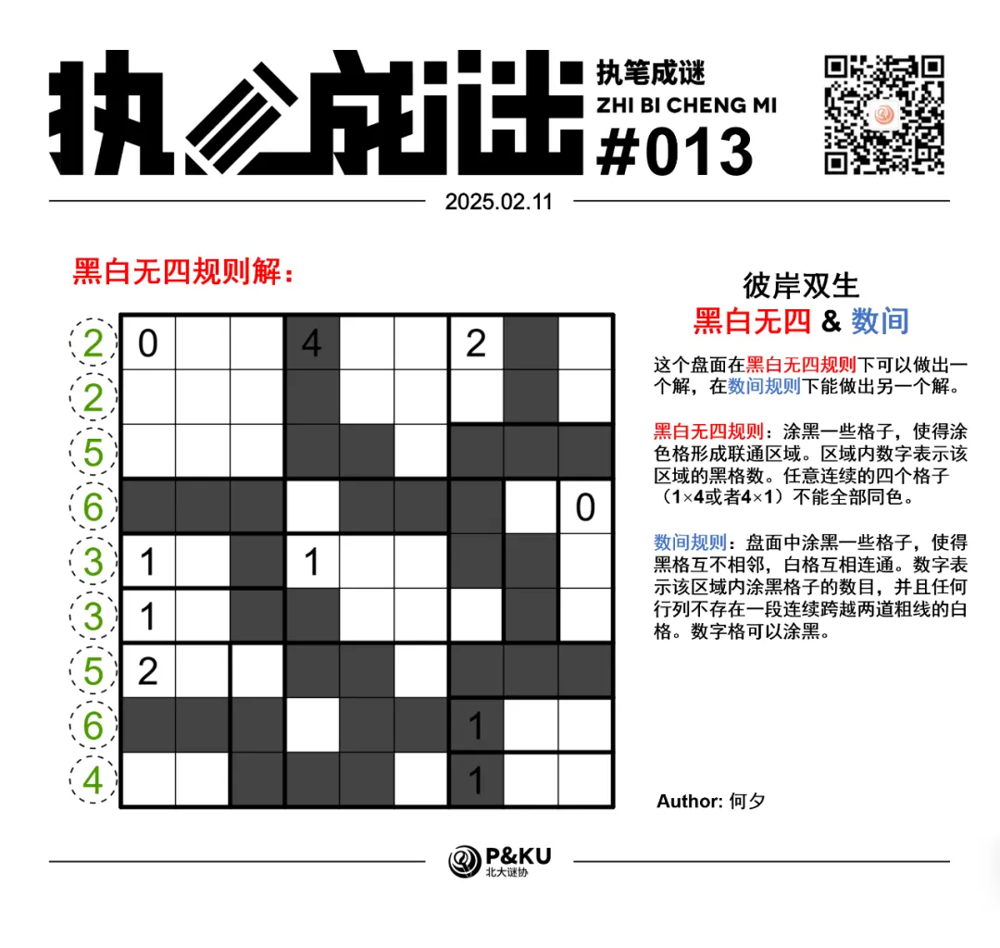
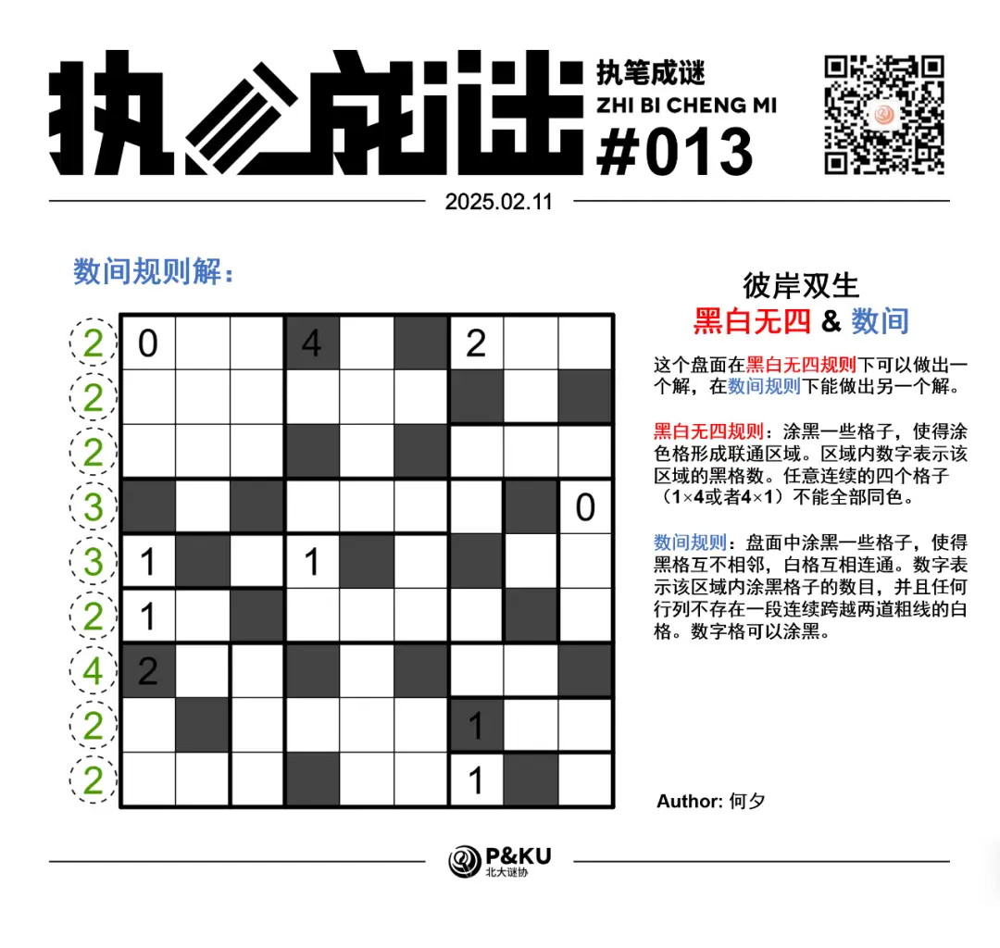

何夕老师为大家带来了一套由其编写的纸笔谜题，主题为 Hidden Twins（彼岸双生）。
**在这一套谜题中，每道题目在原规则盘面能得到一个解的同时，在另一个规则下能得到另一个解，**
你需要在解出原题之后，确定被隐藏的规则，并且以隐藏的规则再解一遍。

今天是该系列的第五题，原规则盘面的纸笔类型为**黑白无四**。

{/* truncate */}

## Aqre 黑白无四规则

涂黑一些格子，使得涂色格形成联通区域。区域内数字表示该区域的黑格数。任意行列连续的四个格子（1×4 或者 4×1）不能全部同色。

下图是一个已经完成的例子：

另一个规则能保证在 2024 年世界谜题锦标赛中出现过。
你可以查看 [2024 年世界谜题锦标赛题型的英文版说明链接](https://ectoplsm.github.io/wpc-unofficial.org/pdfs/WPC%202024.pdf)。

## 做题链接

你可以[在 penpa 网站上进行尝试](https://swaroopg92.github.io/penpa-edit/#m=edit&p=7VZBb7NGEL37V1Sc97DLLrBwS9OklzRtmnyKImRF2CGJFWxSbDcVlv973ixDDJio+ipVzaGyvDwes2/eLAzL+o9tVuVCSRELbYUUCj+jLE6kCHXo/pJ/N4tNkSc/iJPt5rmsAIT49fxcPGbFOp+kFKGEnE52dZzUV6L+OUk95QnPx195U1FfJbv6l6S+FvU1LnlCgbtognzAswO8ddcJnTakksCXjAHvAOeLal7k9xcN81uS1jfCozw/utkEvWX5Z+6xDzqfl8vZgohZtkEx6+fFK19Zbx/Kly3Hqule1Cef29UHuwQbu4RG7FIV/7LdeLrfY9l/h+H7JCXv3w7QHuB1ssN4mew8rWiqhJfm3njaEGE6REQE7l1L2OEU6yKoWiZiOSCUdHO6jAoGsko7phtj4h4Dy8oZvyPjlMNgZbqr6Rlyf8QGdoyN/DHWhmOskqPplBrNp/zRhMqMZEQ5564o3403uEGi1m78yY3SjYEbL1zMGcr3jRS+war66CujgKHtsA+sG+zHB6wCgfMGS8TT+rt4jRhU4bABbnnEG6wFYU2ajPFKwDnrIF6h1DZGcy4NTXqOHEYM3VmnGQo/xEISDuDtA0MzYG9BBMyaAeIDPFwOw0/AHgJoBh3/bQzpmxZDx7COgT49Sy0O2X8IzxFrRphLzy3hGGsbt2sLnZBxiHWLOG8EP5Y1LWpp54aYG3HtEXxa9mCRt42nGiPWjKBpWdNSfItRl2UdC5+W1zYk/6wTIm/EeSPKy5qWvHFdFnVRgzqMvB9+kCtmHOM1r5o1wVFov50LnZhzxdgXVOMBR8Q0mloiXjIvwcvGM47AbS3Ql6xP8arRx1Fo6uMWK9ZUEXDjDUdg8oAH/9Y9/qduNG4MXVtE9Fb7rvde91Xyzzrwb+2kmrbQ/i/8Wsx0kmKX9tZlcb/eVo/ZHHuO28SxrYBbbZezvOpRRVm+FotVP27xtCqrfPQSkfnD01j8rKweBupvWVH0iOarpEc1784etamwNXbOs6oq33rMMts894jONtpTylebvoFN1reYvWSDbMtDzfuJ95fn/qmmz6f/P4H+o08gugXyq70Qvpod9/SW1Wjrgx7pfrCjXc78UaODP2ppSnjc1WBHGhvssLdBHbc3yKMOB/dJk5PqsM/J1bDVKdVRt1OqbsOn08k7)

<AnswerCheck
  answer={{
    '225633564': {
      type: 'CORRECT',
      message: '恭喜你完成了这道纸笔谜题（的一半）！',
    },
    '222332422': {
      type: 'CORRECT',
      message: '恭喜！你找到了这道纸笔谜题的另一半！',
    },
  }}
  mitiType="zhibi"
  instructions={
    
      依次输入从上到下每一行的黑格数，对于多位数，只提交个位。
    
  }
  exampleAnswer="154533"
/>

## 隐藏规则

    
隐藏规则

    **数间（Heyawake）**

    盘面中涂黑一些格子，使得黑格互不相邻，白格互相连通。数字表示该区域内涂黑格子的数目，并且任何行列不存在一段连续跨越两道粗线的白格。数字格可以涂黑。

## 解答

<Solution author={'怎苏昂'}>

</Solution>

### 步骤解析

查看步骤解析

<Carousel arrows infinite={false}>
    <CarouselInner>
        首先通过基本的黑白不能四格连续出现可以得到如下的情形：
        

            
        

    </CarouselInner>
    <CarouselInner>
        此处黑格比较稀疏，需要考虑黑格的联通性，为了使左上角的标注 4 的区域内黑格必须连接出去，可以得到：
        

            
        

    </CarouselInner>
    <CarouselInner>
        同理考虑左侧 1 的联通性，可以得到：
        

            
        

    </CarouselInner>
    <CarouselInner>
        剩下的内容均可以通过黑格的联通性和黑白无四的规则得到：
        

            
        

    </CarouselInner>
    <CarouselInner>
        

            
        

    </CarouselInner>
    <CarouselInner>
        考虑联通性，黑格必须从右下角伸出，但是显然不能通过两个 1 区域延伸至左侧，因此必须从右下两个并排 1 区域的上方延伸出去。
        

            
        

    </CarouselInner>
    <CarouselInner>
        

            
        

    </CarouselInner>
    <CarouselInner>
        根据黑白无四的规则，红色的两个格子内至少有一个黑格，蓝色的两个格子内至少有一个黑格。而后根据区域内只有两个黑格，同时必须沿伸至外侧，依次得到下图。
        

            
        

    </CarouselInner>
    <CarouselInner>
        

            
        

    </CarouselInner>
    <CarouselInner>
        剩下的部分就比较简单了，黑格的联通性和黑白无四规则得到最终答案。
        

            
        

    </CarouselInner>
    <CarouselInner>
        

            
        

    </CarouselInner>
    <CarouselInner>
        

            
        

        本题先通过黑白无四的基础规则将盘面的左上角分出了两个分离的区域，再类似于小蝌蚪找妈妈一般将两个分离的区域接在了一起，十分有趣。
    </CarouselInner>

</Carousel>

### 步骤解析 隐藏规则

  
查看步骤解析

  <Carousel arrows infinite={false}>
    <CarouselInner>
      首先根据基础定式可以得到：
      

        
      

    </CarouselInner>
    <CarouselInner>
      红黄蓝三处区域内各有一个黑格，结合下面的三格只有一个黑格得到：
      

        
      

    </CarouselInner>
    <CarouselInner>
      

        
      

    </CarouselInner>
    <CarouselInner>
      考虑白格的联通性：
      

        
      

    </CarouselInner>
    <CarouselInner>
      白格不能跨越两道粗线：
      

        
      

    </CarouselInner>
    <CarouselInner>
      如果红色涂黑，那么蓝色的两个都必须留白，白色跨越两道粗线，矛盾。故红色留白。
      

        
      

    </CarouselInner>
    <CarouselInner>
      

        
      

    </CarouselInner>
    <CarouselInner>
      综合运用联通性得到下图：
      

        
      

    </CarouselInner>
    <CarouselInner>
      如果红色格涂黑，那么根据白格联通，蓝色格子必须留白，此时跨越了两道粗线，后续过程类似，得到最终结果：
      

        
      

    </CarouselInner>
    <CarouselInner>
      

        
      

    </CarouselInner>
  </Carousel>

