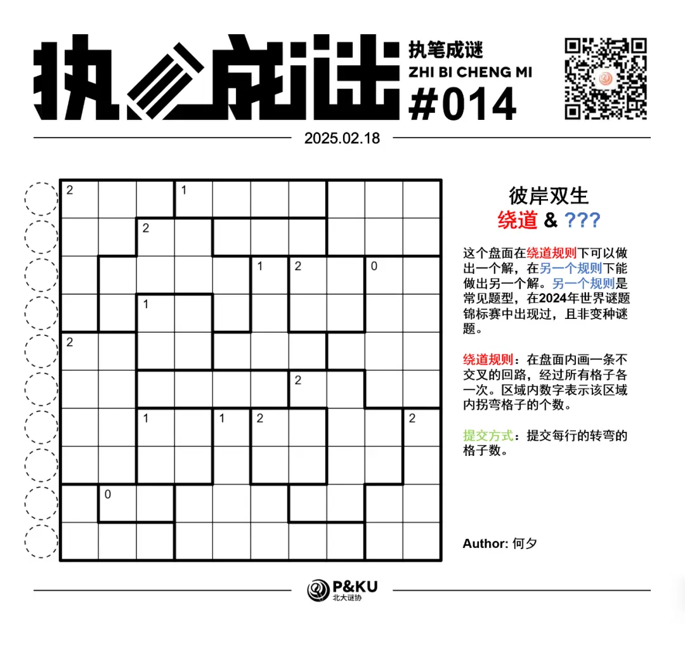
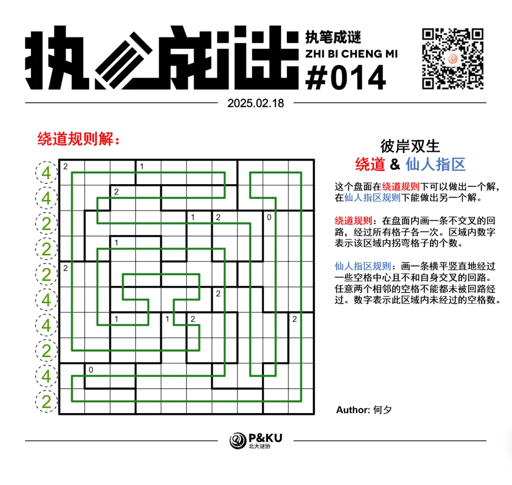
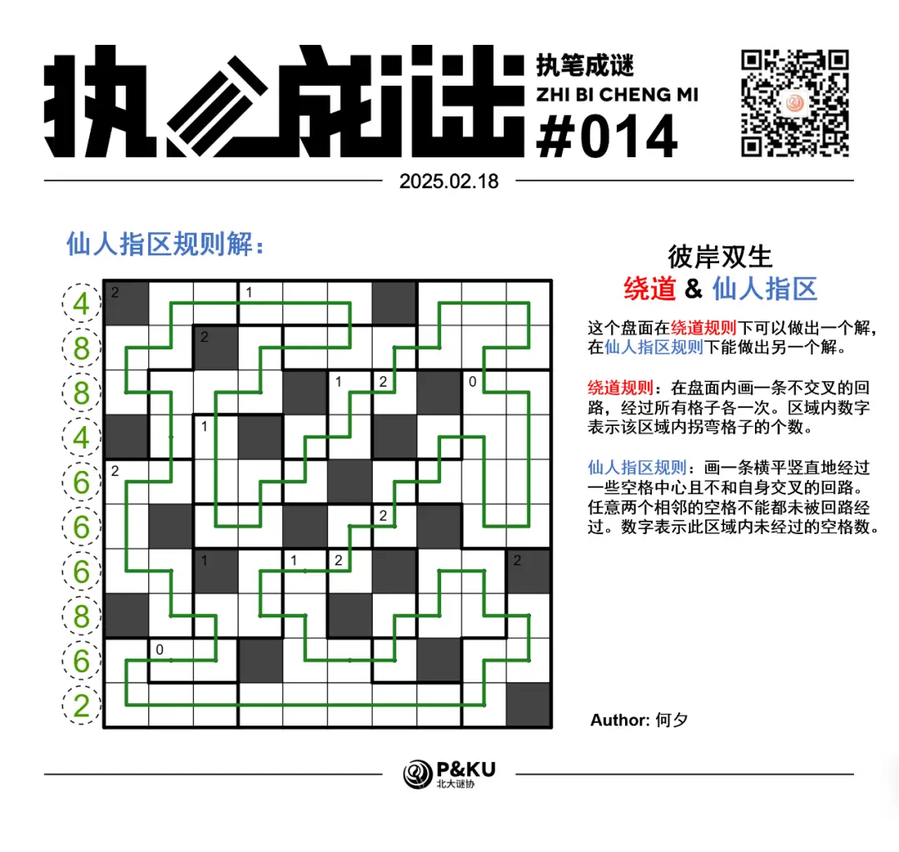

何夕老师为大家带来了一套由其编写的纸笔谜题，主题为 Hidden Twins（彼岸双生）。
**在这一套谜题中，每道题目在原规则盘面能得到一个解的同时，在另一个规则下能得到另一个解，**
你需要在解出原题之后，确定被隐藏的规则，并且以隐藏的规则再解一遍。

今天是该系列的第六题，原规则盘面的纸笔类型为**绕道**。

{/* truncate */}

## Detour 绕道规则

在盘面内画一条不交叉的回路，经过所有格子各一次。区域内数字表示该区域内拐弯格子的个数。

下图是一个已经完成的例子：

另一个规则能保证在 2024 年世界谜题锦标赛中出现过。
你可以查看 [2024 年世界谜题锦标赛题型的英文版说明链接](https://ectoplsm.github.io/wpc-unofficial.org/pdfs/WPC%202024.pdf)。

## 做题链接

你可以[在 penpa 网站上进行尝试](https://swaroopg92.github.io/penpa-edit/#m=edit&p=7VZLb9tGEL7rVxQ872FffN7cNO7FdR9xEQSCYNA2EwuRzJSSmoCG/3u+mZ21SJFFARdFW6AQtPvx23nuziy5++1Qd40yRhmtXKG0AlI+zZQ3hUpNzn8tv6v1ftNU36izw/6+7QCU+vH8XL2vN7tmsSQJo/Rq8diXVX+m+u+rZWISlVj8TbJS/c/VY/9D1V+q/g2WEmXAXQQhC/j6CN/yOqFXgTQa+BLYBbV3gLfr7nbTXF8E5qdq2V+phPx8y9oEk237e5NIHPR8225v1kTc1Hsks7tff5KV3eGu/XgQWbN6Uv0ZhysqMzG7Y8wEQ8yETmOWpP5yzJv1Q/NlLtxy9fSEbf8FAV9XS4r91yMsjvBN9YjxkkdTPSZlbskCDgjRJGXhn9PHiWmvB4vGGJaNq8Zko1XLujo+ZqwbhW3QjcK2HOm64CgKO1+MHtORrst4NT6iVJ/9Iql3nNo5j5bHK2SuesfjdzxqHlMeL1jmNbbCOq2sT5PKomC9H+O0DLjIlS3gn3DujjgtFJ6P+FkeuBCcw84Q52I/T4GRBONM2dIEXBpgpM48/EacWcjngiGTCe+hm4muh00vNotSOY3DAcYMHPxiBhYZ+IqYZUyIE7NyTnQdeC+8LwY4Bw77wHwW9gEzsOhm0M3Eb4qLJmIP+ykOP/qygi1kbMgFM2KQ2FwGeeHJTsQZcimiLuRt2BPM0A17hRnywqfgU4kzpTgl/ozil7wyxJOLzZwuR4mZbFrRtdClwmeMHJ3oOspLeLIfsYb9qEtYi7yGvIn7QLlHX8jLSu4WuXvJ1yNHKny2D5khjjGTvI11QrURMWojk3MnLPuGGTUmNVmiPgf4GCdsatlPjf3UUv9Uk3LumFGfsUdQ/6XwJfgy7APXqpd4UD9W6gczsPQIasNK/bDNZ4zYpH4sajLIo4nfciu/4tHzmHGL53T1veByDLcJ9hH3i8clPLy4Ewp+ylIrTllq1ilL7TxlDe3uDE0FPUNTbc/QfGNOaaqAU/plt+WfbvfSOf6SGP+y/x63WizxQZPs2s317tC9r2/xZubvHbyBwT0ctjdNN6I2bfuJXtQjcv3hoe2a2SUim7sPc/I3bXd3Yv1zvdmMiPAFN6LC+Y6ofYcPiMFz3XXt5xGzrff3I2LwgTSy1DzsxwHs63GI9cf6xNv2mPPTIvmS8H9JFeL//1r8h74W6Qj0i6/Fv+na+LeFw9XbdrOtD3qm+8HOdrnwk0YHP2lpcjjtarAzjQ32tLdBTdsb5KTDwf1Bk5PV0z6nqE5bnVxNup1cDRt+uVp8BQ==)

<AnswerCheck
  answer={{
    '4422244242': {
      type: 'CORRECT',
      message: '恭喜你完成了这道纸笔谜题（的一半）！',
    },
    '4884666862': {
      type: 'CORRECT',
      message: '恭喜！你找到了这道纸笔谜题的另一半！',
    },
  }}
  mitiType="zhibi"
  instructions={
    
      依次输入从上到下每一行的拐弯格数，对于多位数，只提交个位。
    
  }
  exampleAnswer="44442"
/>

## 隐藏规则

    
隐藏规则

    **仙人指区（Regional Yajilin）**

    盘面内涂黑一些互不相邻的格子，使得不涂黑的格子能构成唯一的一条回路。数字表示对应区域内的黑格数。

## 解答

<Solution author={'何夕'}>

</Solution>

### 步骤解析

查看步骤解析

<Carousel arrows infinite={false}>
    <CarouselInner>
        先介绍在 Detour 中常见的两个技巧。第一个是下图中红色区域、橙色区域、黄色区域内均至少有一个拐弯，故可得到其余的绿色区域均没有拐弯。
        

            
        

    </CarouselInner>
    <CarouselInner>
        第二个是奇偶性分析。对于位于同一行（列同理）的若干连续方格，将回路通过竖边记作 1，不通过记作 0，则计数变化当且仅当回路在二者之间拐弯。
        由此得到某一行连续方格中拐弯数的奇偶性仅与回路通过左右边界的情况有关。如下图回路通过左边界而不通过右边界，故拐弯数为奇数。
        

            
        

    </CarouselInner>
    <CarouselInner>
        利用上述技巧辅以简单的分析，有下图。第一行与最后一行中间的线是因为如果不连的话，会在其两侧成对出现拐弯，不满足线索数要求。
        

            
        

    </CarouselInner>
    <CarouselInner>
        接下来讨论左下角线索数为 0 的区域内线的通过情况。如果为竖直经过的话，会得到下图。此时左下方正方形区域线索数无法满足，矛盾。
        

            
        

    </CarouselInner>
    <CarouselInner>
        得到下图
        

            
        

    </CarouselInner>
    <CarouselInner>
        如果下图中叉的位置不连线的话，则拐弯会在其两侧成对出现，其所在区域线索数无法成立。
        

            
        

    </CarouselInner>
    <CarouselInner>
        接下来对下图红色区域进行横向的奇偶性分析。其总共包含三个拐弯，左边界均不通过，故右边界一个通过一个不通过。
        换句话说，两个蓝色方格不能都不拐弯！因此该区域其余方格均不能拐弯。
        

            
        

    </CarouselInner>
    <CarouselInner>
        由此得到下图。其中红蓝两条线是为了避免成小环添加的。可以依次考虑不连接红色线段或蓝色线段会导致哪里成小环。

        由于第9行第8列的方格（简记为 R9C8，下同）必须拐弯，故其所在区域的其他位置不能拐弯。
        

            
        

    </CarouselInner>
    <CarouselInner>
        在下图中，依次对红色区域及蓝色区域进行列向的奇偶性分析，可以得到其上边界上的连线情况。
        

            
        

    </CarouselInner>
    <CarouselInner>
        在下图中，R6C5 与 R6C6 两格无法同时直行，故该区域的其余方格均需直行。
        

            
        

    </CarouselInner>
    <CarouselInner>
        如果 R3C7 与 R4C7 两格均竖直经过的话，会得到下图。此时左下角正方形区域的线索数无法满足。
        注意 R8C2 与 R8C4 两格已通过外围的线连接。
        

            
        

    </CarouselInner>
    <CarouselInner>
        由此得到下图，其中红色线段是因为如果 R4C5 向上连接的话会导致其所在区域的线索数无法满足。此时对蓝色区域横向进行奇偶性分析。
        

            
        

    </CarouselInner>
    <CarouselInner>
        接下来几乎没有难度了，通过一些尝试也可以做出此题。
        

            
        

    </CarouselInner>

</Carousel>

### 步骤解析 隐藏规则

  
查看步骤解析

  <Carousel arrows infinite={false}>
    <CarouselInner>
      首先介绍 Yajilin 中的一些小结论。第一：在角落上如图所示的 6 个格子中，两个红色格无法被涂黑，4 个蓝色格至多有 1
      个被涂黑。
      

        
      

    </CarouselInner>
    <CarouselInner>
      第二：在边界上如图所示的 4 个方格中，至多一个被涂黑。
      

        
      

    </CarouselInner>
    <CarouselInner>
      第三：对于一个包含两个黑格的 2\*2 区域，与之纵横相接的所有方格均不能再涂黑。或者说，2\*3 的区域至多 2
      个方格被涂黑。
      

        
      

      这些结论都可以通过简单尝试得到。
    </CarouselInner>
    <CarouselInner>
      利用上述结论辅以简单的分析，可以得到下图。其中右下角月亮形状的区域只有两个位置可以放黑格。
      

        
      

    </CarouselInner>
    <CarouselInner>
      得到下图
      

        
      

    </CarouselInner>
    <CarouselInner>
      如果右下角正方形区域的黑格如下图放置，则会导致矛盾。
      

        
      

    </CarouselInner>
    <CarouselInner>
      接下来进行一些常规分析。
      

        
      

    </CarouselInner>
    <CarouselInner>
      

        
      

    </CarouselInner>
    <CarouselInner>
      如果右上角正方形区域中的黑格如下图所示放置，则会导致矛盾。
      

        
      

    </CarouselInner>
    <CarouselInner>
      由此得到下图。
      

        
      

    </CarouselInner>
    <CarouselInner>
      如果 R5C6 被涂黑则会导致下图中的矛盾。
      

        
      

    </CarouselInner>
    <CarouselInner>
      由此得到下图。
      

        
      

    </CarouselInner>
    <CarouselInner>
      接下来再经过若干次类似的单格尝试之后最终得到答案。
      

        
      

    </CarouselInner>
  </Carousel>

