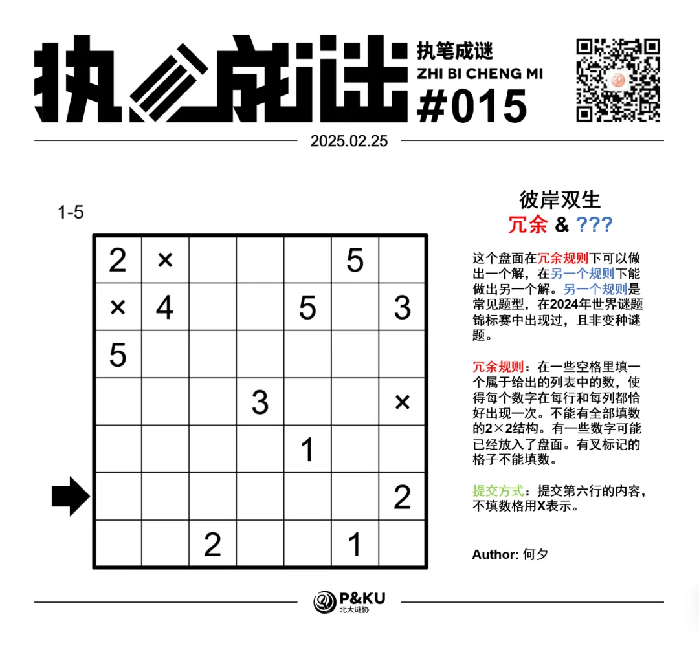
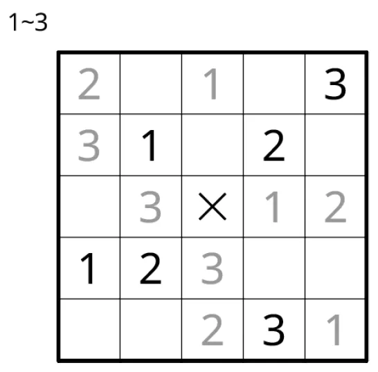
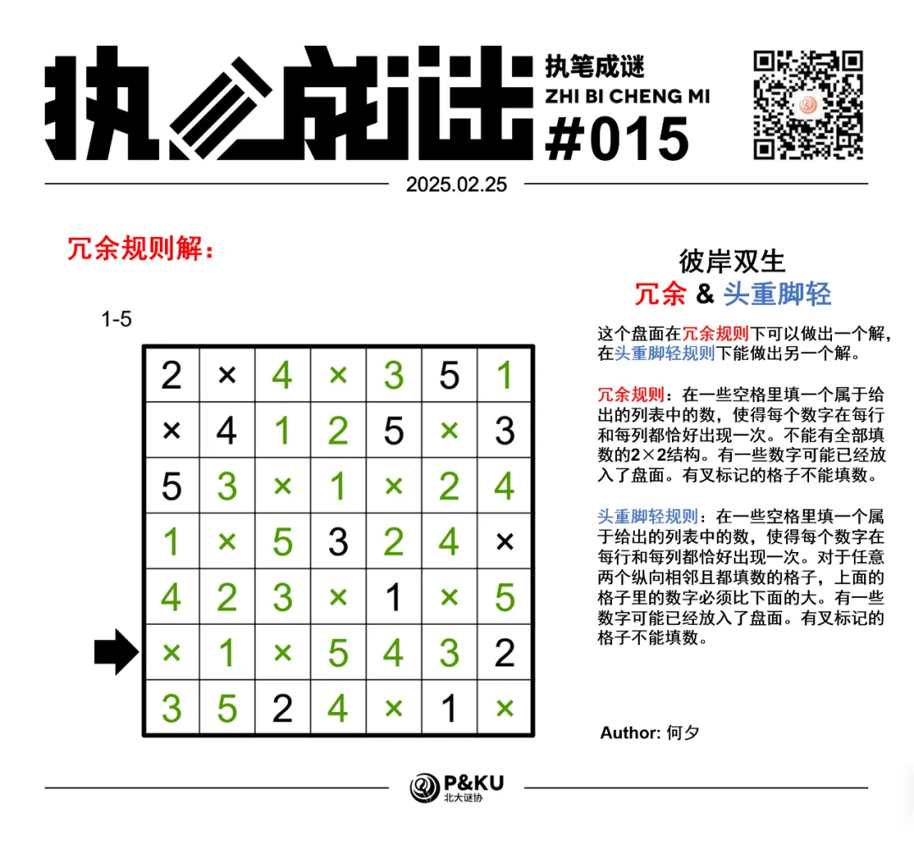
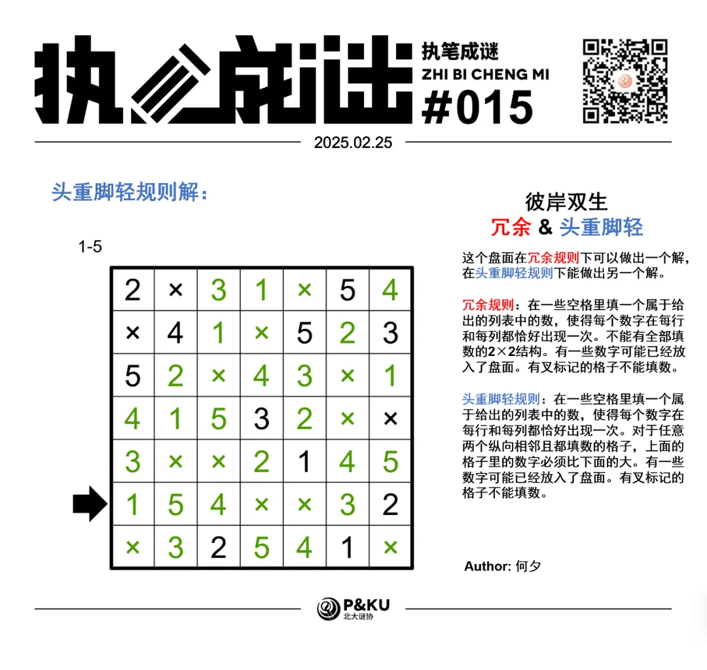

何夕老师为大家带来了一套由其编写的纸笔谜题，主题为 Hidden Twins（彼岸双生）。
**在这一套谜题中，每道题目在原规则盘面能得到一个解的同时，在另一个规则下能得到另一个解，**
你需要在解出原题之后，确定被隐藏的规则，并且以隐藏的规则再解一遍。

今天是该系列的第七题，原规则盘面的纸笔类型为**冗余**。

{/* truncate */}

## Fuzuli 冗余规则

在一些空格里填一个属于给出的列表中的数，使得每个数字在每行和每列都恰好出现一次。
不能有全部填数的 2×2 结构。有一些数字可能已经放入了盘面。有叉标记的格子不能填数。

另一个规则能保证在 2024 年世界谜题锦标赛中出现过。
你可以查看 [2024 年世界谜题锦标赛题型的英文版说明链接](https://ectoplsm.github.io/wpc-unofficial.org/pdfs/WPC%202024.pdf)。

## 做题链接

你可以[在 penpa 网站上进行尝试](https://swaroopg92.github.io/penpa-edit/#m=edit&p=7ZTfbps+FMfv8xSTrz0J8ycJ3CVd87vJsj/NVFUIIZLQBpXEnYF1Ispz7IH2Yj3nQAUGevGTVq0XE+Lo8PGx/cX219n3IlIxn8JjTbnBBTyWbdJrGi69Rv2skzyNvXd8VuR7qSDh/NNiwW+jNItHvqDeRjA6la5Xznj5n+czwTgz4RUs4OUX71R+9MoVL6+giXEBbFkVmZBeNuk1tWN2UUFhQL6qc0hvII2Uko/hPJxX6LPnl2vOcKI5dceUHeSPmNVC8HsrD5sEwSbK4W+yffJQt2TFTt4Xda0IzrycvazXavRiWunFbEAv/gbq3SZqm8bh8hXkusH5DOv+FQSHno/avzXptEmvvBPElXdi5pi6vndADWdjHNFyEcFuAcD9YraB4PevFrGRVH0IOKJb4phI7BZwun0mCKwGjK1OxWTaqZj2pnGJ4ErXQBg0T0u+EDSuRqq/fiawFoJW5AZWxMVJHa4fK2hbUIVJcQ3LyEuL4geKBkWH4pJqLileU7ygaFMcU80EN+J/bVVb5CvJ8S2XjP/8jP/8VzDy4WZgmUzDrFC30RaOOV0ccJKBHYvDJlYaSqV8SJOjXpfcHaWKB5sQxru7ofqNVLvO6I9Rmmqgugg1VBlWQ7kCN7a+6bBo5BDlew20nKuNFB9zXUAe6RKj+6gz26H55/OI/WT0+hasr/3v2v1b1y7ugfHWHP3W5NDxlWrQ+4AH7A900OY17zkdeM/TOGHf1kAHnA20a25AfX8D7Fkc2Asux1G7RkdVXa/jVD2741Rtx/vB6Ak=)

<AnswerCheck
  answer={{
    X1X5432: {
      type: 'CORRECT',
      message: '恭喜你完成了这道纸笔谜题（的一半）！',
    },
    '154XX32': {
      type: 'CORRECT',
      message: '恭喜！你找到了这道纸笔谜题的另一半！',
    },
  }}
  mitiType="zhibi"
  instructions={
    
      依次输入第六行的内容，不填数用X表示。
    
  }
  exampleAnswer="XX231"
/>

## 隐藏规则

    
隐藏规则

    **头重脚轻（Top Heavy Number Place）**

    在一些空格里填一个属于给出的列表中的数，使得每个数字在每行和每列都恰好出现一次。
    对于任意两个纵向相邻且都填数的格子，上面的格子里的数字必须比下面的大。有一些数字可能已经放入了盘面。有叉标记的格子不能填数。

## 解答

<Solution author={'何夕'}>

</Solution>

### 步骤解析

  
查看步骤解析

  <Carousel arrows infinite={false}>
    <CarouselInner>
      对于前两行，其还有两方格不填数，同时注意到图中红色区域及蓝色区域各至少有一个方格不填数，故这两个区域各恰有一个位置不填数，圆圈的位置需要填数。
      进一步的，红色区域的上方两格需要填数，否则这两格与其再上一行两格组成的 2\*2
      区域均要填数。对蓝色区域也有同样的推理。
      

        
      

    </CarouselInner>
    <CarouselInner>
      此时第四行已有两个位置不填数，其余位置均需要填数。得到下图。
      

        
      

    </CarouselInner>
    <CarouselInner>
      使用与第一幅图类似的方式分析，得到下图。
      

        
      

    </CarouselInner>
    <CarouselInner>
      接下来可以较为轻松地得到所有不填数的方格位置。
      

        
      

    </CarouselInner>
    <CarouselInner>
      最后通过简单的排除法即可得到答案。
      

        
      

    </CarouselInner>
  </Carousel>

### 步骤解析 隐藏规则

  
查看步骤解析

  <Carousel arrows infinite={false}>
    <CarouselInner>
      首先是一些明显不能填数的位置，比如 5 的上方以及 1
      的下方。同时最后一行最后一列也不能填数。此时最后一列其余位置均需要填数。
      

        
      

    </CarouselInner>
    <CarouselInner>
      容易得知最后一列的填数情况。
      

        
      

    </CarouselInner>
    <CarouselInner>
      由于第一行的 1 放在第三或第四列，其所在列的第二行无法放数，故下图圆所在方格必须填数，且只能填 2。
      

        
      

    </CarouselInner>
    <CarouselInner>
      对第二行与第三行进行类似的分析，得到下图。
      

        
      

    </CarouselInner>
    <CarouselInner>
      此时第四行的 5 只能放在第三列。由此确定第三行另一个不填数的位置在第三列，进一步地得到下图。
      

        
      

    </CarouselInner>
    <CarouselInner>
      对第四列分析得到下图。
      

        
      

    </CarouselInner>
    <CarouselInner>
      对第六列分析得到下图。
      

        
      

    </CarouselInner>
    <CarouselInner>
      再经过一些简单分析后得到最终结果。
      

        
      

    </CarouselInner>
  </Carousel>

