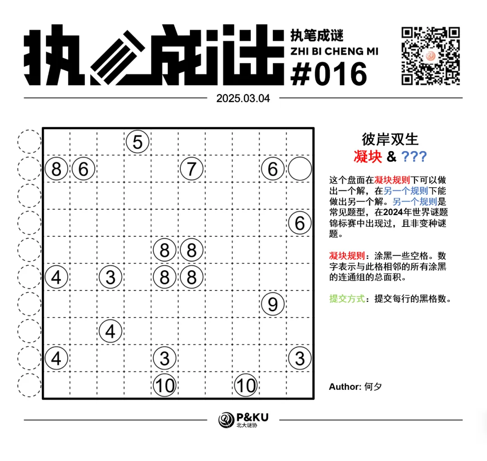
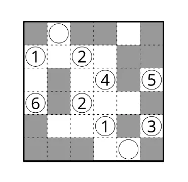
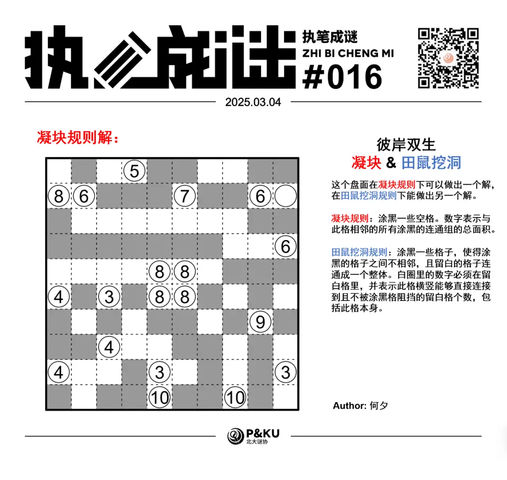
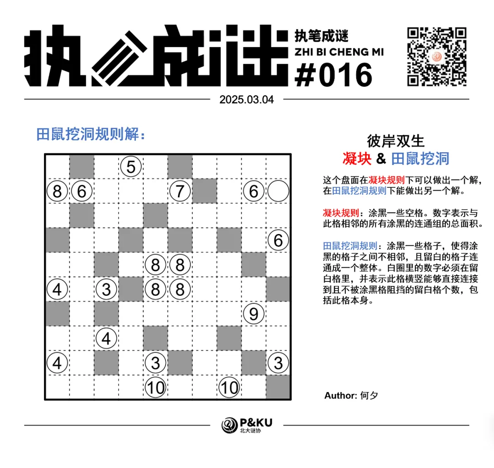

何夕老师为大家带来了一套由其编写的纸笔谜题，主题为 Hidden Twins（彼岸双生）。
**在这一套谜题中，每道题目在原规则盘面能得到一个解的同时，在另一个规则下能得到另一个解，**
你需要在解出原题之后，确定被隐藏的规则，并且以隐藏的规则再解一遍。

今天是该系列的第八题（也是最后一题），至此彼岸双生系列的题目已全部放出。本题原规则盘面的纸笔类型为**凝块**。

{/* truncate */}

## Kurotto 凝块规则

涂黑一些空格。数字表示与此格相邻的所有涂黑的连通组的总面积。

另一个规则能保证在 2024 年世界谜题锦标赛中出现过。
你可以查看 [2024 年世界谜题锦标赛题型的英文版说明链接](https://ectoplsm.github.io/wpc-unofficial.org/pdfs/WPC%202024.pdf)。

## 做题链接

你可以[在 penpa 网站上进行尝试](https://swaroopg92.github.io/penpa-edit/#m=edit&p=7ZZPb9s4EMXv/hQFzzyI+m/d0myylzTbNCmCQDAC2VESI7KVyvamkOHvnjdDChZl9tAWQYuiMEw9/zQmH4ccSqsvm6IppVJSeTJIpSehZBjFMlSpjFTCX898rubrqszeyaPN+rFuIKT87/RU3hfVqhzlJmoy2rbjrL2Q7b9ZLnwh+avERLYX2bb9kLU3sr3ELSEV2BmUEtKHPIGMtLzm+6SO9X3lQZ8bDXkDOZs3s6q8PdPkY5a3V1LQOO/53yTFov6/FPpv/HtWL6ZzAtNijcmsHufP5s5qc1c/bUysmuxke6TtnnR2g71dkmTXSG2XlMNu/PZ2x5PdDmn/BMO3WU7eP+9lupeX2RbtObeK25tsKwIf3YQYrG9QhImLxs7YxBk7dsYqzxmsfHd04I6O3NGxIxqzPOW5+txeIRWyDbj9h1uP24jbM445QVZ8P5F+iGF87ODQl36EvklH4InhCXhqeJrIwNMcVxkozXGVAaWYdABOiSUdglM6ScfglEQfg1+zhWNuQzYSS5gRmcIgpEOldahgKtYaFesnhifgqeFpDFOa4wpTmuMKU4YH4KHhIXhseAyeGJ6Ak8GOk/EunibU9UMT7fqnBHTjUmKMH05Y55MS2fmnBHfzosQrJCDmVUlo+37XBodLqg0cJ7E+fESYEkh7YEwg3oMoIJD0APfRiyDnFhgz6HU6Ho6iPCZhjyiPSNAntJutfyn20ie0WrkY90jI/fR71jOwCBvsj8UVbBFaAxwjXh9FNrLOC+4TC/XzRXa42wdLnqNg6Ik0/ER/Ap2Mcjwsxaqubleb5r6Y4ejnZylOd7DlZjEtGwtVdf1czZd23PxhWTel8xbB8u7BFT+tm7tB7y9FVVlAvx1YSK+5hdYNnlC930XT1C8WWRTrRwv0nmZWT+VybRtYF7bF4qkYjLbYz3k3El8Ff/OA3mL+von8ojcRWgLvh99H3ugo+d3s8O6tG2fpAzuqH9RZ5YYfFDr4QUnTgIdVDeoobNBhbQMdljfgQYWDfaPIqddhnZOrYanTUAfVTkP1Cz6fjF4B)

<AnswerCheck
  answer={{
    '5537346536': {
      type: 'CORRECT',
      message: '恭喜你完成了这道纸笔谜题（的一半）！',
    },
    '2124222231': {
      type: 'CORRECT',
      message: '恭喜！你找到了这道纸笔谜题的另一半！',
    },
  }}
  mitiType="zhibi"
  instructions={
    
      依次输入每一行的黑格数，多位数只填写个位。
    
  }
  exampleAnswer="422224"
/>

## 隐藏规则

    
隐藏规则

    **田鼠挖洞（Kurodoko）**

    涂黑一些格子，使得涂黑的格子之间不相邻，且留白的格子连通成一个整体。
    白圈里的数字必须在留白格里，并表示此格横竖能够直接连接到且不被涂黑格阻挡的留白格个数，包括此格本身。

## 解答

<Solution author={'何夕'}>

</Solution>

### 步骤解析

查看步骤解析

<Carousel arrows infinite={false}>
    <CarouselInner>
        极值逻辑与面积大小加减在凝块中十分常见。通过已知面积之和的两块区域中一块的最大值，可以得到另一块的最小值。
        因此距离较近而差距较大的提示数在凝块中十分重要。

        在下图中，红色方格延伸出的区域面积至多为 5，因此蓝色区域面积至少为 3，且不能直接相右延伸。
        因为否则红色区域也需要延伸（其面积至少为 2），此时 ⑧ 相邻的区域均与 ⑥ 相邻，矛盾。
        

            
        

    </CarouselInner>
    <CarouselInner>
        下图黄色方格不能涂黑，否则 ⑥ 相邻的区域均与 ⑤ 相邻，矛盾。因此红色方格所在区域面积至多为 2,⑧ 下方的区域面积至少为 6。
        

            
        

    </CarouselInner>
    <CarouselInner>
        注意到 ⑥ 右侧区域面积为 5，因此其上方方格需要涂黑，且其面积为 1。
        

            
        

    </CarouselInner>
    <CarouselInner>
        对于下图中的红色与蓝色方格，通过与第一步中类似的逻辑得到蓝色方格均需要涂黑。
        

            
        

    </CarouselInner>
    <CarouselInner>
        下图中的黄色方格不能涂黑。否则 ③ 无法向左或右延伸，因为这会导致 ④ 周围的区域均与 ③ 相邻，
        同时 ③ 也无法向右延伸面积为 3 的区域，因为这会导致 ⑧ 周围的区域均与 ③ 相邻。同样的逻辑可以得到橙色方格不能涂黑。
        

            
        

    </CarouselInner>
    <CarouselInner>
        由此可以确定 ③ 周围黑格的情况，并得到一些简单的推论。
        

            
        

    </CarouselInner>
    <CarouselInner>
        

            
        

    </CarouselInner>
    <CarouselInner>
        容易发现如果 ⑩ 右侧的面积为 3 的区域不与 ⑨ 相邻的话，⑨ 无法向上延伸出 9 格区域而使右侧的 ⑥ 成立。得到下图。
        

            
        

    </CarouselInner>
    <CarouselInner>
        由于右侧的 ⑥ 至少与上方的 ⑥ 共用面积为 2 的区域，且这部分面积无法与 ⑨ 共用，
        因此前者至多与 ⑨ 共用面积为 4 的区域，⑨ 还需要的两个区域只能通过下图中的方式得到。
        

            
        

    </CarouselInner>

</Carousel>

### 步骤解析 隐藏规则

  
查看步骤解析

  <Carousel arrows infinite={false}>
    <CarouselInner>
      极值逻辑与大小加减在田鼠挖洞中同样常见。对于左上角的 ⑧，其纵向至多看到 4 格，否则就会与下方的 ④ 相连导致其看到 5
      格。 由此得到其向右至少看到 5 格，得到下图。
      

        
      

    </CarouselInner>
    <CarouselInner>
      通过一些简单的逻辑得到下图。
      

        
      

    </CarouselInner>
    <CarouselInner>
      用与第一步中一样的方格对左侧中间的 ④ 进行分析，得到下图。
      

        
      

    </CarouselInner>
    <CarouselInner>
      分析上方 ⑤ 所看到的方格，发现情形唯一，得到下图。（同时可以得到 ⑦ 的情形）
      

        
      

    </CarouselInner>
    <CarouselInner>
      对下图中紫色标记出的线索数进行分析，得到下图。
      

        
      

    </CarouselInner>
    <CarouselInner>
      如果中央左上方的 ⑧ 纵向上看到 3 格，那么右上方的 ⑧ 同样在纵向上看到 3
      格（它们在横向上看到同样多的方格，这种分析方法在田鼠挖洞中十分常见）由此得到下图。 注意到 ③ 此时看到 4 格，矛盾。
      

        
      

    </CarouselInner>
    <CarouselInner>
      由此得到下图。中央的 ⑧ 均在水平方向上看到 5 格，竖直方向上看到 4 格。
      

        
      

    </CarouselInner>
    <CarouselInner>
      之后通过一些简单的逻辑得到最终答案。
      

        
      

    </CarouselInner>
    <CarouselInner>
      

        
      

    </CarouselInner>
    <CarouselInner>
      

        
      

    </CarouselInner>
  </Carousel>

