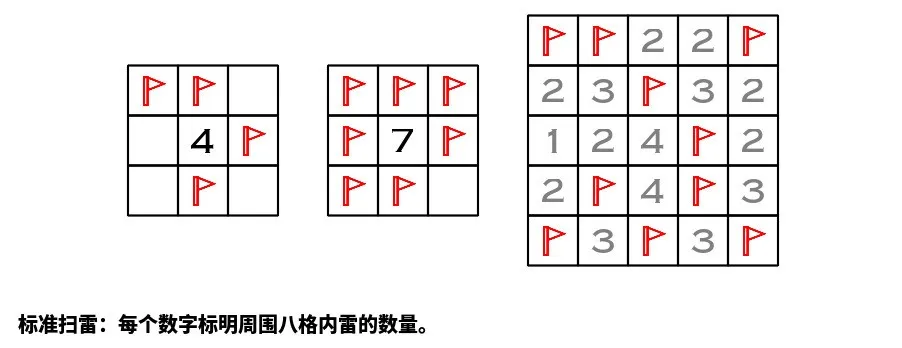
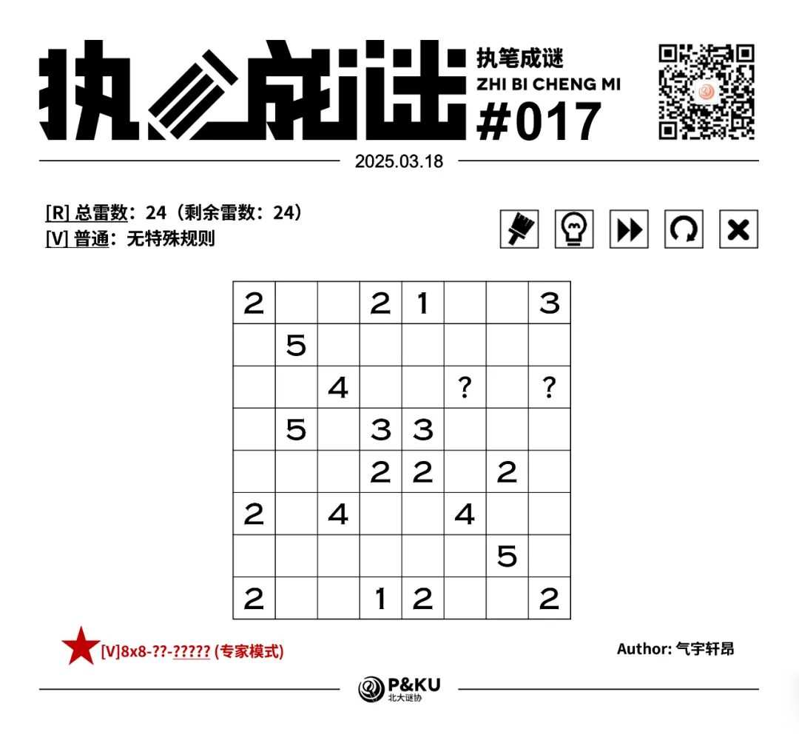
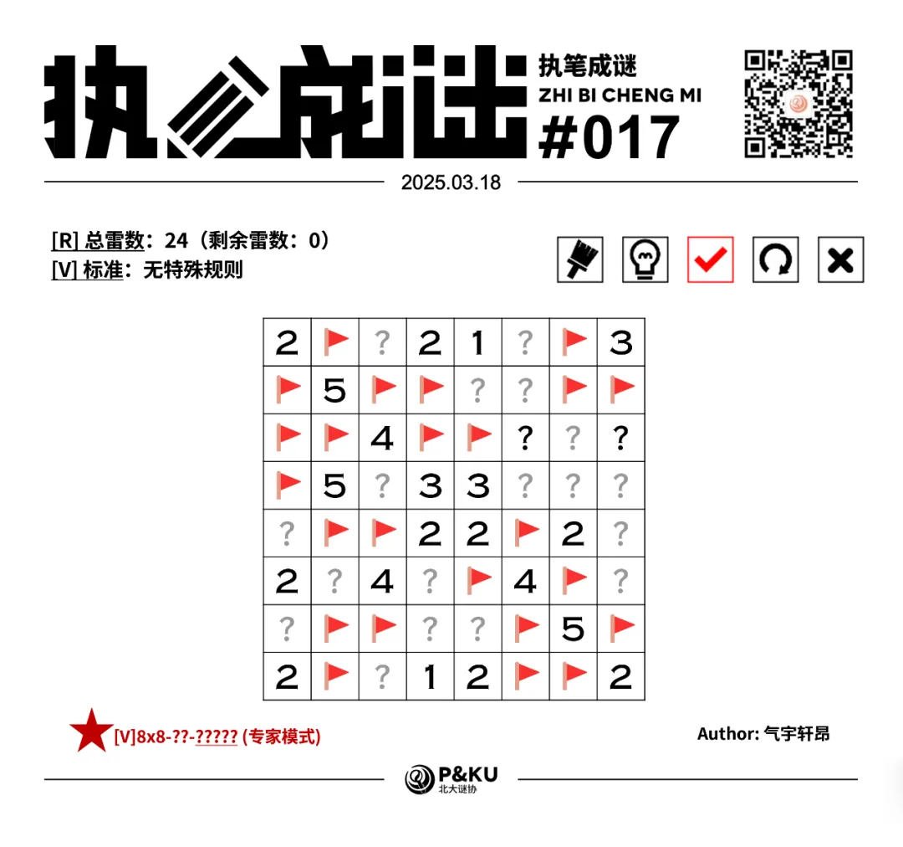

【主题简介】

气宇轩昂老师为大家带来了一套由其编写的纸笔谜题，主题为 Minesweeper Variants（扫雷变体）。
**这一套谜题包含了《14 种扫雷变体》的各种玩法！**

今天是该系列的第一题。本题的规则为[V]标准，即标准扫雷。

（注意雷数在左上角已经给出，问号格一定不是雷）

{/* truncate */}

## 做题链接

你可以[在 penpa 网站上进行尝试](https://swaroopg92.github.io/penpa-edit/#m=edit&p=7ZXNTttYFMf3eQrk9a3kj3w43lQMhW4Y5gMqhKIIOcFAhBMzjlMqR5EQA6R0GGUq0RYBVRnKSFBmGKRBHSChL9PYSVZ5Bc49NsR20kU3EYvK8tHxz+ee+/e9+d/kfynIukJEuASRsISDSwjzePNsHG/WvSYyhqpIA/bGSWv3/3btub1ftsrr7drGgL1cBWS/OmvXdvgwGSwY85oOlWdb1mm5eX1sb68QYu0dNY6v7P1a/eIfe+uTtfYXttm0/63ULz7YlT8ah1fQol593/zzyFr7aL08snbPYZ5m+T/rcAfmsdZOnOEwsLGzCsWtcgU6tGvvnFH1atVerbAPxPrlb60351hzjrI27/rbG8ugBPv83vz1+k7J5+WVxu526+1B/eKF/foSPq55ela/Wrf3/m4dbNNWtx8JleSHkREyK6t5JZRwlycZKppxyRwk5mMpwXAMYXi4OSZJzJ+kovm9ZI4RcxxeMUQENuoU8ZAOd9JJfE+zIQdyLORjbg7pFKTpjJ5WlelRh/woJcwJwtB5vsPRNGWy2lOFcXXQ57SWTWUoyGZySt6F+cKMtlBwy7hkiZiDqNSt7iFX6MilqSOXZn2XG0+WSrDiP4PgaSlBtT/ppGInHZeKEMekIsNH6VDYFM7ZFoaPB4DA3q7FLRAoEDwAh0Q6IMJTEPaACAUPPSAWAFFs6ukRxSGeWaKo1ANi2MOjNCYGgIjSvSD4tSIO8SiNcwHAseGAMo4LtuU4VO9ZI47DUb4av1xYfw53YQrjCEYe4wRsEjEFjI8wshgjGEexZhjjJMYhjGGMUayJ0W3+qh9CH+Qk+CiepJ0r0t/nZCgB5xGT19TpfEGfldPgLjyuwEXAcoVsStF9SNW0RRXM5oOZuZymKz1fUajMzPWqT2n6TKD7kqyqPuD87/iQc074kKHDIeB5lnVdW/KRrGzM+0BKNuBfKj+fWfR3UnKGX4Ah+yXKC3JgNnr2MJKhF5RSiHnG4J0QYHnD3876/p/1dPXZ+2b0+yYHf7ea3tP0gHv4HmhPf7u8y+LAu8xMJ+z2M9AelgYadDWgbmMD7PI2sC/Ym3YNOpyqCpqcTtXlczpV5/Ph9E6GMLsB)

<AnswerCheck 
  answer={'25413243'}
  mitiType="zhibi"
  instructions={
    
      依次输入每一行的雷数，多位数只填写个位。
    }
  exampleAnswer={'31123'} 
/>

## 解答

<Solution author={'怎苏昂'}>

</Solution>

### 步骤解析

  
查看步骤解析

  <Carousel arrows infinite={false}>
    <CarouselInner>
      首先，如果一个数周围格子数等于它最大可放置雷数，那么必须全部放置。
      

        
      

    </CarouselInner>
  <CarouselInner>
      而后注意到下图中蓝色区域至少有一个雷（根据 E4 格的 3），黄色区域至少有一个雷（根据 G7 格的 5），结合 G5 格的 2，所有带绿色感叹号的格子属性均可得出。
      

        
      

    </CarouselInner>
    <CarouselInner>
      

        
      

    </CarouselInner>
    <CarouselInner>
      根据 E8 格的 2、F6 格的 4、以及 E5 G5 两个 2 分别得到：
      

        
      

    </CarouselInner>
    <CarouselInner>
      

        
      

    </CarouselInner>  
        <CarouselInner>
      

        
      

    </CarouselInner>
    <CarouselInner>
      观察 A6 格的 2，蓝色区域内至多有两个雷。
      观察 C6 格的 4，蓝色区域内至多两个雷。
      于是蓝色区域内必须恰好有两个雷，绿色叹号格子的属性可以得知。
      （该推理方法可以被总结为扫雷的减法定式，在之前的<a href='https://info.pkupuzzle.art/wechat-official-account/zhibi-010'>彼岸双生的这篇文章</a>中的解析扫雷篇里有所提及）
      

        
      

    </CarouselInner>  
    <CarouselInner>
      

        
      

    </CarouselInner>
    <CarouselInner>
    而后根据“全部占满雷”和“全部不是雷”的逻辑即可得到接近最终解，而后最后一个格子的属性可以通过总雷数得出：
      

        
      

    </CarouselInner>
    <CarouselInner>
      

        
      

    </CarouselInner>
  </Carousel>

