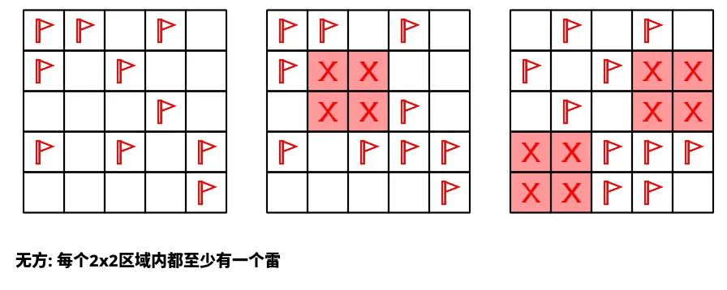
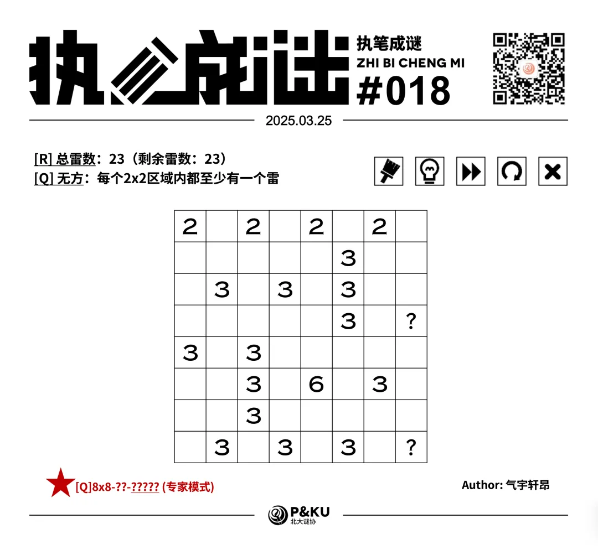
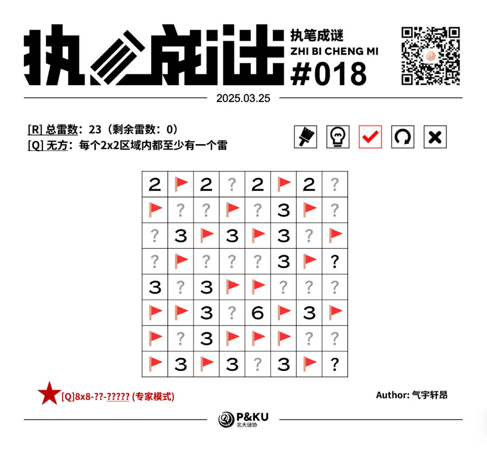

【主题简介】

气宇轩昂老师为大家带来了一套由其编写的纸笔谜题，主题为 Minesweeper Variants（扫雷变体）。
**这一套谜题包含了《14 种扫雷变体》的各种玩法！**

今天是该系列的第二题。本题的规则为[Q]无方，即在标准扫雷基础上，任意2x2的区域内必须至少有一个雷。

（注意雷数在左上角已经给出，问号格一定不是雷）

{/* truncate */}

## 做题链接

你可以[在 penpa 网站上进行尝试](https://swaroopg92.github.io/penpa-edit/#m=edit&p=7ZXfb9tUFMff81dMfr5I/pGffkFlrLyUDWjRNEVR5aTeGs2Jh+OwylGkaFsJgaIwqWxVW9QygtQxNiJRQZak/DPYN8lT/oWee+w28Y152MvYA7J8dPy55577vffmnFS+qGqWTtLwKGkiEgkeJS7jK4sZfMXgWSvahq5eoa0Xk4O/psOv6dNj+uT1dNi6QhsDQPSH7nS4LytkqWpvmhZEdne9V83x2XO694AQ7/Bk9LxPj4du7yXd/dvb/gXT7NDf227vV9r+ftTpQwp38PP4pxNv+0/v8Yl3cArrjJt/eJ19WMfbfuFPh4mj/UcQPGm2IcN0eOTPcgcD+qgtvpd2X387eXqKMacoa+cyP201QAnm+W788OxSyT+NB6ODvcmPz9zeN7Atetwcv+q6/a/o4W+TZ3ss1cUmIZK+7HidJ5DWX1Hekr2dvnd0NHl4xtR2H9PDlttrwL78zOTG8jK5rRkVPZYNjjMXqzkZ1VkizkdqVpAEIsj45ojzqVpzPlaFglnKFwXirMK4QNIwsOJHyuBem7k3cZx5V30oieBfD3xwb4FbKFoFQ19f8cknatZZIwJb7AOczVyhZH6pC4EY9u0LAJDXbLj6ymbxXjBSqW6Yd6tBrJSrE2cpSjNbKtCszDQz19fMvAjNbCtvqlnhNZeKZb0SJTeTq9fh7D8Dwetqlmn/fOamZ+6qWgN7Xa0JcpJNheuRCCSAfHKaA4rIA5kDcSVQeQESEg8WIhIcSKZ4kGHg/RlIxbmIFEqfA2mUPgcyKD05B1D6XIQkYsg8kXjxksSrlyReviSh/ku5cLoSnvEttMtoZbRrcAXEUdB+iFZEm0C7gjHX0N5EexVtHG0SY1LsEt/omt+CnKycxA47exJv9zsXy0LfESqmsV6pWre1AtQOtiWoEWDlaimvWyFkmOY9A0opBIt3yqalRw4xqG/ciYrPm9YGl/2+Zhgh4P8fhZDfBULItqDE5741yzLvh0hJszdDYK6FhTLpZTsswNbCErW7Grca6yyCaltVvR4TtgR8swocb/z/nv5f9nR2D+K7VvLvmhz8BZtWZPkDjugAQCMrPeALxQ58oazZgouVDTSiuIHy9Q1oscQBLlQ5sH8pdJaVr3Wmii93ttRCxbOlZtuHPp6LnQM=)

<AnswerCheck 
  answer={'23322443'}
  mitiType="zhibi"
  instructions={
    
      依次输入每一行的雷数，多位数只填写个位。
    }
  exampleAnswer={'32131'} 
/>

## 解答

<Solution author={'怎苏昂'}>
  

  
  

</Solution>

### 步骤解析

  
查看步骤解析

  <Carousel arrows infinite={false}>
    <CarouselInner>
    本题的题眼在于图中所示的 363 三线索。
    对于标注的每一个三格蓝色区域（D567/F567），不可以全部是雷（否则结合 C6/G6 的 3 和无方规则会有矛盾）。
    因此可以得到绿色叹号格子内的全部信息。
      

        
      

    </CarouselInner>
    <CarouselInner>
      

        
      

    </CarouselInner>
    <CarouselInner>
    而后补足 B8 的 3。
      

        
      

    </CarouselInner>
    <CarouselInner>
    对 C67 的两个 3 运用加法定式。
      

        
      

    </CarouselInner>
    <CarouselInner>
      

        
      

    </CarouselInner>
    <CarouselInner>
    考虑 C5 的 3。根据无方条件，BC4 至少有一个雷。于是 D46 一定不是雷。
      

        
      

    </CarouselInner>
    <CarouselInner>
      

        
      

    </CarouselInner>
    <CarouselInner>
    进行一些基础数字的补全。
      

        
      

    </CarouselInner>
    <CarouselInner>
    无方条件最直接的应用。
      

        
      

    </CarouselInner>
    <CarouselInner>
      

        
      

    </CarouselInner>
    <CarouselInner>
    对 F4 格的 3 进行分析同理可得 G3 F5 两个格子不是雷。
      

        
      

    </CarouselInner>
    <CarouselInner>
      

        
      

    </CarouselInner>
    <CarouselInner>
    对 F23 两个 3 运用加法定式。
      

        
      

    </CarouselInner>
    <CarouselInner>
      

        
      

    </CarouselInner>
    <CarouselInner>
    考虑无方条件。
      

        
      

    </CarouselInner>
    <CarouselInner>
      

        
      

    </CarouselInner>
    <CarouselInner>
    进行了一些补全之后考虑剩余雷数条件，剩余 7 个雷，C1 的 2 和 B3 的 3 占据完之后其余地方只剩下两个格子，同时最少两个雷。
    根据这个极值条件可以得出剩余的地方是雷，以及 C1 B3 交错的地方不是雷。
    而后可以轻松得到答案。
      

        
      

    </CarouselInner>
    <CarouselInner>
      

        
      

    </CarouselInner>
  </Carousel>

