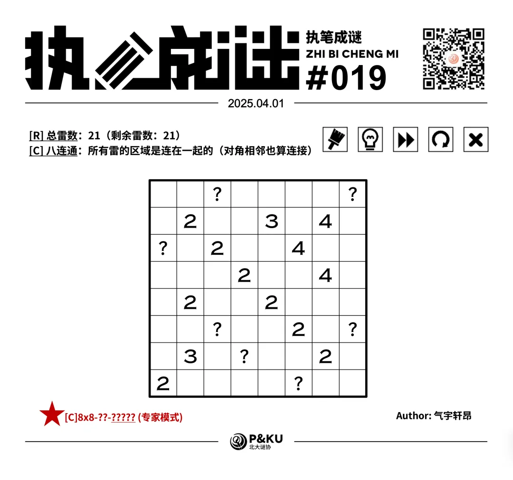
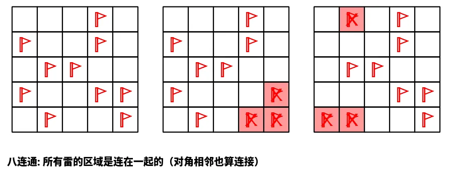
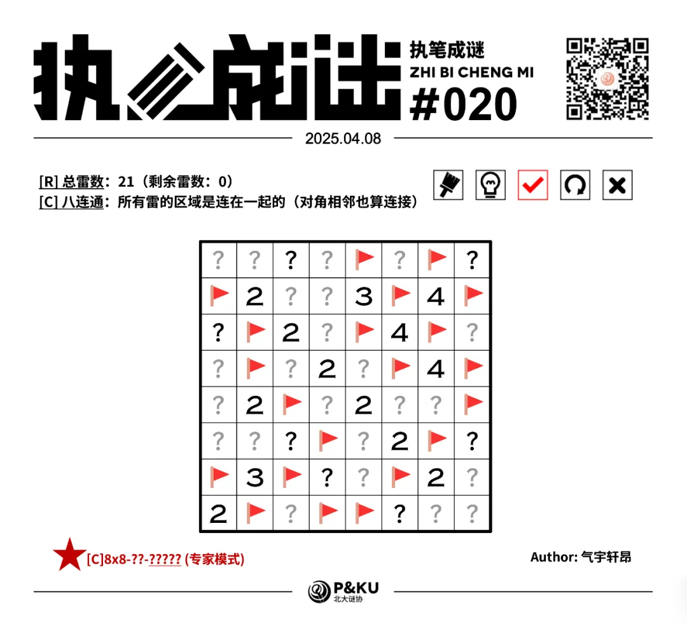

【主题简介】

气宇轩昂老师为大家带来了一套由其编写的纸笔谜题，主题为 Minesweeper Variants（扫雷变体）。
**这一套谜题包含了《14 种扫雷变体》的各种玩法！**
今天是该系列的第三题。本题的规则为[C]八连通。

<ImgCaption>（注意雷数在左上角已经给出，问号格一定不是雷）</ImgCaption>

{/* truncate */}

## [C]八连通规则

在标准扫雷基础上，所有雷构成的区域是对角连通的。

## 做题链接

你可以[在 penpa 网站上进行尝试](https://swaroopg92.github.io/penpa-edit/#m=edit&p=7VVbj9tUEH7Pr6j8fJB8SbKJX9BSurwsy6WLqiqKVk7W7UZ14uI4FDmKFJUu6cJCCvSy2hRSSiq2lG5XIoLcFn4M9knylL/QOWM3sR3zgJBKH6ojj8afZ+Z8c06+SfnjimKoJAVLShGeCLCkuIiPyKfx4b21WTA1VT5D955MW3/MRjed3SeTv36Y1g9no70ztD4ElN45mY0ORYGsVswd3YDgk9vOcWNy+pgeXCfEuX80fjygD0Z27ym9/aez+wgr7dNnTbv3C23eGncGUMIe/jT58cjZ/d355shpdWGrSeM3p8P2gT3ddEgcH96A4GmjCRVmo7abZQ+H9EaTfyNl97+c3utiTBdp7c/r0706MME6X00+O50z+bt+fdw6mH7/0O59Qe/26YPG5PjEHnxO7/86fXjASr1oEiLp047TuQtlAXH2B067DYdBb96ye3XWy52uffodO6Rn/cnP345bPfr1I7vfHh/fm58ZFCHvra2RS4pWVmMZ75izsaqVlq1VYr0jZziBI5wIj8BlifWBXLXela0NYp2HTxwRAFt3g0Rwzy3cC/ideWddUODB3/B8cC+Cmy8YeU3dWneR9+WMtUk4ts9bmM1crqh/onIeD/ae14u5AgNyigm/hvJO4ar3pVzZ1q9UvFghWyPWKtL1UiI4SwvOzHU5My+CM2vlP3MuFkpqOYpuOlurwbF/CIS35Azj/tHCTS3c83IV7IZc5cQUS30TaLh3w0lSGEgzAO7uBRAXGSD5gDgD4gsgwYdqJDDFVyORCKUkEfBFJJGYL2IlHLGCET4gFe4lLYQi0uHm0ticrxeBxxxfiMBje74qgoD9BRAkN8+CwxXwiC+iXUMrot2EGyCWhPZttDzaBNp1jDmH9gLas2jjaJMYs8Lu8F/d8kugkxGTOHMXK/Fy37OxDEwcrqxrW+WKcUnJg3RwIIFEACtVijnVCECarl/VQEkBsHC5pBtq5CcGqtuXo+JzurEdqn5N0bQA4P5DBSB3CAQg0wCF+94Vw9CvBZCiYu4EAN8EC1RSS2aQgKkEKSpXlNBubLBwsmlU1FqM+5TDJyPB8cZfT/P/aZqzK+BfNbW/anTwx6sbkcoHOEL8gEaK3MOXdA74kqLZhsuiBjRC14CGpQ3QsroBXBI4YP+gcVY1LHPGKqx0ttWS2NlWi/ZhhGdjzwE=)

<AnswerCheck
answer={'23332233'} 
mitiType="zhibi"
instructions="依次输入每一行的雷数，多位数只填写个位。"
exampleAnswer={'12232'} 
/>

## 解答

<Solution author={'怎苏昂'}>
  

</Solution>

### 步骤解析

  
查看步骤解析

  <Carousel arrows infinite={false}>
    <CarouselInner>
    本题的题眼如图所示。
    如果左下角想要八连通的方式连通到右上角，必须要么从红色的区域穿过，要么从蓝色区域穿过。
    但是红色区域受制于 B5 格黄色的 2，必然无法连通到左下角的雷区，因此有蓝色区域的四格雷。
      

        
      

    </CarouselInner>
    <CarouselInner>
      

        
      

    </CarouselInner>
    <CarouselInner>
    而后进一步延伸我们刚刚得到的四颗雷，使得雷区延伸至左下角，得到下图。
      

        
      

    </CarouselInner>
    <CarouselInner>
    现在让我们不妨假设红色格不是雷，即”左下角雷区不能从红色格延伸出去”。
    那么为了保证连通性，之前的另一条连通链也必须全部是雷（图中蓝色格）。
    然后得到黄色格不是雷，但此时我们已经发现中间 D4E5 两个格子的 2 对应的雷区已经延伸不出去了，所以矛盾。
      

        
      

    </CarouselInner>
    <CarouselInner>
      

        
      

    </CarouselInner>
    <CarouselInner>
    一个简单的加法定式。
      

        
      

    </CarouselInner>
    <CarouselInner>
      

        
      

    </CarouselInner>
    <CarouselInner>
    此时我们类似于上面的逻辑可以进一步延伸左下角的雷区，得到 C5 格的雷。
    而后整理一下盘面所有已经可以全部得出的数，得到下图。
      

        
      

    </CarouselInner>
    <CarouselInner>
    进一步延伸左下角的雷区到左上角，得到下图。
      

        
      

    </CarouselInner>
    <CarouselInner>
    最后结合总雷数条件和八连通条件，即可得到答案。
      

        
      

    </CarouselInner>
  </Carousel>

