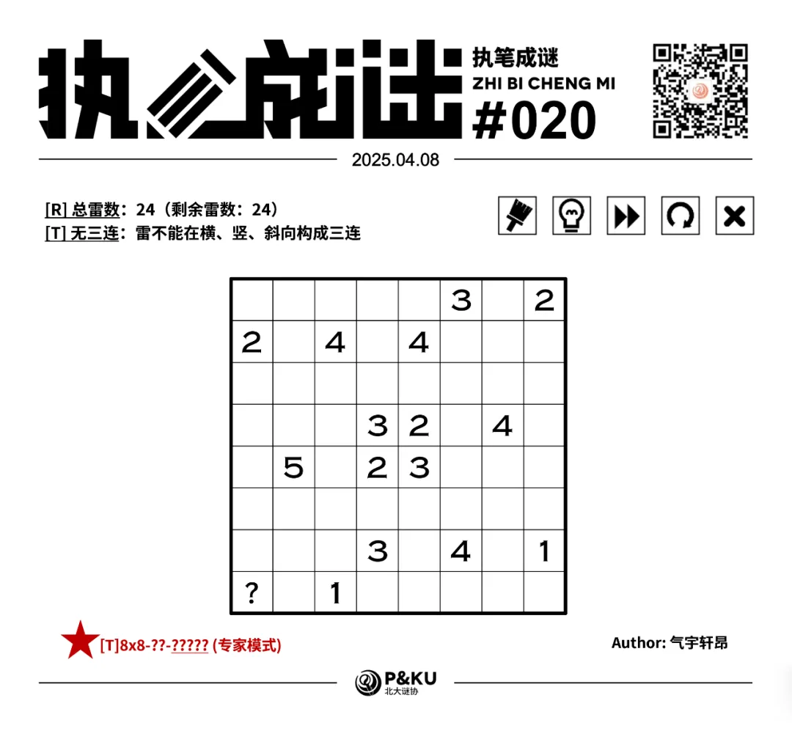
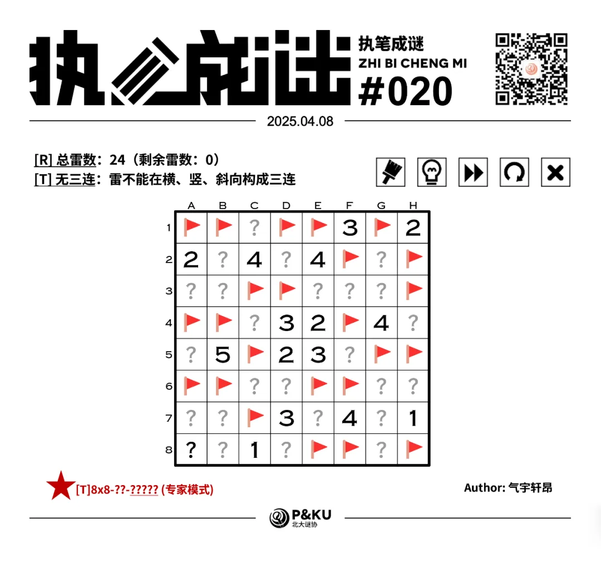

【主题简介】

气宇轩昂老师为大家带来了一套由其编写的纸笔谜题，主题为 Minesweeper Variants（扫雷变体）。
**这一套谜题包含了《14 种扫雷变体》的各种玩法！**
今天是该系列的第四题。本题的规则为[T]无三连。

{/* truncate */}

## [T]无三连规则

在标准扫雷基础上，所有雷不能在横向、纵向、斜向上构成三连。

  
  <ImgCaption>（注意雷数在左上角已经给出，问号格一定不是雷）</ImgCaption>

## 做题链接

你可以[在 penpa 网站上进行尝试](https://swaroopg92.github.io/penpa-edit/#m=edit&p=7VXfT9tWFH7PX1H5+U7yj/zCLxPryl5Y9wMmhKIIOcEtUZ24c5y1chQJsbIsK1Oo1AECtrIuk2AdHdJQF0jK/pjZN8lT/gXOPTaJ7XgPvHQ8TJaPTj6f853P9/q7KX9ZUQyVpOGS0oQnAlxSXMRb5Kfw5r1rvmBqqnyLNl4N9v4adr+l2wd2u9H/+6dht3GLrnYApT+cDLu7YpxMV8wV3YDik+fO63r/7RHdWSPE2T/sHZ3Tg67dPqbPL5z1X5Fpg/7RtNu/0eZmr3UOFHbnl/7Ph876G+fZobN3CqP69T+d1i7McdZfue3Q2Nt9AsWDehMYht0Xbpfd6dAnTf69tH32dLB9ijWnKGtjxE8bq6AEeb7vf/12pOSf1bXe3s7gx5d2+zu6dUYP6v3XJ/b5N3T/98HLHUZ19ZJQSY9bTmsLaN2JsAy9zjHUwJKMmJ3NDbr9JvCmW/vA7Gw+s89eQI198RRIgI18MjND7ilaWY1lvPXOxqrWlGxNE+sjOcMJHOFEuAUuS6zP5Kr1sWzNEWsOHnEkDdisWyRCemecLuBzlt12QYGH/K6XQ7oIab5g5DV1adZFPpUz1jzh2JwPsJulXFH/SuU8Hex3Xi/mCgzIKSZ8FuWVwkPvSbmyrD+oeLVCtkasaZTrtVxpZqM8zdJYM0tdzSyL0Mxe5bqapbDmYqGklqPkTmVrNVj2z0Hwkpxh2r8Yp+lxOidXId6Vq5wkeBMEd284SWIAbNUISIeAOM+AuA8QQ0AyESJNJkMcSST1taSwJeEDUqGWFLb4SAU+rF3gUbyPVuCRl23CFSKg/Pf9COof1cDKCLg+ixhnMIoY52H5iCVh/BAjjzGBcRZr7mBcwHgbYxxjEmtSbAOutUXvQE5GTOLJOb4S7/Z3NpaB44Ir69pSuWLcU/Lw3eNpAt83YKVKMacaAUjT9Yca2CAAFu6XdEONfMRAdfl+VH1ON5ZD7I8UTQsA7v9MAHIdHIBMA+zp+60Yhv4ogBQVcyUA+I6fAJNaMoMCTCUoUXmghKaxU4GTTaOi1mLcYw7vjATLG///KP6PjmK2BfxNc/tNk4Mfr25EOh/gCPMDGmlyD5/wOeATjmYDJ00NaISvAQ1bG6BJdwM4YXDA/sXjjDVsc6Yq7HQ2asLsbNT49eEIz8YuAQ==)

<AnswerCheck
  answer={'52333413'}
  mitiType="zhibi"
  instructions={'依次输入每一行的雷数，多位数只填写个位。'}
  exampleAnswer={'31132'}
/>

## 解答

<Solution author={'孔明七星'}>
  

</Solution>

### 步骤解析

  
查看步骤解析

  <Carousel arrows infinite={false}>
    <CarouselInner>
      本题的入手点在于盘面中间的 3223 结构。
      用容斥原理可以得到左上右下两个绿色格子的总雷数比右上左下两个绿色格子的总雷数多
      2，因此必有左上右下是雷，右上左下不是雷。
      

        
      

    </CarouselInner>
    <CarouselInner>
      

        
      

    </CarouselInner>
    <CarouselInner>
      考虑 B5 的 5。无三连规则表明其左侧三格至多两个雷，右侧两格至多一个雷，因此得到绿色格的雷。
      

        
      

    </CarouselInner>
    <CarouselInner>
      

        
      

    </CarouselInner>
    <CarouselInner>
      进一步使用无三连规则确定 5 周围的所有雷。
      

        
      

    </CarouselInner>
    <CarouselInner>
      对 D4 的 3 和 E2 的 4 运用加法定式。
      

        
      

    </CarouselInner>
    <CarouselInner>
      

        
      

    </CarouselInner>
    <CarouselInner>
      对右上角的 3 和 2 运用加法定式，然后运用无三连规则即可完成上半部分盘面。
      

        
      

    </CarouselInner>
    <CarouselInner>
      

        
      

    </CarouselInner>
    <CarouselInner>
      

        
      

    </CarouselInner>
    <CarouselInner>
      接下来考虑 G4 的 4 。无三连规则表明其左侧两个蓝格和右侧两个蓝格各至多一个雷，因此得到绿色格的雷。
      

        
      

    </CarouselInner>
    <CarouselInner>
      进一步使用无三连规则确定 4 周围的所有雷。
      

        
      

    </CarouselInner>
    <CarouselInner>
      最后考虑剩余雷数条件。 剩余 4 颗雷， C8 的 1 和 F7 的 4 共占据 3 颗雷，得到 H8 格是雷。 而后可以轻松完成盘面。
      

        
      

    </CarouselInner>
    <CarouselInner>
      

        
      

    </CarouselInner>
  </Carousel>

