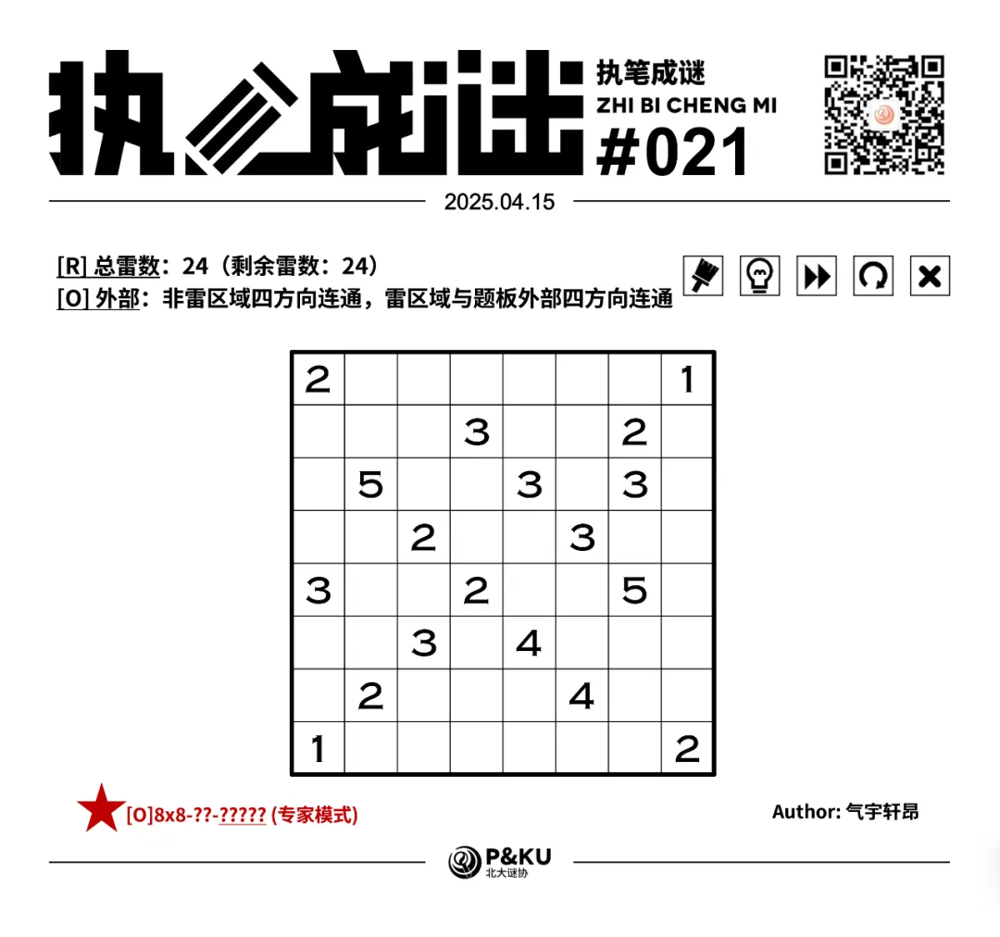
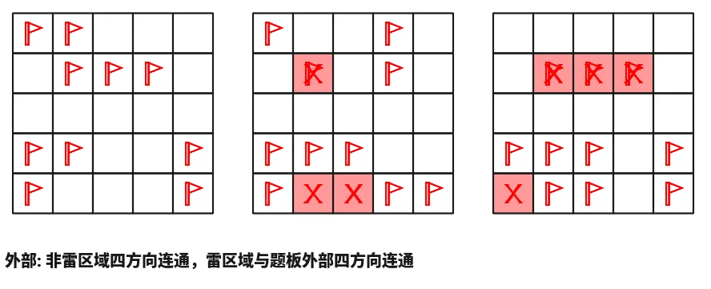
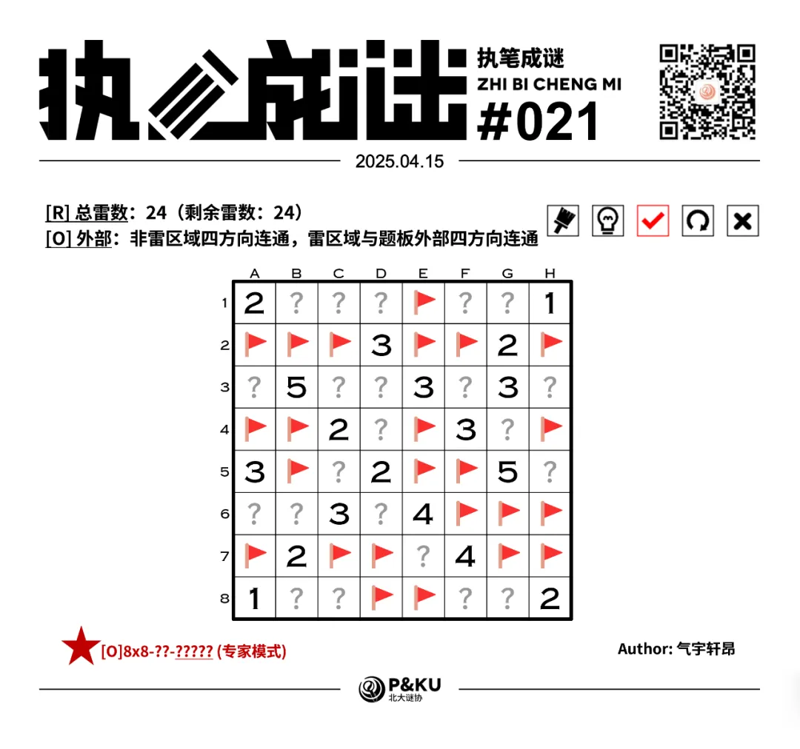

【主题简介】

气宇轩昂老师为大家带来了一套由其编写的纸笔谜题，主题为 Minesweeper Variants（扫雷变体）。
**这一套谜题包含了《14 种扫雷变体》的各种玩法！**
今天是该系列的第五题。本题的规则为[O]外部。

  
  <ImgCaption>（注意雷数在左上角已经给出，问号格一定不是雷）</ImgCaption>

{/* truncate */}

## [O]外部规则

在标准扫雷基础上，所有非雷区域四方向连通，所有雷格四方向连通到外部。

## 做题链接

你可以[在 penpa 网站上进行尝试](https://swaroopg92.github.io/penpa-edit/#m=edit&p=7VXdb9tUFH/PXzH5+SL5Ix+O38pYeSnjo0VVFUWVk3prNCcejsOQo0hR1xIKgWzSNqpmW8cIUsbYqEQFaZKNPwbbiZ/yL/TcY7exHfOAkMYekOWj4989H797b34n1c9qsq4QER5BJCzh4BGSPL48m8WX9Z+1kqEq0iVn/7nb/WM2/sruPXBv92fj/UtOcwSQc/94Nj7kk2SpZmxrOkQe37NftqavnjkHO4TYD/uTZ0PnydgavHDuvbb3fsIybefXjjX42encmfSGUMIa/Tj9oW/v/W7f7dvdE+gzbf1m9w6hj7333EuHxMnhLgS7rQ5UmI2PvCxrNHJ2O+w7onX6jfv9CcacIK32RX1nvwlMsM6309uvLpj81dyZdA/cR0+twdfOg1PnSWv68tgafuk8/MV9ekBLnW8SIp0XPdg9lAXEbg/toyNr8N309enkftvudiHdvnN3+udjtwm02+6jxxdhkVUoRT5cXibXZLWqJHL+SecTdTMrmUvEfF/KMRxDGB5ejskT82Opbn4gmavEXIUlhoiArXhBPLhX5u46rlPvsgdyLPhXfR/cDXCLJb2oKpsrHvKRlDPXCEP7vIvZ1GXK2ucK4/Og30WtXChRoCAb8IOobpdu+ivV2pZ2o+bHcvkGMZeQrp9yzpm28jkLc87U9ThTL4Yz3cq/5lwuVZRqHN1svtGAY/8ECG9KOcr907krzt1VqQ72qlRn+DRNhZvhvLthBOF86z6Q5CggBIBkJCWFEakAgBGBlBR2CQDpaI10JhKRidbIYEQgRWQjbUUxkpLFiGQAyEZqcCxuNxDCcZgUOACOC3eGk+Pw/DbQLqPl0a7B8RJTQPseWhZtCu0KxlxBu472Mtok2jTGZOgF/aMrfAN0cnwaZ+r8Sb3Z73wiB+OEqWrqZrWmX5OLoAucNvD7B6xSKxcUPQSpmnZTBZmEwNL1iqYrsUsUVLaux8UXNH0rUv2WrKohwPsHCkGewkOQoYN8A9+yrmu3QkhZNrZDQGA8hSopFSNMwJDDFOUbcqQbnRqMZOg1pZFgvmDwzQlwvMn/R/V/NKrpFbBvm9rfNjr449X0WOUDHCN+QGNF7uMLOgd8QdG04aKoAY3RNaBRaQO0qG4AFwQO2N9onFaNypyyiiqdtloQO2013z6M8HziDA==)

<AnswerCheck
  answer={'16043352'}
  mitiType="zhibi"
  instructions={'依次输入每一行的雷数，多位数只填写个位。'}
  exampleAnswer={'23032'}
/>

## 解答

<Solution author={'孔明七星'}>
  

</Solution>

### 步骤解析

  
查看步骤解析

  <Carousel arrows infinite={false}>
    <CarouselInner>
      首先介绍“外部”规则下的常见定式： 盘面中不能出现如图所示的结构，即 2x2 区域内一组对角格是雷，另一组对角格不是雷。
      这是因为，若出现了这一结构，则由雷格连通至题板外部推知两个非雷格必定不连通，矛盾。
      

        
      

    </CarouselInner>
    <CarouselInner>
      从右上角入手，由 G2 的 2 和 H1 的 1，可知 2 周围两个蓝色格共一个雷，其它格共一个雷。
      结合外部条件得到绿色格不是雷。
      

        
      

    </CarouselInner>
    <CarouselInner>
      对粉色和蓝色格构成的 2x2 区域用定式，得到两个蓝色格至多一个雷。 结合 F4 的 3 得到绿色格是雷。
      

        
      

    </CarouselInner>
    <CarouselInner>
      

        
      

    </CarouselInner>
    <CarouselInner>
      用外部条件延伸中心的雷区域。
      

        
      

    </CarouselInner>
    <CarouselInner>
      考虑左下角三个粉色数字。 2 周围两个蓝色格恰有一个雷，从而其余格恰有一个雷，再对 2 和 3 用加法定式得到 2
      周围的两个绿色格不是雷，3 周围的两个绿色格是雷。
      

        
      

    </CarouselInner>
    <CarouselInner>
      

        
      

    </CarouselInner>
    <CarouselInner>
      延伸得到的两个雷，进而可以补全左下角。
      

        
      

    </CarouselInner>
    <CarouselInner>
      

        
      

    </CarouselInner>
    <CarouselInner>
      再考虑右上角。用定式得到 G1 格不是雷，从而绿色格是雷。 再用外部条件即可补全右上角。
      

        
      

    </CarouselInner>
    <CarouselInner>
      

        
      

    </CarouselInner>
    <CarouselInner>
      

        
      

    </CarouselInner>
    <CarouselInner>
      分析右下的 2。 假设绿色格是雷，想要使 2 与其它非雷格连通，则必有两个蓝色格都不是雷，矛盾。 因此绿色格不是雷。
      

        
      

    </CarouselInner>
    <CarouselInner>
      由此可以补全右下角。
      

        
      

    </CarouselInner>
    <CarouselInner>
      最后考虑总雷数条件。剩余 3 颗雷均应分布在 B3 的 5 周围，得到绿色格都不是雷。
      

        
      

    </CarouselInner>
    <CarouselInner>
      由此即可完成盘面。
      

        
      

    </CarouselInner>
  </Carousel>

