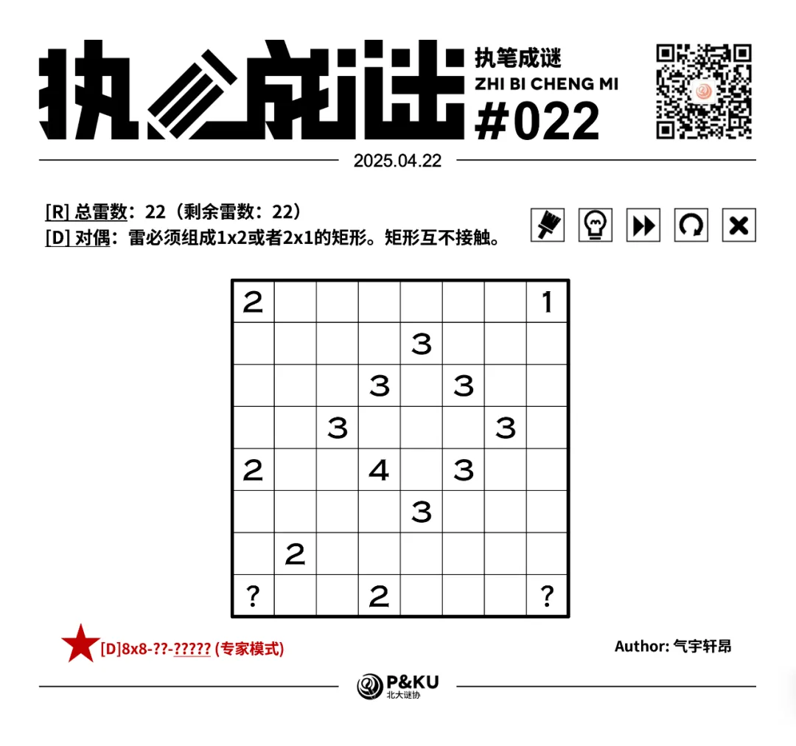
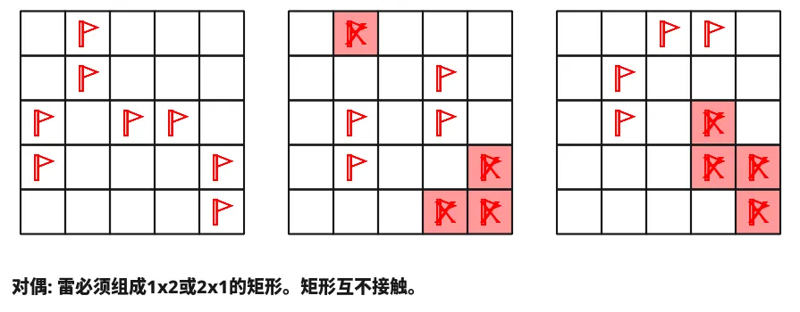
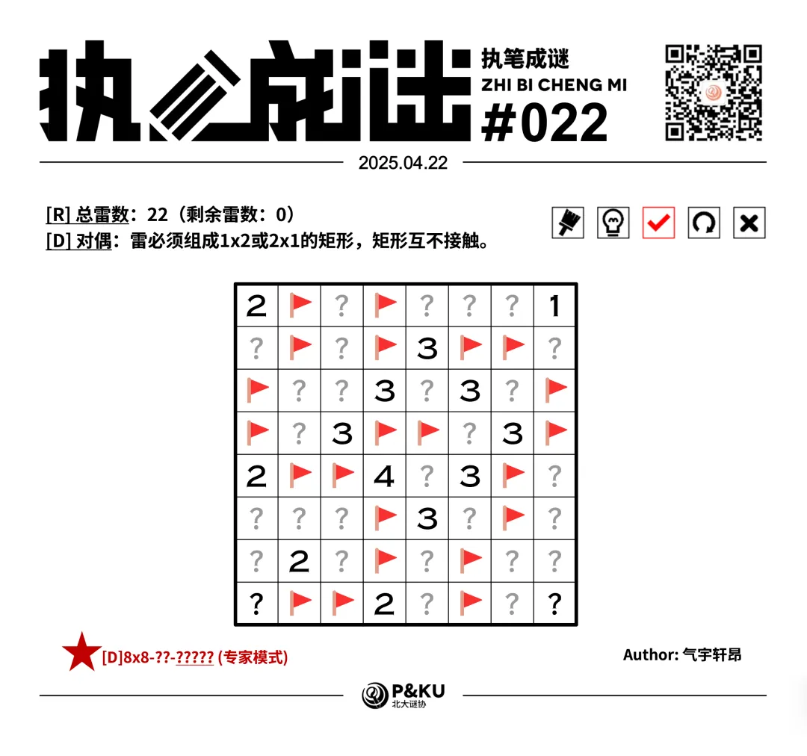

【主题简介】

气宇轩昂老师为大家带来了一套由其编写的纸笔谜题，主题为 Minesweeper Variants（扫雷变体）。
**这一套谜题包含了《14 种扫雷变体》的各种玩法！**
今天是该系列的第六题。本题的规则为[D]对偶。

  
  <ImgCaption>（注意雷数在左上角已经给出，问号格一定不是雷）</ImgCaption>

{/* truncate */}

## [D]对偶规则

在标准扫雷基础上，所有的雷构成若干个1×2的矩形，矩形之间不在边上相邻（允许对角相邻）。

## 做题链接

你可以[在 penpa 网站上进行尝试](https://swaroopg92.github.io/penpa-edit/#m=edit&p=7ZVdb9tkFMfv8ykmXz9Ifsmrb1AZLTelvLRoqqKoclJvjebEw3FY5ShSWxqysKGMaYyqGWyUTLSMdRVUI2/tl8F2nKt8hZ7n2G1iJ1xwE/UCWT46/vn/nHN87PO48GVR0mQSh0OIE5ZwcAhhHk+eTeDJesdKVldk8YZdez1o/D3sPbDetq3td8Ne7Ya91QVk/3Ay7O3zPJkr6huqBsqTp9Zx1Tk7svd2CLGeH/aPOvbLntl6Yz89tyqvMMwj+23dbP1u1x/3mx0IYXZ/dX45tCrvrO8PrcYp5HGqf1nNfchjVV67y2Fhf38XxINqHSIMey/cVWa3a+/W2ffiZvvh4MdT1JxiWY+u4tu1LagE43znfH12Vck/Wzv9xt7gpwOz9a39rG2/rDrHJ2bnG/v5H4ODPRrq8iFBab9pWs1nEJaSn3ftB4+dh6+s9p/wINwmD+L+iyPr7AAEruPWY3ae0KTn7X6jNdjp0hZWtp3jFjTS+e3JJaxBfPLJwgK5LSkFOZT02p8KlYyEaMwR4yMxyXAMYXg4OSZFjM/EkvGxaCwRYxluMYQDtuiKeHDnR+4tvE+9my7kWPCXPB/cVXAzWS2jyGuLLvlUTBorhKF5PsDV1GVy6lcy49VBrzNqLp2lIJfNywUPForr6t2iJ+NSZWLMYaWeekq5wqhc6rrlUm/m5SZS5TJ0/HMoeE1M0tq/GLnxkbsslsAuiSWGj9Kl8FI497UwgnD56B4I8xQIIxBBxTiIBEA0HATxAIihYixtLEZBeAwkAksSbBCgYiwGx6Hk/XGCtfo0mOhKA23gsBmraBfQ8mhXoFfEENB+iJZFG0G7iJp5tLfQ3kQbRhtFTYx2+z+9jxmUk+SjuGGOjshsr1OhJGwLTEFV1gpF7baUgY8cdw34mIHli7m0rPmQoqr3FPjmfTB7J69q8tRbFMrrd6bp06q2Hoh+X1IUH3B/Lz7kjqsP6RrM4ti1pGnqfR/JSfqGD6QlHX5GhY3sPX8kOa/7C9Alf4nSXSmQjW4BjKhrRbkcYjYZPJMCtDf8/5Y7+y2Xdp+9boN+3crB71bVpg494ClzD3TqfHt8YsSBTwwzTTg5z0CnjDTQ4FQDmhxsgBOzDexfxptGDU44rSo45DTVxJzTVKPHh907FboA)

<AnswerCheck
  answer={'24243223'}
  mitiType="zhibi"
  instructions={'依次输入每一行的雷数，多位数只填写个位。'}
  exampleAnswer={'11321'}
/>

## 解答

<Solution author={'怎苏昂'}>
  

</Solution>

### 步骤解析

  
查看步骤解析

  <Carousel arrows infinite={false}>
    <CarouselInner>
      首先介绍“对偶”规则下的常见角 2 定式： 对于角部的剩余 2 个雷，其马步位置两格均不是雷。（可以通过穷举得出。）
      

        
      

    </CarouselInner>
    <CarouselInner>
      

        
      

    </CarouselInner>
    <CarouselInner>
      考虑 D4 这一个格子，如果不是雷，则 C4 格周围的三个雷会矛盾。
      

        
      

    </CarouselInner>
    <CarouselInner>
      

        
      

    </CarouselInner>
    <CarouselInner>
      同理对于如下三个提示数分别使用和角 2 定式类似的逻辑。
      

        
      

    </CarouselInner>
    <CarouselInner>
      

        
      

    </CarouselInner>
    <CarouselInner>
      对 D3 格的 3 进一步进行延伸，得到下图。
      

        
      

    </CarouselInner>
    <CarouselInner>
      考虑 B7 格的 2。 它周围的 5 格可以看作两个 1x2 的封闭区域和一个单格。 由于雷必须对偶，得到 C6 格不能是雷。
      

        
      

    </CarouselInner>
    <CarouselInner>
      

        
      

    </CarouselInner>
    <CarouselInner>
      考虑 F2 格，如果不是雷，F1 格也不能是雷。 因此 F2 格一定是雷。 顺带出 G2 格是雷。
      

        
      

    </CarouselInner>
    <CarouselInner>
      

        
      

    </CarouselInner>
    <CarouselInner>
      最后类似运用上述逻辑，得到解。
      

        
      

    </CarouselInner>
  </Carousel>

