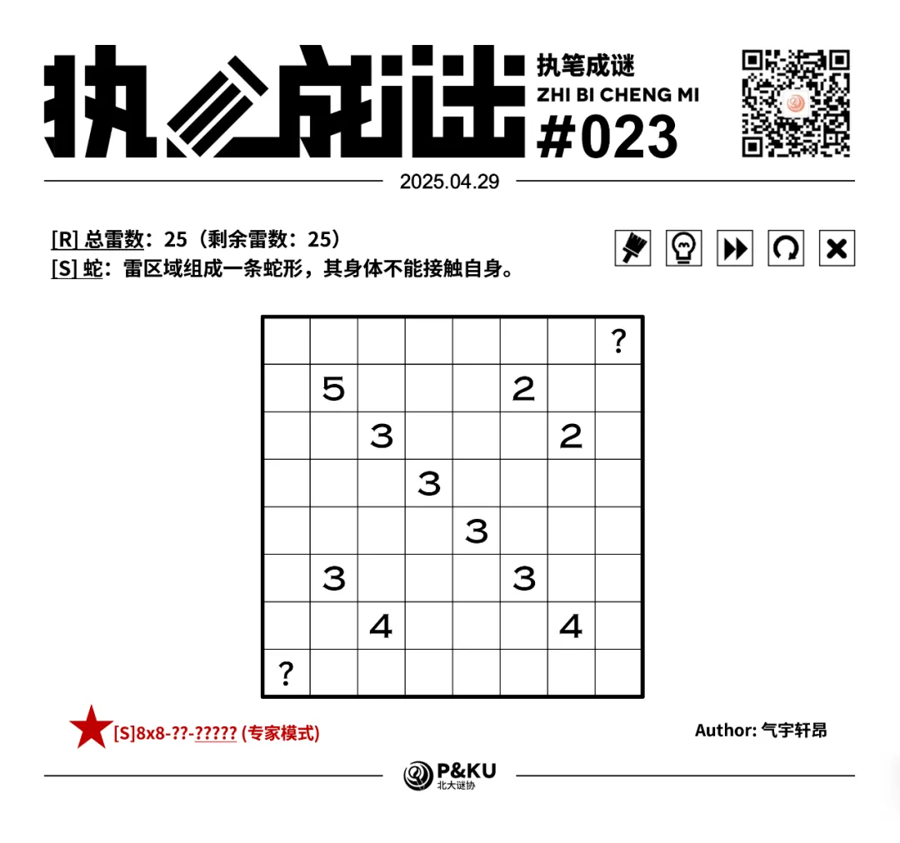
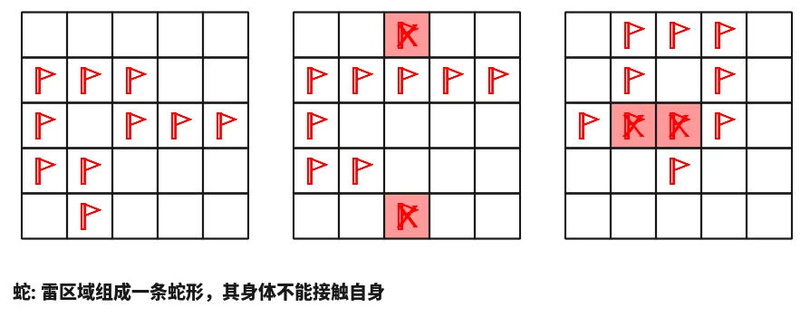
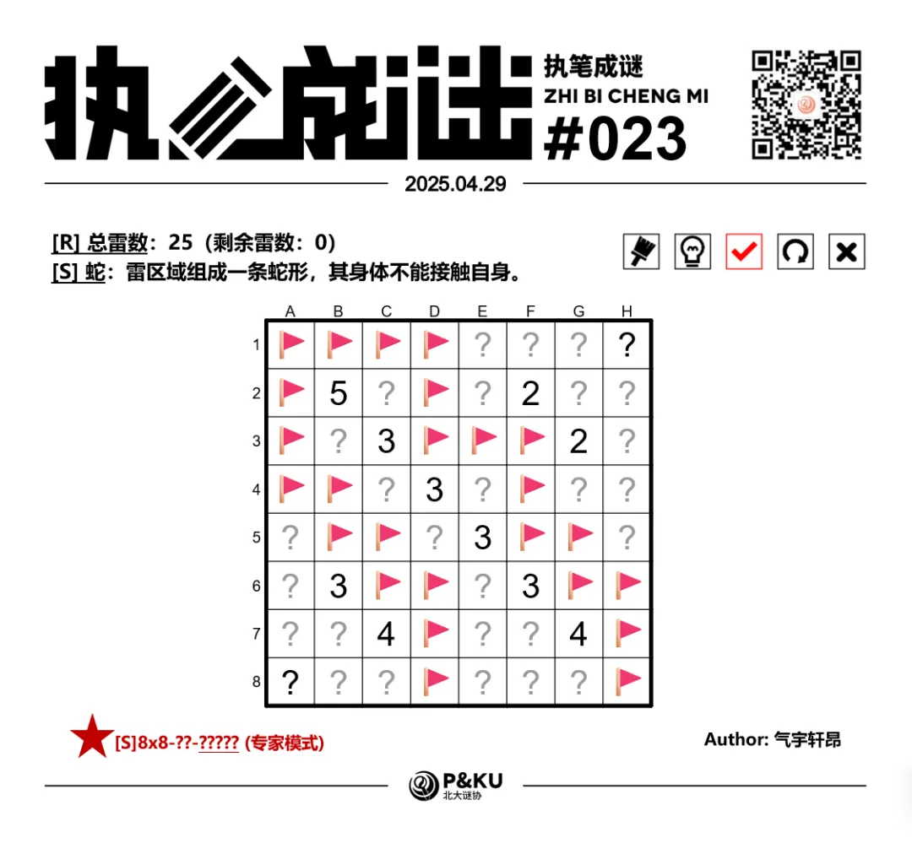

【主题简介】

气宇轩昂老师为大家带来了一套由其编写的纸笔谜题，主题为 Minesweeper Variants（扫雷变体）。
**这一套谜题包含了《14 种扫雷变体》的各种玩法！**
今天是该系列的第七题。本题的规则为[S]蛇。

<ImgCaption>（注意雷数在左上角已经给出，问号格一定不是雷）</ImgCaption>

{/* truncate */}

## [S]蛇规则

在标准扫雷基础上，所有的雷组成一条蛇形，身体不能和自身接触。

## 做题链接

你可以[在 penpa 网站上进行尝试](https://swaroopg92.github.io/penpa-edit/#m=edit&p=7ZVfT9NeGMfv9yrIuT4X/bONrTcGEbxB/AOGkGUh3Siw0K3YdWK6LAFkDhLin4gRmRhRTEACIf6MTDZ4M7bduOIt8JzTutKuxnjxQy5M0yfP+ZznnPM9Z/2e5R8URFXCMXj4GGYwCw8f5ujLMXH6Ms4znNFkSeiylndPq4dnjaVWtXLWWO6y5urQtl4dnDXWuQjuKWhTigplB6vmfqV1vGOtLWBsvt1u7hxZ7xtGbc9aPTHLn+gcKzDM3Htt1D+2NrfNF9tm9Wur8p+5tW6Wd6G4ub5oT/1jbqFZXTvd+GA+KTvw3aK19NyozVkbm1TIilk+NI5fQi+Zdh6mXYNFjdqWUfsM9Ua9bNSeQr3dbJ18b1Zrpwt1OvCbuf+YzDl/QGucIe2a9uoweXu35uGXZv1Zs/7GrBxBAb7d348nRDkvhRLOgSVDRT0u6D1YvykkEIsw4uBlURLrd4WifktAaSWbyiCsD0E/wix0DNiVHKR9bjpC+0nWa0OWgXzQySEdhTSdUdOyNDZgkztCQh/GiCx2nY4mKcoqDyXkiCFtWwCAbCYn5R2YL4wr0wWnjE2WsN7zG7m8K5ektlySBcglu/j/5MaTpRIc+z0QPCYkiPb7bhpz0yGhCHFQKCKeJ0OvgQz7t0F8nICIC8K0An67nyDCEcBfAFFfRTTiq+iO+UCs2wfirA+wDENI+CIJ+wlLa9rqYU8s3dkojf00cjQOw8axztN4g0aGxgiNA7Smj8YRGntpDNMYpTXd5Oj+6HAvQU6Ci9JLy30il9tOhhJgdJRX5LF8QZ0Q0/DF0nsAvkxguUI2JakeJCvKjAwfsAdmJnOKKgV2ESiNTwbVpxR13Df7rCjLHmBf8R5ke8+DNBWMdaEtqqoy6yFZUZvygJSowR9Cfioz451JymleAZrolShOi77ViJ+RoKkFqRRCjxB9Ezwcb/jfJfqXLlHyEzBXze1XTQ79eBU10PmAA8wPNNDkDu/wOfAOR5MFO00NNMDXQP3WBtTpboAdBgf2C4+TWf02J6r8TidLdZidLOVuH67wZOgc)

<AnswerCheck 
    answer={'42434422'}
    mitiType="zhibi"
    instructions={'依次输入每一行的雷数，多位数只填写个位。'}
    exampleAnswer={'03421'} 
/>

## 解答

<Solution author={'孔明七星'}>
  

</Solution>

### 步骤解析

  
查看步骤解析

  <Carousel arrows infinite={false}>
    <CarouselInner>
    本题的蛇条件表明所有雷格是边连通的。
    如果左下角想要边连通到右上角，则必须从蓝色或绿色区域穿过。
    蓝色区域受制于 G7 格的 4 无法穿过，故必有绿色区域的五格雷。
      

        
      

    </CarouselInner>
    <CarouselInner>
      

        
      

    </CarouselInner>
    <CarouselInner>
    利用连通性延伸蛇的两端。
      

        
      

    </CarouselInner>
    <CarouselInner>
    继续考虑连通性。
    如果蛇想要连通到 C7 格红色的 4 周围，要么穿过蓝色区域，要么经过 C5 和 D6 两个绿格。
    蓝色区域受制于 B6 的 3 无法穿过，故蛇必须经过绿格。
    右上角同样考虑，就得到绿色的四格雷。
      

        
      

    </CarouselInner>
    <CarouselInner>
      

        
      

    </CarouselInner>
    <CarouselInner>
    对 C3 和 D4 的 3 用加法定式。
      

        
      

    </CarouselInner>
    <CarouselInner>
      

        
      

    </CarouselInner>
    <CarouselInner>
    由此进一步连接并延长蛇。
      

        
        {/* TODO: 替换白底素材 */}
      

    </CarouselInner>
    <CarouselInner>
      

        
      

    </CarouselInner>
    <CarouselInner>
    现在假设 F5 格不是雷，则由连通性，F6 格粉色的 3 右上方均是非雷格，左下方均是雷格，由蛇条件，此时 C7 的 4 周围雷数不够，矛盾。
    这表明 F5 格是雷。
      

        
      

    </CarouselInner>
    <CarouselInner>
    随后分析 C7 的 4 和 F6 的 3，进一步延伸蛇的两端。
      

        
      

    </CarouselInner>
    <CarouselInner>
      

        
      

    </CarouselInner>
    <CarouselInner>
      

        
      

    </CarouselInner>
    <CarouselInner>
    此时剩余雷数为 4，故剩余雷均在 G7 的 4 周围，即绿色格不是雷。由此运用蛇条件即可完成盘面。
      

        
      

    </CarouselInner>
    <CarouselInner>
      

        
      

    </CarouselInner>
  </Carousel>

