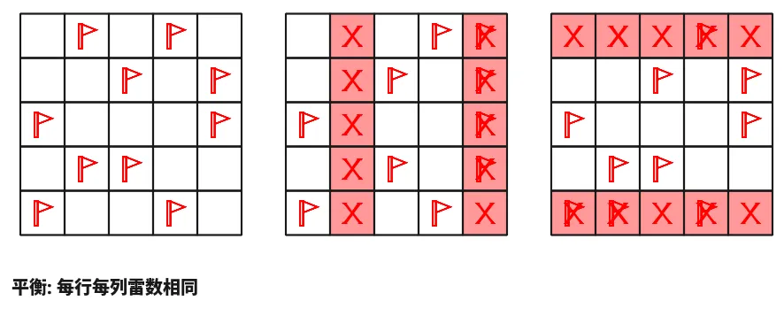

【主题简介】

气宇轩昂老师为大家带来了一套由其编写的纸笔谜题，主题为 Minesweeper Variants（扫雷变体）。
**这一套谜题包含了《14 种扫雷变体》的各种玩法！**
今天是该系列的第八题，也是本系列的最后一题。本题的规则为<b>[B]平衡</b>。

<ImgCaption>（注意雷数在左上角已经给出，问号格一定不是雷）</ImgCaption>

{/* truncate */}

## [B]平衡规则

在标准扫雷基础上，每行每列雷数相同。

## 做题链接

你可以[在 penpa 网站上进行尝试](https://swaroopg92.github.io/penpa-edit/#m=edit&p=7VVfb9tUFH/Pp6j8fJH8J38cv6AyVl7KBrSoqqwoclJvjebExbEZchSpKitpoShDGmvVFLGMIHWUjUqrIG0yvgyxkzzlK/TcY7eOHSOEkAoPyLpHx797/vx8bu4v1U8sxVCJCI8gEpZw8AhJHhfPZnGx/rNcMjVVmnN3T8at3yb9Hef89ajdnvR359zNHkDut6eT/iGfJPOWua4bEHn6xHnVGL154R5sEeIcHQ9fXLjP+oPuS/fJ7872j1hmz/2lOej+5DYfDzsXUGLQ+2HUPna2f3W+OXZaZ9Bn1HjtdA6hj7N94qVD4vDwEQSPG02oMOl/72UNej33UZN9SxycfzXeP8OYM6S1d13f3d0EJljn69Hnb66Z/LG5NWwdjL97Puh+6T49d581Rq9OBxdfuEc/j58f0FJXHwmR7suO03nqkR+1qXV29iHGCxi2us7jPQgjdxcWyD1Fq6oJ2Z9iLlGzs5I9T+z3JJnhGMLwsDgmR+wPpZr9vmQvEXsJthgiArboBfHg3g7cFdyn3i0P5Fjw7/g+uKvgFktGUVPzix7ygSTby4Shfd7BbOoyZf1TlfF50PeiXi6UKFBQTDjs6nppw9+pWmv6A8uP5XJ1Ys8jXT/lijNt5XMWAs7U9ThTL4Yz/ZR/zLlcqqjVOLrZXL0OY/8ICOclmXL/OHDFwF2SamDvSDWGz9BUOBnOOxtGYKOAGAGSSQq8HQApjgLCFJCKAGk+kpJORwHsMgVkojUyyDQZACK2nSImYo2plGy0bTYbieBYbDMVwnFCpCzHIdnrLJgch/NbRbuAlke7DOMltoD2XbQs2hTaRYy5jXYF7S20SbRpjMnQA/pbR3gDdGQ+jXoZPKmbfc8lZJATpqpr+apl3FOKcC9QbeD3D1jFKhdUIwRpur6hwTUJgaX7Fd1QY7coqK7dj4sv6MZapPpDRdNCgPfvEoK8Gx6CTAOu79S7Yhj6wxBSVsz1EDAlT6FKasUMEzCVMEXlgRLpRlWDkUzDUusJ5jMGlyzAeJP/S/W/JNX0CNj/2m3/CzqyvQpjYol9lzAbVl7JF3UNRxO/weZunD/+2nUjVioAjlELQGNVwcdnhAHwGQmgDWdVANAYIQA0qgUAzcoBgDOKANifiAKtGtUFyioqDbTVjDrQVsHng+bnEuhdAg==)

<AnswerCheck 
    answer={'36345463'}
    mitiType="zhibi"
    instructions={
    
      依次输入每一行从左到右第二个雷的位置。
    
  }
    exampleAnswer={'45534'} 
/>

## 解答

<Solution author={'怎苏昂'}>
  

</Solution>

### 步骤解析

  
查看步骤解析

  <Carousel arrows infinite={false}>
    <CarouselInner>
    本题的第一步关键在同时观察 78 行和 AB 列。
    可以得出黄色区域+红色区域有 5 个雷，从而得到粉色区域一个雷。
    然后顺着 AB 列：粉色区域一个雷，橙色两个雷，得到灰色区域三个雷，于是得到绿色格不是雷。
      

        
      

    </CarouselInner>
    <CarouselInner>
      

        
      

    </CarouselInner>
    <CarouselInner>
    将 D5 的 4 周围填满之后，考虑 456 行，得到 F456 不是雷。
      

        
      

    </CarouselInner>
    <CarouselInner>
      

        
      

    </CarouselInner>
    <CarouselInner>
    将 45 行填满。
      

        
      

    </CarouselInner>
    <CarouselInner>
    考虑 ABC 三列可以得到 AC1 是雷。
      

        
      

    </CarouselInner>
    <CarouselInner>
      

        
      

    </CarouselInner>
    <CarouselInner>
    将 B3 的 3 填满。
      

        
      

    </CarouselInner>
    <CarouselInner>
    在解决完 AB 列之后可以观察 3 行，结合 F3 的 3 以得出绿色格子的信息。
      

        
      

    </CarouselInner>
    <CarouselInner>
      

        
      

    </CarouselInner>
    <CarouselInner>
    而后通过简单容斥和加减法即可得到最终答案。
      

        
      

    </CarouselInner>
  </Carousel>

