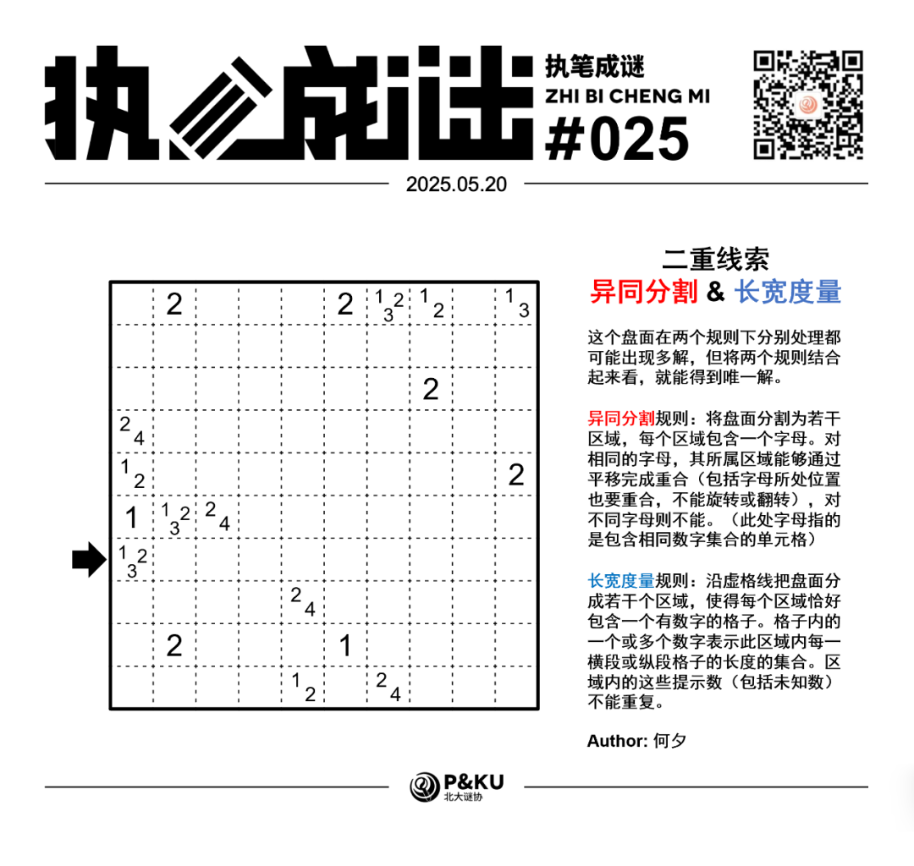
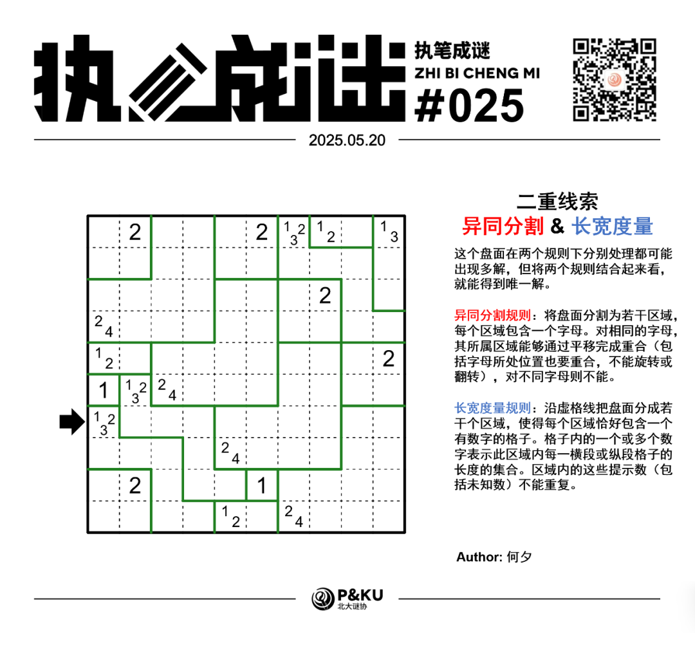

何夕老师为大家带来了一套由其编写的纸笔谜题，主题为 **Double Clue（二重线索）**。
**这一套谜题中，每一题在两个规则下分别处理都可能出现多解，但将两个规则结合起来看，就能得到唯一解。**

今天是该系列的第一题。本题的规则是 **异同分割（Nikoji）+ 长宽度量（Lohkous）**。

{/* truncate */}

## Nikoji 异同分割规则

将盘面分割为若干区域，每个区域包含一个字母。对相同的字母，其所属区域能够通过平移完成重合（包括字母所处位置也要重合，不能旋转或翻转），对不同字母则不能。

（此处字母指的是包含相同数字集合的单元格）

## Lohkous 长宽度量规则

沿虚格线把盘面分成若干个区域，使得每个区域恰好包含一个有数字的格子。格子内的一个或多个数字表示此区域内每一横段或纵段格子的长度的集合。区域内的这些提示数（包括未知数）不能重复。

## 做题链接

你可以[在 penpa 网站上进行尝试](https://swaroopg92.github.io/penpa-edit/#m=edit&p=7ZZtb+JGEMff8ykqv81K9foZS30BHFxzRwjJgShYCBliwImNU2OTq1G++83sroOfclIrVYqqCrEefrM7+59ZM/bxz9SNPUIpoTJRLSITsIimG0SjFtGpyb6y+Ez8JPDsX0gnTfZRDAYht4MB2brB0SNf5vthL+q8fOr8cbKSxYJ+ltNrefY4eLy6D79e+2pMByNrfDO+8ZVd5/de987oXxnj9DhNvNNdSLuP08VkO57t2spf/dFCyxa3sv5lsf311Jn+1nKEhmXrnLXtrEOyz7YjKRJhXyotSXZnn7MbO5uT7Bu4JEKBDcGiElHA7IOpc3PG/Gj1uJ/KYI/A1viyOZhuHEcvq+6qy9HYdrIJkXCjLluOphRGJ0/iMdjvTRSufQRrN4FaHff+s/Ac04foKRVzIaAUpkHib6IgihEieyVZh+fQb8hBFTkIk+eAVjUHkS/msPHjTeCthv9CCu3mFF7hfO4hiZXtYD7Ti2ldzG/2GcaRfZZUDVfCEVICtYeQqlUFbbahol6QJnNUIAojhTkmm1OYYvLAeMCCtNVqGCqzOCXClmF530hdEKV8t0Jw9NemcZmlaXq1AFSv7Wjy7IqTTL7sLRKUk7KizqGoVMEFOinfwuAcsCkKGydwFCRT2fiJjTIbdTYO2Zw+BFMUkygoXIG/mqYQRTe5rQNHZWibwC3BLZOoWEew4UpUyjlciaoKrgLXBNeAG4IbwE3ksPmMSeixUWNCDAJiJBsyZrZGua1REGVwGxqXYgpuArcEtwwQxTlcQRTncAVRgqvANcE14IbgBnBTcBM4Csw5Cs/nY0J5HEw0j48FyPfFwgg9rGC5Tixkrh8LnOeFhadQAIOdiol/n7/1ByveF//sBqifREWOA4eJD43qR/8v0GXLgSeOdIyC1TGNt+7GW3nf3U0i2fyhV/SU2CEN1x60xQIKoug58A9NEXJXCfq7QxR7jS6E3sPuvVDoagi1juKHiqYXNwjKubAXghLiD5ESSmJ4QhR+s0ZTIqGb7Eug8DQpRfIOlWImblmi++RWdgsv5XhtSd8l9nVUfHH5//Xgo78e4FnJH62HfTQ57DaP4p/0nIuzihs6D9CfNJ+Ct4m/02cK3iqvNRUUW+8rQBtaC9BqdwFUbzAAaz0G2DttBqNWOw2qqjYb3KrWb3CrYstxlq0f)

## 提交格式示例

例如对于如下样例，在提交第三行的情况下请提交 **77700**。

<AnswerCheck
  answer={'7777222222'}
  mitiType="zhibi"
  instructions={'依次输入题图箭头所指行从左到右每个格子所属区域的面积，对于多位数只提交个位。'}
  exampleAnswer={'77700'}
/>

## 解答

<Solution author={'怎苏昂'}>
  

</Solution>

### 步骤解析

  
查看步骤解析

  <Carousel arrows infinite={false}>
    <CarouselInner>
      在这样的一个二重规则下，首先可以先通过最左侧的“24”线索先推演出一个正方形，并且同步到其余24线索：
      

        
      

    </CarouselInner>
    <CarouselInner>
      将123区域进行延伸，并完成12区域。
      

        
      

    </CarouselInner>
    <CarouselInner>
      根据第一行最右侧的2可以得到2必须是一个2x2的方形。
      

        
      

    </CarouselInner>
    <CarouselInner>
      仔细分析中心的大片区域，将其分割为四片完全一致的24长宽度量区域。
      

        
      

    </CarouselInner>
    <CarouselInner>
      进一步考虑123区域的延伸。
      

        
      

    </CarouselInner>
    <CarouselInner>
      最后将左下角的123区域分割成两个完全相同的两片即可得到最终解。
      

        
      

    </CarouselInner>
  </Carousel>

