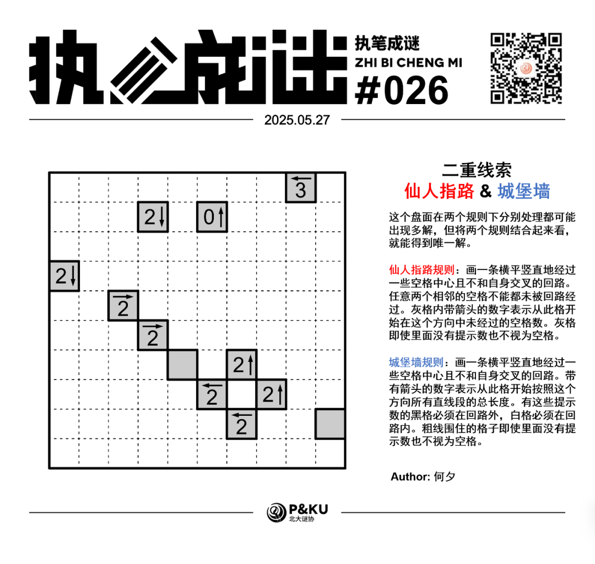
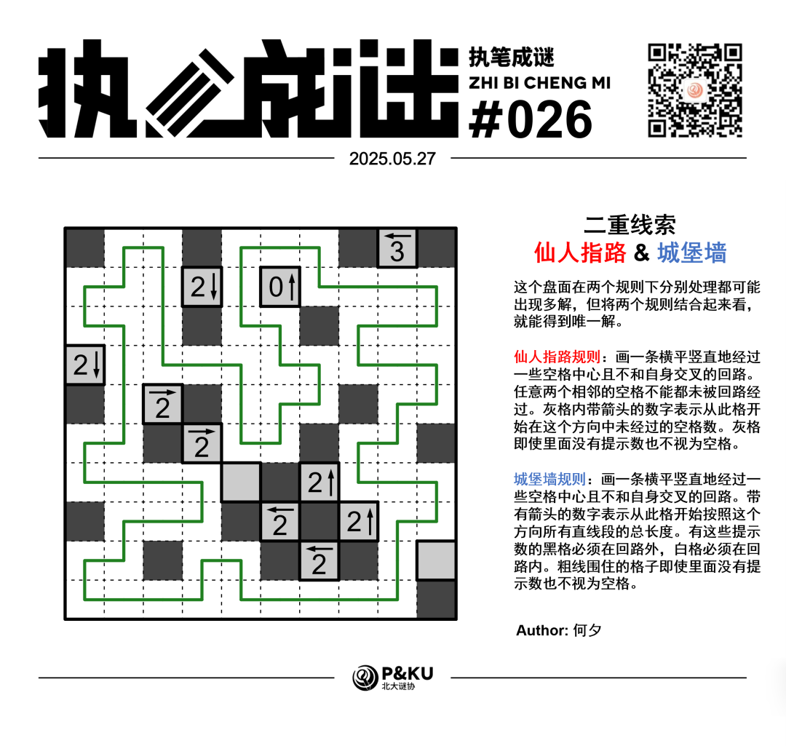

<WechatArticleLink
  href="https://mp.weixin.qq.com/s?__biz=MzkwMDc0MzAwNw==&mid=2247485930&idx=1&sn=91ccaf44b4cfcaedfe2f4ddd8ba31d3c&chksm=c0be23daf7c9aacc49211351fdb727fdf642ec281f653875b949086f9824f1bc6d451b6c1881#rd"
/>

何夕老师为大家带来了一套由其编写的纸笔谜题，主题为 **Double Clue（二重线索）**。
**这一套谜题中，每一题在两个规则下分别处理都可能出现多解，但将两个规则结合起来看，就能得到唯一解。**

今天是该系列的第二题。本题的规则是 **仙人指路（Yajilin）+ 城堡墙（Castle Wall）**。

{/* truncate */}

## Yajilin 仙人指路规则

画一条横平竖直地经过一些空格中心且不和自身交叉的回路。任意两个相邻的空格不能都未被回路经过。灰格内带箭头的数字表示从此格开始在这个方向中未经过的空格数。灰格即使里面没有提示数也不视为空格。

## Castle Wall 城堡墙规则

画一条横平竖直地经过一些空格中心且不和自身交叉的回路。带有箭头的数字表示从此格开始按照这个方向所有直线段的总长度。有这些提示数的黑格必须在回路外，白格必须在回路内。粗线围住的格子即使里面没有提示数也不视为空格。

## 做题链接

你可以[在 penpa 网站上进行尝试](https://swaroopg92.github.io/penpa-edit/#m=edit&p=7Vbvb+I4EP3OX3Hy17W0sZ1AEmk/0F8rVS1XrvR6bVShFEKhDWQ3QFul6v/eN7azJIHurXQ6qSedQjyPN+PxzMQZZ/l9HecJFw79lM8hcbnC17f02/p27DWYrdIk/I1316tplgNw/vvREZ/E6TLhx1f3ewcP3afD7l+fvWulLnqTT/cH/Yv78eWfou/MPudOL/UXp2cHe+mnr8X16bT7mBwm7bNlNpqmSTyOi+vL4+d0ceTfTSdi/3i670/ihbP87g+Cx73+ly+tyAZy03opgrDo8+JrGDHJuL4Fu+FFP3wpTsOix4tzqBhX4E6ABOMS8HADL7We0L4hhQPcMw4F4BXgaJaP0mR4YpizMCoGnNE6e3o2QTbPHhNmXOj/o2x+OyPiNl6hXsvp7JvVLNfj7GFtbeGQzdfpajbK0iwnkrhXXnRNCudlCrSyTYGysSkQNCkQaqZgc/yXUwh2p/CKx/MHkhiGEeVzsYH+Bp6HL0z5LFScuR0jAi06Ugvf6ISjjBT2v3SMVJZXnpGu1XsCEv571n/E1JAqQ3sE4dJaeMJDVaGwbsScobOhKIaGFcVDFG0OS+nYmhzFR1zFm46VuEocOu6mHeVQs0MeInzBeKXHIz1KPQ5QRl4oPR7o0dGjp8cTbXOIGkhPcem5LJTw6LlctrEI4XanggO85wiSsA9739p3nA0mmw6S0zbwE9i5AfpEgBJq3qtg2PhIUtsEXAnjHxLY+FQOmo7F2sYx/sGBN3M1lmYtSGDjH/oNlpjrWv8u/LvWv4L/EpONKv23K7gDjE1T8gI7pJxb8o4E37ZYIE7sjxL/iBPxlDYK9vTQS+xa3oV/2oGUr0Rtlc1doeYlFqiznSuRr3TNWpDAJQ+bHxg2tg4SMUubLySwrb8SFUzrUl7YIJd6m+zr0dVjW2+fDr2jv/gWm3ftn+/Uvw0nQuR0OtUv77/H3bQinGBsmaXD5TqfxKNkmDzHoxULzUla1dS4xXp+m6DPVqg0y76ls8UuD6WqRs7uFlme7FQRmYzv3nNFqh2ubrN83IjpKU7Tei76K6NGmVOpRq1yHDmV/3GeZ081Zh6vpjWicjzVPCWLRjFXcT3E+CFurDbflOO1xZ6ZviNFX0P/f2588M8NelTOR2tXHy0cvcuz/CctZ6Ns0jsaD9if9J6Kdhf/TpupaJv8Vk+hYLfbCtgdnQVss7mA2u4vILdaDLh3ugx5bTYaiqrZa2iprXZDS1U7TnTTegM=)

## 提交格式示例

例如对于上面的仙人指路样例，请提交 **00201**。

<AnswerCheck
  answer={'4020331331'}
  mitiType="zhibi"
  instructions={'依次输入每一行的空格数，对于多位数只提交个位。'}
  exampleAnswer={'00201'}
/>

## 解答

<Solution author={'怎苏昂'}>
  

</Solution>

### 步骤解析

  
查看步骤解析

  <Carousel arrows infinite={false}>
    <CarouselInner>
      首先根据F2格的0上和I1格的3左可以把第一行的回路空格情况全部得出。
      

        
      

    </CarouselInner>
    <CarouselInner>
      通过“回路构成的区域必须联通”得到这两条线。
      

        
      

    </CarouselInner>
    <CarouselInner>
      

        
      

    </CarouselInner>
    <CarouselInner>
      而后考虑回路延伸得到如下一些信息。
      

        
      

    </CarouselInner>
    <CarouselInner>
      考虑F8格的2左，在同时考虑Yajilin规则和Castle
      Wall规则的情况下只能是如图所示的这种情形（考虑线段总长度为2必须至少需要3个格子+未被回路经过的2个格子）
      

        
      

    </CarouselInner>
    <CarouselInner>
      观察A4格的2下可以得到唯一的摆放。
      

        
      

    </CarouselInner>
    <CarouselInner>
      考虑F8格的2左也可以得到唯一的Yajilin摆放。进而左下角的回路走向完全确定。
      

        
      

    </CarouselInner>
    <CarouselInner>
      D2格的2下的Yajilin摆放方式完全确定。
      

        
      

    </CarouselInner>
    <CarouselInner>
      对G7格的2上进行穷举，如下两种情形分别可以通过“不符合G7的Castle Wall”和“会产生交叉路口”排除。
      

        
      

    </CarouselInner>
    <CarouselInner>
      

        
      

    </CarouselInner>
    <CarouselInner>
      同时结合G7的Castle Wall规则可以得到G45的线条。
      

        
      

    </CarouselInner>
    <CarouselInner>
      同理考虑D6格子的2右，结合Castle Wall规则可以得到J6格是空格。
      

        
      

    </CarouselInner>
    <CarouselInner>
      C5格的2右。
      

        
      

    </CarouselInner>
    <CarouselInner>
      最后根据H8格的2上得到答案。
      

        
      

    </CarouselInner>
  </Carousel>

