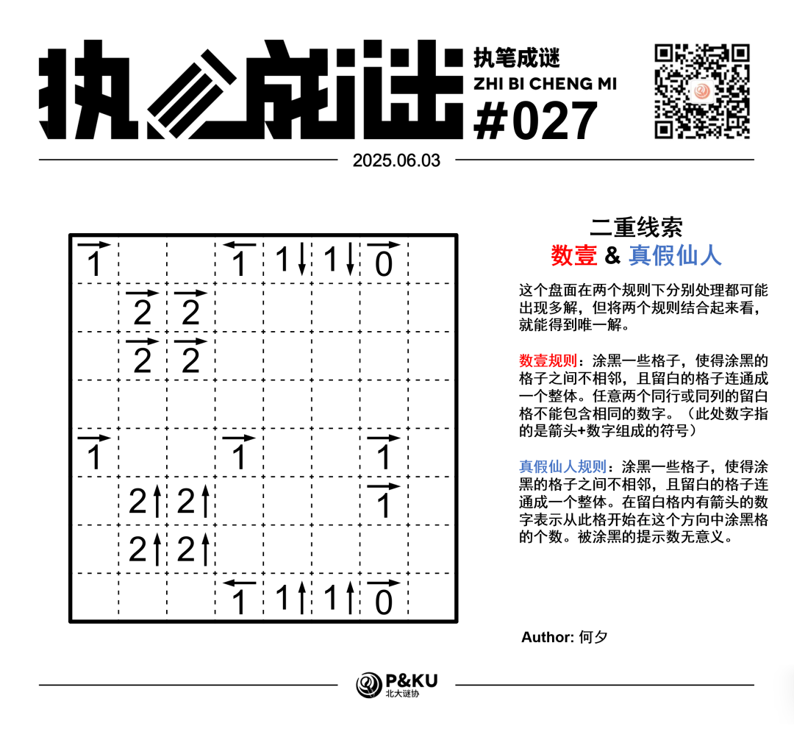
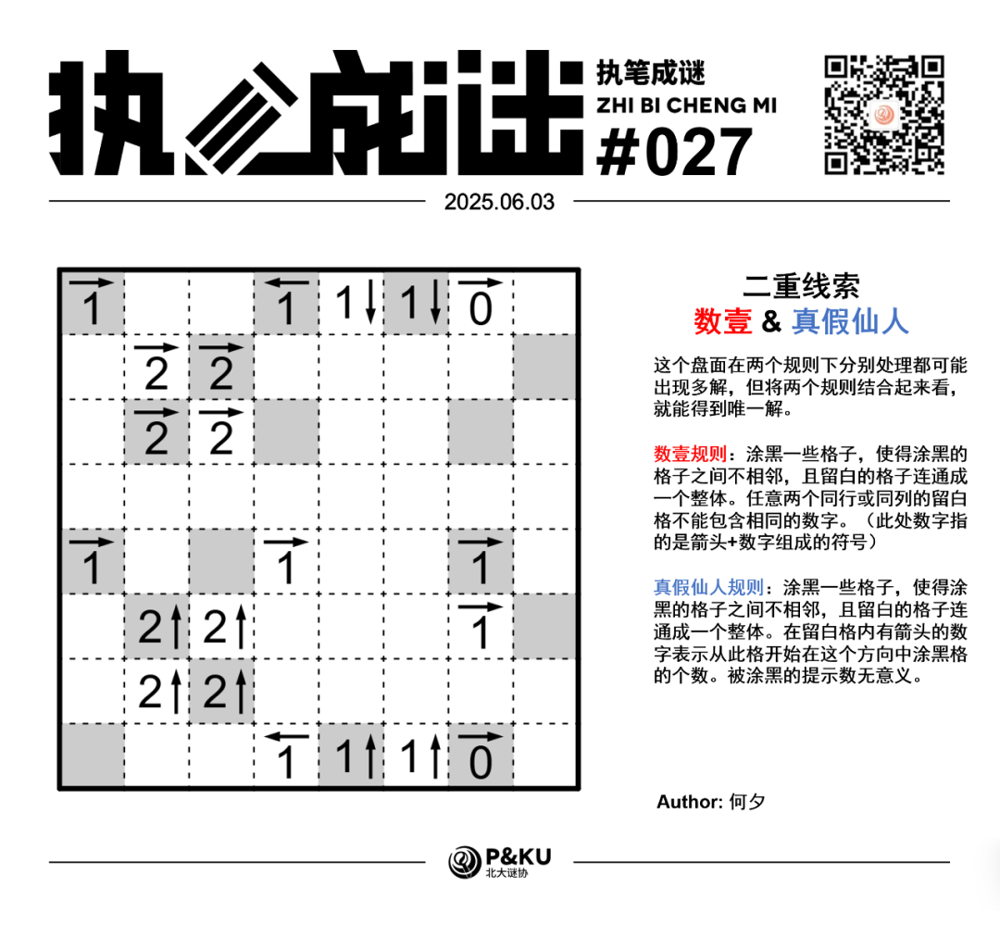

<WechatArticleLink
  href="https://mp.weixin.qq.com/s?__biz=MzkwMDc0MzAwNw==&mid=2247485977&idx=1&sn=214a14e9fe5754a0b778d2878ee10c6d&chksm=c0be2029f7c9a93f32a6975c84f02e9a3d1cc32b85003b6287a01704efb291cdfaba05c6efdb#rd"
/>

何夕老师为大家带来了一套由其编写的纸笔谜题，主题为 **Double Clue（二重线索）**。
**这一套谜题中，每一题在两个规则下分别处理都可能出现多解，但将两个规则结合起来看，就能得到唯一解。**
今天是该系列的第三题。本题的规则是数壹(Hitori)+真假仙人(Yajisan-Kazusan)。

{/* truncate */}

## Hitori 数壹规则

涂黑一些格子，使得涂黑的格子之间不相邻，且留白的格子连通成一个整体。任意两个同行或同列的留白格不能包含相同的数字。（此处数字指的是箭头+数字组成的符号）

## Yajisan-Kazusan 真假仙人规则

涂黑一些格子，使得涂黑的格子之间不相邻，且留白的格子连通成一个整体。在留白格内有箭头的数字表示从此格开始在这个方向中涂黑格的个数。被涂黑的提示数无意义。

## 做题链接

你可以[在 penpa 网站上进行尝试](https://swaroopg92.github.io/penpa-edit/#m=edit&p=7ZXPb5swFMfv+Ssmn33AJr/g1nXNLlm3LpmqCiFEEtqgkrgzsE5E+d/7/LCEjelhh3U9TIinx8eP5y92vk75s05lRudw+XPqUQaXP+Z4cy/A29PXOq+KLPxAL+pqLyQklH5dLOh9WpTZKNJV8ejUBGFzQ5vPYUQ4oXgzEtPmJjw1X8JmRZsVDBHKgC0hY4RySK+69BbHVXbZQuZBft02VK/dQbrN5bbIkmVLvoVRs6ZEzfMR31YpOYhfGWlb4PNWHDa5Apu0go8p9/mTHinrnXisdS2Lz7S5eF2u38lVaStXZX25+nv+stwgPp9h2b+D4CSMlPYfXTrv0lV4gngdngif4quJWk61Q9CRBy1S8jXyvRb5BmIu4gp5Zi8fe3ETjbGXhSbYy0bYy0KzsSN1NnPQXEs1EVbxxDPQ3EEBzmi9GGj1RhXztHyTMd9ZMca0WqtuMsBwA4xFg41huD13GBcYOcY17B5tfIyfMHoYJxiXWHOF8RbjJcYxxinWzNT+/9Ev5A3kRHyKx013Td72OR5FcFqRUhRJWcv7dAvew8MM7AXsWB82mbRQIcRTkR/tuvzhKGQ2OKRgtnsYqt8Iuet1f06LwgLt4Wyh9hSxUCXhiDCeUynFs0UOabW3gHGcWJ2yY2ULqFJbYvqY9mY7dN98HpHfBO/Ih/Ud//8r+Ed/BWoLvPdm9/cmB3+9Qg5aH/CA+4EOulxzx+jAHUurCV1XAx0wNtC+twG59gboOBzYKyZXXfs+V6r6VldTOW5XU5mGj+LRCw==)

## 提交格式示例

例如对于上面的数壹样例，请提交 **2021**。

<AnswerCheck
  answer={'32303213'}
  mitiType="zhibi"
  instructions={'依次输入每一行的黑格数，对于多位数只提交个位。'}
  exampleAnswer={'2021'}
/>

## 解答

<Solution author={'怎苏昂'}>
  

</Solution>

### 步骤解析

  
查看步骤解析

  <Carousel arrows infinite={false}>
    <CarouselInner>
      首先通过本题的关键在于如下的一个全局结构：在确定完0旁边必须是白格之后，通过蓝色和黄色的数壹限制，可以确定第一行和最后一行的1下和1上分别需要各涂黑一格，且涂黑格对应的列不同。于是中间的这两列一定是留白的。
      

        
      

    </CarouselInner>
    <CarouselInner>
      在通过数壹规则得到第五行第一列是黑格之后，观察一下图中的红色和蓝色部分，必须要有五个黑格（两个2→四格+一个2→背后有一格），于是可以得到这些格子不是黑格。（0→通过白格连通性判断。）
      

        
      

    </CarouselInner>
    <CarouselInner>
      于是可以得到第一步提到的部分的涂黑情况。
      

        
      

    </CarouselInner>
    <CarouselInner>
      紧接着处理第二步提到的红色部分。同理蓝色部分也能通过连通性得出。
      

        
      

    </CarouselInner>
    <CarouselInner>
      最后通过明显没法满足的2↑只能涂黑，然后根据1→得到最终答案。
      

        
      

    </CarouselInner>
  </Carousel>

