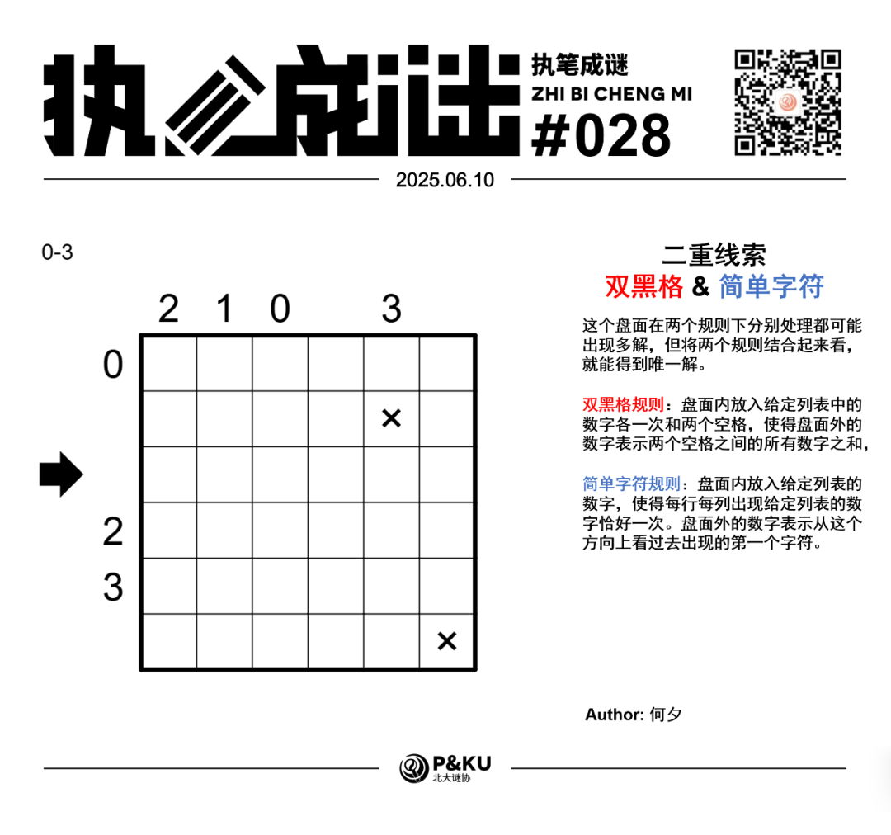
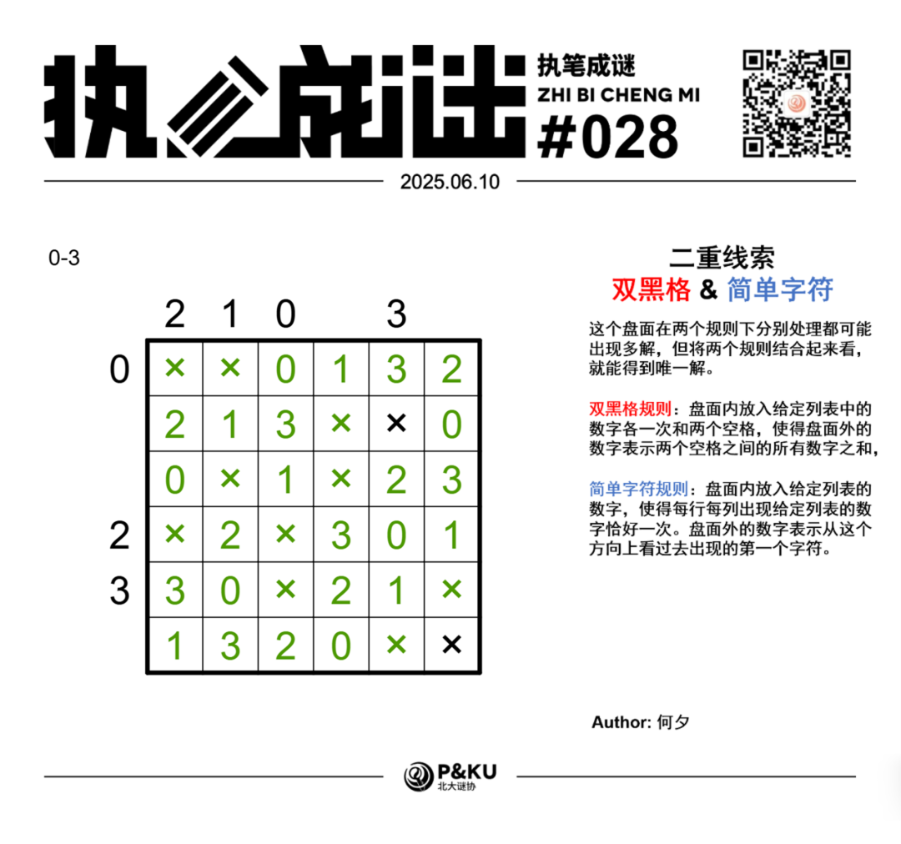

何夕老师为大家带来了一套由其编写的纸笔谜题，主题为 **Double Clue（二重线索）**。
**这一套谜题中，每一题在两个规则下分别处理都可能出现多解，但将两个规则结合起来看，就能得到唯一解。**
今天是该系列的第三题。本题的规则是双黑格(Doppelblock)+简单字符(Easy As)。

{/* truncate */}

## Doppelblock 双黑格规则

盘面内放入给定列表中的数字各一次和两个空格，使得盘面外的数字表示两个空格**之间**的所有数字之和。

## Easy As 简单字符规则

盘面内放入给定列表的数字，使得每行每列出现给定列表的数字恰好一次。盘面外的数字表示从这个方向上看过去出现的第一个字符。（注意打x的格子必须是空格）

## 做题链接

你可以[在 penpa 网站上进行尝试](https://swaroopg92.github.io/penpa-edit/#m=edit&p=7VRRb9o8FH3nV0x+NlJMAoS89evKXli3DqaqiiJkIJSoAXdOsk5G/PfeexNEnGTSt0mb+jAZX50cX18fbnySfSukjvkEhutzhwsYru/Q9D38OdVYJHkaB+/4VZHvlAbA+afplG9lmsW9sMqKekczCcwdNx+CkAnG2QCmYBE3d8HRfAzMnJs5LDHuAzcrkwYAby7wntYRXZekcADfVhjgA8C9zHfl0+cgNAvO8Iz/aCdCtlffY1ZpwOe12q8SJA7FfptWZFZs1FNRpYnoxM1VQyUeUKl0LyoRlioRdahE8ahyneh1Gi9nv6V0JXNoebZLnrvkTqLTCbr9BQQvgxC1f71A/wLnwRHibXBkAx+3On0X1HA2woqeixS8IyDwLTHPO3fjTAxpU40YI1HWIGLYzJhQjVpR4dh7QI8gVQ+gaowSPGjD+YUyMRjZFGROKX9AcQF/jBuX4nuKDsUhxRnl3FC8p3hN0aM4opwxtuaXmleX/IfkhOPSfjgm/xP1h7wv3NY8L4uoF4IlWabSZVborVzDTSPHwmUCDrywirVFpUo9p8nBzkseD0rHnUtIxpvHrvyV0ptG9ReZphZRfn8sqvSMReUaDFF7llqrF4uhq1InauaxKsWH3BaQS1uifJKN0/aX/3zqsR+MZohd9v597/7u9w4777w14741OXRple50PNAdpge209wV3/I38C0n44FtMwPb4Wdgm5YGqu1qIFvGBu4n3saqTXujqqbD8aiWyfGous/DqPcK)

## 提交格式示例

例如对于上面的双黑格样例，请提交 **23XX1**。此示例提交第三行。

<AnswerCheck
  answer={'0X1X23'}
  mitiType="zhibi"
  instructions={'输入第三行的内容，空格用 X 表示。'}
  exampleAnswer={'23XX1'}
/>

## 解答

<Solution author={'Winfrid'}>
  

</Solution>

### 步骤解析

  
查看步骤解析

  <Carousel arrows infinite={false}>
    <CarouselInner>
      由于双黑格规则，R1C5一定有数字，否则那一列的提示数应该为0。而由于easy as规则，这个数字一定是3。
      

        
      

    </CarouselInner>
    <CarouselInner>
      然后暂时没有很容易的突破口了，我们不妨考虑一下……3这个数字是比较复杂的，但是1和2是比较简单的：
1在双黑格规则下一定只能是由1(+0)构成，2也同理。这意味着双黑格提示数为1或者2的时候，这个数字一定不在该行/列的两头。
而在easy as规则下，1和2又必须是第一个出现的数字。
这么一考虑，就能够意识到<strong>1和2所对应的行和列，第一个格子一定是不填数的，第二个格子一定是1或者2本身，第三个格子可以是0，也可以不填数</strong>。
因此可以推出很多结论。
      

        
      

    </CarouselInner>
    <CarouselInner>
      

        
      

    </CarouselInner>
    <CarouselInner>
      

        
      

    </CarouselInner>
    <CarouselInner>
      至此，我们就填完了前面两列。接下来考虑第五行的作为双黑格提示数的3，其一定对应1+2，所以这一行的第四格和第六格都不填数，中间填一个1和一个2。
      

        
      

    </CarouselInner>
    <CarouselInner>
      然后考虑第五列作为双黑格提示数的3。因为3=1+2，或3=1+2+0，所以不填数的另一个格子只能是R5C5或者R6C5，但第五行又必须要填数，所以只能是R6C5。
      

        
      

    </CarouselInner>
    <CarouselInner>
      最后只需要靠基本功，就能完成盘面啦！
      

        
      

    </CarouselInner>
  </Carousel>

