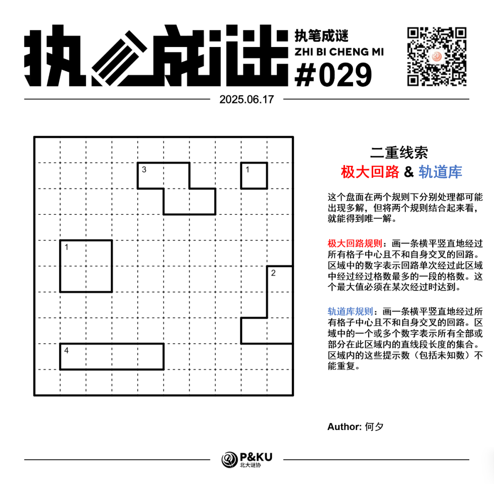
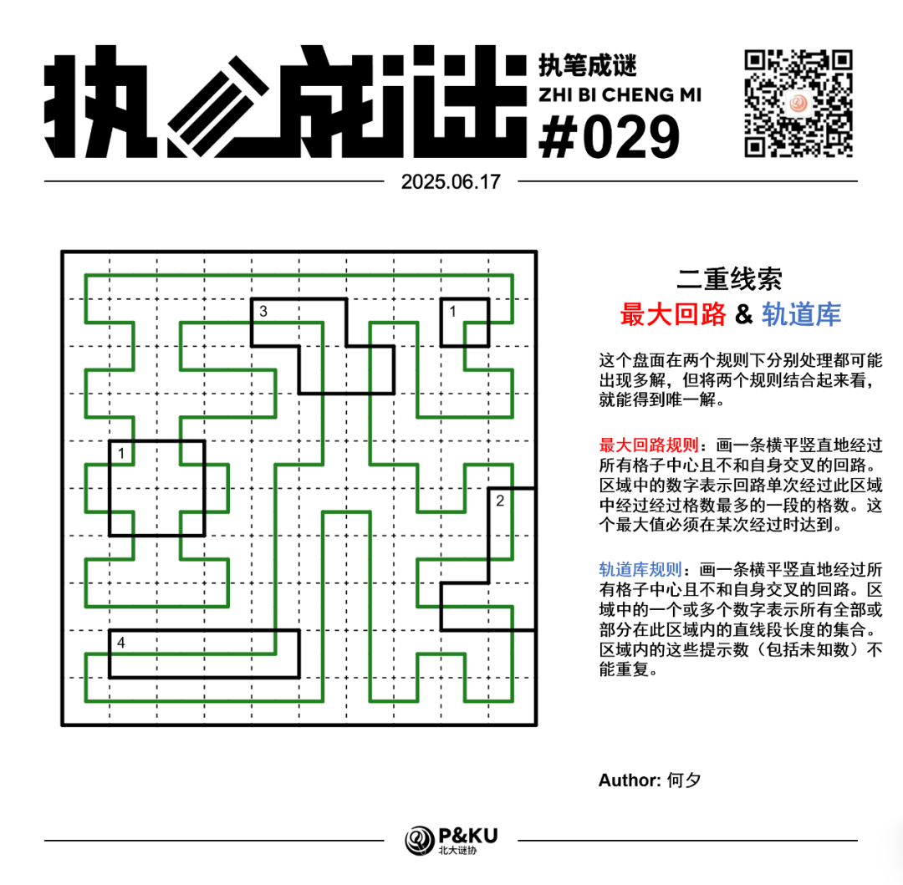

何夕老师为大家带来了一套由其编写的纸笔谜题，主题为 **Double Clue（二重线索）**。
**这一套谜题中，每一题在两个规则下分别处理都可能出现多解，但将两个规则结合起来看，就能得到唯一解。**
今天是该系列的第五题。本题的规则是极大回路(Maxi Loop)+轨道库(Rail Pool)。

{/* truncate */}

## Maxi Loop 极大回路规则

画一条横平竖直地经过所有格子中心且不和自身交叉的回路。区域中的数字表示回路单次经过此区域中经过经过格数最多的一段的格数。这个最大值必须在某次经过时达到。

## Rail Pool 轨道库规则

画一条横平竖直地经过所有格子中心且不和自身交叉的回路。区域中的一个或多个数字表示所有全部或部分在此区域内的直线段长度的集合。区域内的这些提示数（包括未知数）不能重复。

## 做题链接

你可以[在 penpa 网站上进行尝试](https://swaroopg92.github.io/penpa-edit/#m=edit&p=7VXPb9pMEL3zV1R73oP3h43tW5omvdB8TZMqiiwUGeIkKAanBprKiP89b2a3gMFVpVSqUukTeP32eXbmeXZnPP+2zOtCqoD+Jpa442dVzJeOI74C/7ucLMoifSePlouHqgaQ8r/TU3mXl/Oil3mrYW/VJGlzLpuPaSa0kHwpMZTNebpqPqXNQDYXeCRkDG4ApIQMAU8c1IBX/JzQsSNVAHwGbIABrwGn+eLBzT6nWXMpBcV4zysJimn1vRBuOc/H1XQ0IWK2nN6Vnpwvb6vHpTdTw7VsjpzKi58qKYBXabYqCTqVhPZV+tcgleNJPS6Lm8GrlI7yBVI+f5g8dclNhus1sv0Fgm/SjLR/3cJ4Cy/SFcYzHlW6Ekk/Ig8ulSJJ9Ob1sVHKtKZaBzTFHvLUhLzU+lxds89THjWPlwgpG8PjBx4DHkMeB2xzAg1GW2lMLFItBe7AiceJNBYxCVscSqs8VsCQRljDfoP7EnOPI+C+xyEwxDJGLB0y1hGda7cWd6kTZ4M7sFuLO7DzqWO7xf0Aa633k0jMtz4jp19r8NY4bA2wt7fwE3o/IexDbx/CPvJ+LDRscIi1XptRwF6/gQbjcsKxjLc3FMvrt9BvfSyDuBsMG+P0GPg0tNWMNbDTbBTy6f0zVj63AXLosU6wL4F/L2CdkD029oq395hHy2PE296nc/iKk/onJ+y3cjJkkrpd+xf+e9ywl6HpinlV3syX9V0+Ri/hnox2AQ7dblTULaqsqqdyMmvbTe5nVV10PiKyuL3vsh9V9e2e9+e8LFuE+8q0KNcVW9SiRsvbmed1XT23GG74u8ROe2x5KmaLtoBF3paYP+Z70abbd173xA/BV2boa/j/F+3vftEo88Fb6xZvTQ4f2qrurHjQHUUPtrO4PX9Q3+APKpkCHhYz2I56Brtf0qAOqxrkQWGD+0Vtk9f98iZV+xVOoQ6KnELt1nk27L0A)

## 提交格式示例

例如对于上面的轨道库样例，请提交 **011110**。

<AnswerCheck
  answer={'1110100011'}
  mitiType="zhibi"
  instructions={'依次输入第三行从左到右每一格是否拐弯（1 表示是，0 表示否）。'}
  exampleAnswer={'011110'}
/>

## 解答

<Solution author={'Winfrid'}>
  

</Solution>

### 步骤解析

  
查看步骤解析

  <Carousel arrows infinite={false}>
    <CarouselInner>
      左边的“1”区域和左下的“4”区域是突破口。根据极大回路规则，“1”区域之中，每两个格子之间都不能有连线，而“4”会穿过所有格子。而根据轨道库规则，“1”区域延伸出的所有线段都只能外延一格。
      

        
      

    </CarouselInner>
    <CarouselInner>
      然后根据轨道库规则，左下的“4”的最左侧的格子肯定不能向上或向下延伸，因为还没走到4格就会死。所以其必须向左延伸1格。而根据轨道库规则，最右侧的线就只能向上延伸4格了。
      

        
      

    </CarouselInner>
    <CarouselInner>
      接着我们用回路的基本规则，给左下部分扫个尾，顺带随手给四个角补上线头。
      

        
      

    </CarouselInner>
    <CarouselInner>
      然后考虑一下右下角的2。我们不妨考虑一下，极大回路规则下这个2表明，这个区域里一定有2个格子会在同次进入该区域时被涉及。那么它可以是中间两个格子吗（也即R8C10和R9C10）？
不行！因为假如这样的话，R9C10一定会向下延伸以避免向左触及第三个格子（极大回路规则）。但一旦向下，则又会触犯轨道库规则（这一段的长度是3）。
所以我们要在R8C10和R9C10之间画上×。
      

        
      

    </CarouselInner>
    <CarouselInner>
      

        
      

    </CarouselInner>
    <CarouselInner>
      给右下部分收个尾。
      

        
      

    </CarouselInner>
    <CarouselInner>
      接下来我们来看上方那个3。根据极大回路规则，这个3只存在两种可能性：经过了左边三个格子，或者经过了右边三个格子（红色）。
对于后者，我们着重考虑一下R2C6的线头应该从哪里伸出去：向上会被顶住，达不到轨道库规则要求的长度为3；向左会经过第四个格子，违反极大回路规则。似乎只能向右了，但是这样走会走到右上角的“1”区域，从而违反这个区域的轨道库规则！
      

        
      

    </CarouselInner>
    <CarouselInner>
      因此，这个区域里的“3”只能是经过左侧三个格子。
      

        
      

    </CarouselInner>
    <CarouselInner>
      给左上部分收个尾。
      

        
      

    </CarouselInner>
    <CarouselInner>
      接下来我们再看看上面那个区域“3”剩下来的格子。我们只考虑一件事：这个格子会存在向右的线头吗？
显然不会！因为假如存在的话，那么就说明它还要向上或向下走长度为3的线段，但这显然是做不到的。所以，这个格子里的线条就是单纯的竖着一条。
      

        
      

    </CarouselInner>
    <CarouselInner>
      收个尾。
      

        
      

    </CarouselInner>
    <CarouselInner>
      

        
      

    </CarouselInner>
  </Carousel>

