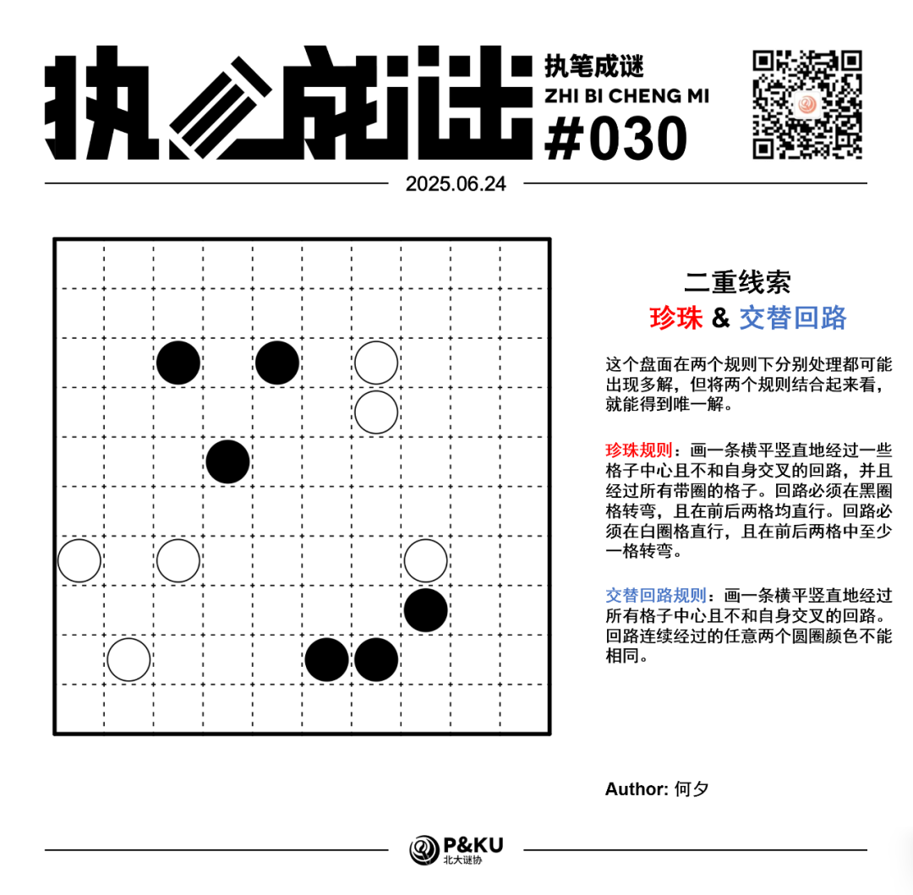
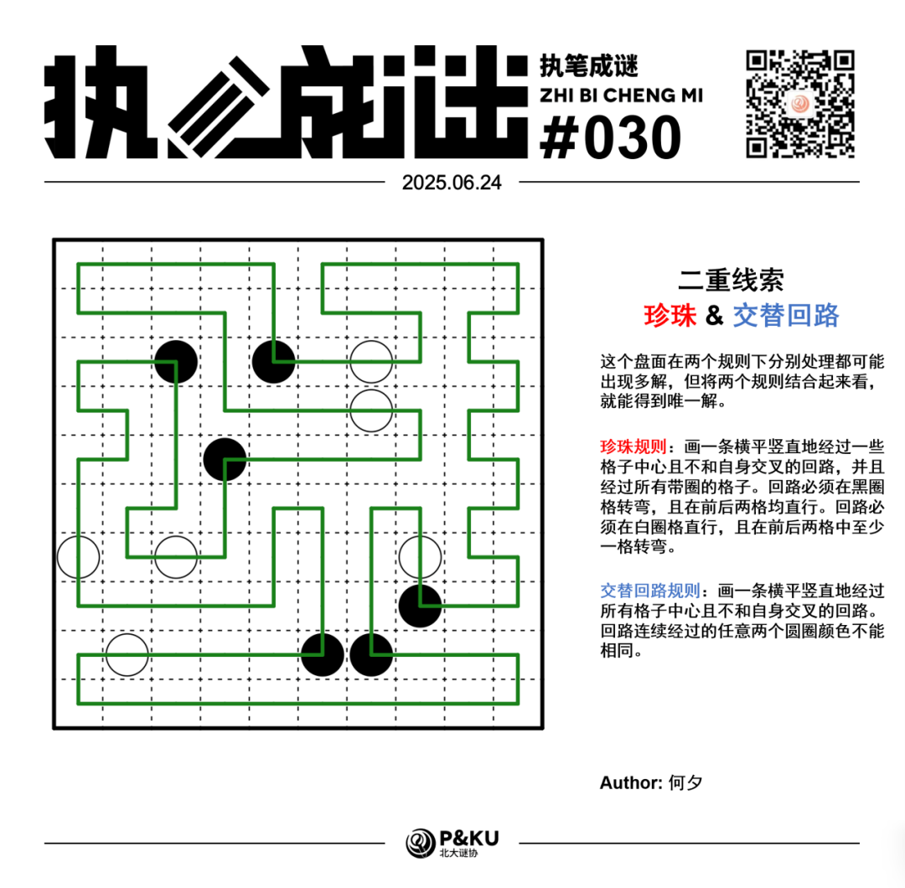

何夕老师为大家带来了一套由其编写的纸笔谜题，主题为 **Double Clue（二重线索）**。
**这一套谜题中，每一题在两个规则下分别处理都可能出现多解，但将两个规则结合起来看，就能得到唯一解。**
今天是该系列的第六题。本题的规则是珍珠(Masyu)+交替回路(Alternate Loop)。

{/* truncate */}

## Masyu 珍珠规则

画一条横平竖直地经过一些格子中心且不和自身交叉的回路，并且经过所有带圈的格子。回路必须在黑圈格转弯，且在前后两格均直行。回路必须在白圈格直行，且在前后两格中至少一格转弯。

## Alternate Loop 交替回路规则

画一条横平竖直地经过所有格子中心且不和自身交叉的回路。回路连续经过的任意两个圆圈颜色不能相同。

## 做题链接

你可以[在 penpa 网站上进行尝试](https://swaroopg92.github.io/penpa-edit/#m=edit&p=7ZXBb9owFMbv+Ssmn32IkxBCbl1XdmHdOphQFUXIQChRE9w5yToZ8b/3+SUTOPEumzZ10hT8+PjlYX8YPlN9bbjMKHP1w48oPMMVsAiHF4U43O5a5HWRxW/oVVPvhQRB6cfplO54UWVO0nWlzlFNYnVH1fs4IR6hOBhJqbqLj+pDrGZUzeEWoRGwGShG6AjkTSs9kEu8r9V1C5kL+ha0DxrkPchNLjdFtpq15FOcqAUlep23+G4tSSm+ZaSdAl9vRLnONTg05a7oYNVsxWPTtbH0RNVV63T+w6leoHPqn51q2TrVqu+0+yi/7XTNa9j2ap8/2exO0tMJdvwzGF7Fifb+5Syjs5zHR6i3WBnW+/hIQhem8WCxS4Mk9Kw0AMr6dBzZaDSxzcCYdQrGQiv2mBX7I+vcgW/tDsb2bm27h2FPprgzHtYFbBxVPtZ3WF2sI6wz7LnBusR6jTXAGmLPWG/9L385f8hO4rchN6/Rv8dSJ4GzhlSiWFWN3PENxAePIkgIMAj4OpMGKoR4KvKD2Zc/HITMrLc0zLYPtv61kNve7M+8KAzQHq4Gan9uBqolpPziNZdSPBuk5PXeABcngjFTdqhNAzU3LfJH3lutPH/mk0O+ExyJr/8E/h/kf/8g17vvvrYT47XZwR+ukNbUA7YEH6g14B0fZBz4IM16wWGggVoyDbQfa0DDZAMchBvYT/KtZ+1HXLvqp1wvNQi6Xuoy60nqvAA=)

## 提交格式示例

例如对于上面的珍珠样例，请提交 **121121**。

<AnswerCheck
  answer={'2121211222'}
  mitiType="zhibi"
  instructions={'依次输入第三行从左到右每一格是否拐弯（2 表示是，1 表示否）。'}
  exampleAnswer={'121121'}
/>

## 解答

<Solution author={'怎苏昂'}>
  

</Solution>

### 步骤解析

  
查看步骤解析

  <Carousel arrows infinite={false}>
    <CarouselInner>
      本期二重线索有意思的点在于交替回路变相给珍珠加了全局条件。首先我们可以通过珍珠条件得到下图：
      

        
      

    </CarouselInner>
    <CarouselInner>
      然后通过交替回路全通过的条件得到下图。
      

        
      

    </CarouselInner>
    <CarouselInner>
      考虑第三行的两个黑珍珠不能直接相接，得到下图。
      

        
      

    </CarouselInner>
    <CarouselInner>
      R3C3的黑珍珠不能往上走，否则会提前封闭回路。
      

        
      

    </CarouselInner>
    <CarouselInner>
      

        
      

    </CarouselInner>
    <CarouselInner>
      利用类似于简单回路避免形成四格小环的性质，可以得到R5C1和R6C1的线。进而通过白珍珠前后必须要至少一个拐弯得到下图。
      

        
      

    </CarouselInner>
    <CarouselInner>
      进一步对黑珍珠的朝向进行讨论，结合全通过回路每个格子必须往两侧伸出的性质得到下图。
      

        
      

    </CarouselInner>
    <CarouselInner>
      考虑交替回路的黑白经过的交替规则得到R7C67不能接在一起。于是得到R7C6必须往上延伸。进一步避免回路提前闭合，并进一步利用交替性质得到下图。
      

        
      

    </CarouselInner>
    <CarouselInner>
      最后反复利用回路的性质，注意一下R4C7的白珍珠即可得到最终的答案。
      

        
      

    </CarouselInner>
  </Carousel>

