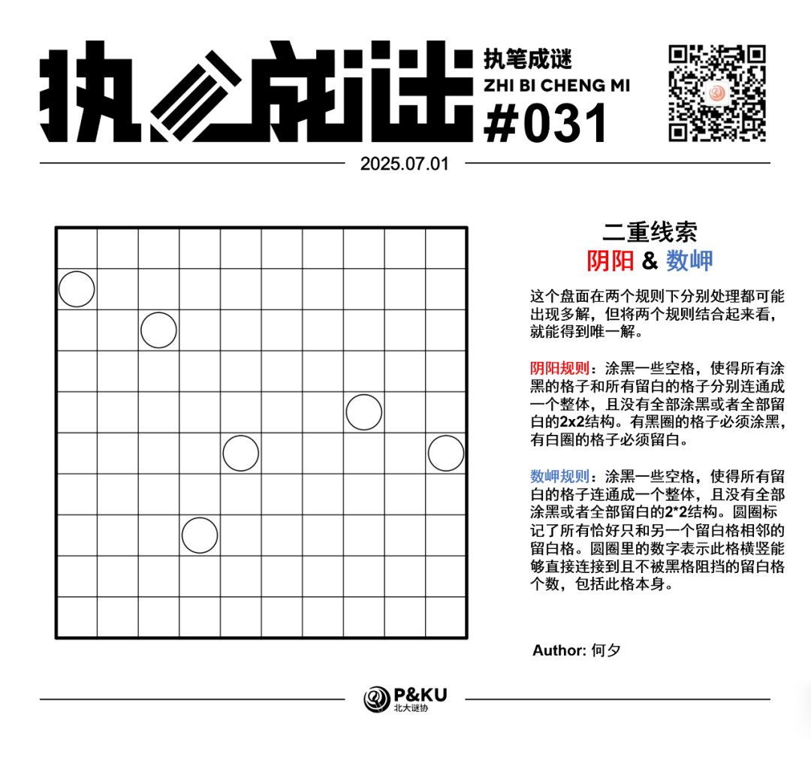
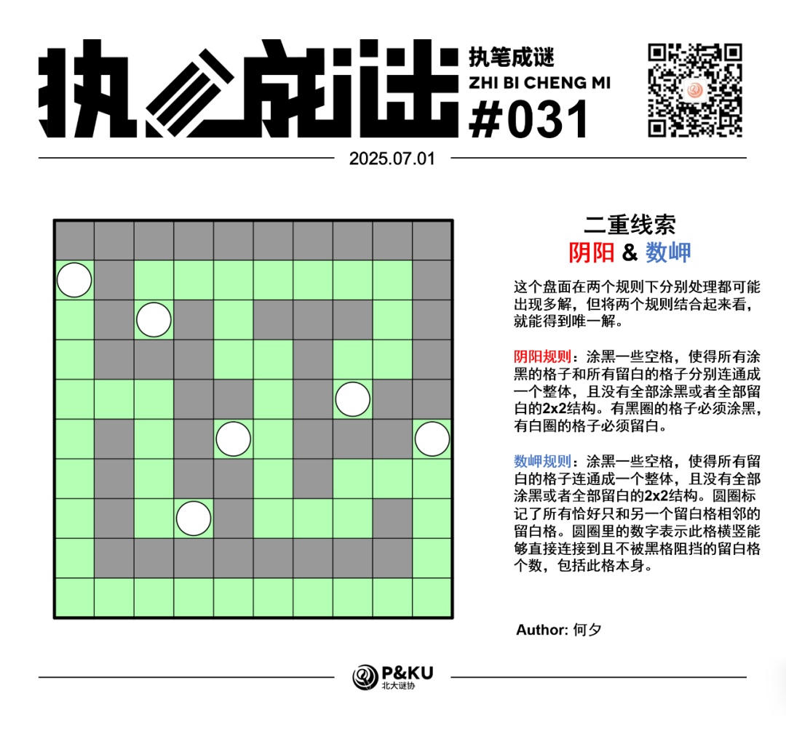

<WechatArticleLink
  href="https://mp.weixin.qq.com/s?__biz=MzkwMDc0MzAwNw==&mid=2247486162&idx=1&sn=de5465ba9faf9210d819e88a0f4eab54&chksm=c0be20e2f7c9a9f49468099a4b8e98ab67347906e179f59e9b79d2f4bb429008f2ad756c9e08#rd"
/>

何夕老师为大家带来了一套由其编写的纸笔谜题，主题为 **Double Clue（二重线索）**。
**这一套谜题中，每一题在两个规则下分别处理都可能出现多解，但将两个规则结合起来看，就能得到唯一解。**
今天是该系列的第七题。本题的规则是阴阳(Yinyang)+数岬(Nurimisaki)。

{/* truncate */}

## Yinyang 阴阳规则

涂黑一些空格，使得所有涂黑的格子和所有留白的格子分别连通成一个整体，且没有全部涂黑或者全部留白的2\*2结构。有黑圈的格子必须涂黑，有白圈的格子必须留白。

## Nurimisaki 数岬规则

涂黑一些空格，使得所有留白的格子连通成一个整体，且没有全部涂黑或者全部留白的2\*2结构。圆圈标记了所有恰好只和另一个留白格相邻的留白格。圆圈里的数字表示此格横竖能够直接连接到且不被黑格阻挡的留白格个数，包括此格本身。

## 做题链接

你可以[在 penpa 网站上进行尝试](https://swaroopg92.github.io/penpa-edit/#m=edit&p=7ZTvb6JMEMff+1dc9m03eViwHpLcC2q11561ttV4QohBuiotuL0FbA/j/97ZxUZ+tblc0qRPcsEdh88sszML+41+JS6nmCjip+kY/uFqEl0OVW/JoeyvkR8H1PiCzSReMQ4Oxle9Hl64QUTxxXTV7zDz6dT8udFjyyJnSnKuTO5790c34Y9zX+OkN9CHl8NLX12a3zsn163uUWuYROOYbq5DcnI/tkaL4WTZVn93B1Yzta6U4wtr8d/GHH9r2PsanMY2bRupidMzw0YEYaTCIMjB6bWxTS+NdIrTWwghrDsYhUkQ+x4LGEeSEZjXzx5Uwe0e3ImMC6+TQaKAP9j74E7B9XzuBXTWz8jQsNMRRmLtE/m0cFHINlQsJmoT9x4L574AczeG7YtW/iPCGgSi5I49JPupxNnh1Mw6uP3DDiDJawfCzToQXk0HorGP7aDt7Hbwcm6gh5lhi3bGB1c/uLfGFuxAWiLt1NiiZhPSEFgrXx9qKXW0rdVRotSmIEq7FmukiqGWnqxIlXYEBeNUk/ZUWkXaY2n7ck5X2om0HWmb0rbknK+i5b/elA8qx9ayU168jv9/zGnYIAcoYsEsSvjC9eiMPrtejIxMkfKRAlsn4ZzCecqhgLHHwF/XZXgNFaC/XDNOa0MC0rvlW6lEqCbVnPG7Uk1PbhAUe5FqXUDZ51tAMYfDmrt3OWdPBRK68aoAcge7kImuS5sZu8US3Qe3tFp42I5dAz0jOWwNq+J9/dPuT6zd4kUpn02sPls58htn/B3BOQTLuEZ2gL6jPLloHX9DZHLRMq8oiii2KipAa3QFaFlaAFXVBWBFYIC9oTEia1lmRFVlpRFLVcRGLJXXG9tpvAA=)

## 提交格式示例

例如对于上面的阴阳样例，请提交 **22425**。

<AnswerCheck
  answer={'0265554380'}
  mitiType="zhibi"
  instructions={'依次输入每一行的黑格数目，只需提交个位。'}
  exampleAnswer={'22425'}
/>

## 解答

<Solution author={'怎苏昂'}>
  

</Solution>

### 步骤解析

  
查看步骤解析

  <Carousel arrows infinite={false}>
    <CarouselInner>
      本期二重线索首先比较重要的点在于边界上的两个白圈。考虑最常见的阴阳定式有两个：一个是最外圈必须最多只能有一段黑一段白，一个是不能出现类似于棋盘格的2x2结构。所以处于边界上的两个白圈要么往上相互连接要么往下相互连接，如下所示。
      

        
      

    </CarouselInner>
    <CarouselInner>
      

        
      

    </CarouselInner>
    <CarouselInner>
      然而，如果我们采取白格往上连接的方式，很容易发现右下角如果要满足“黑色不2x2”和“不被圈标记的白格至少和两个白格相邻”，那么就会出现“白色2x2”的矛盾。（四个红色格子都是白的）
      

        
      

    </CarouselInner>
    <CarouselInner>
      故两个边界上的白圈通过盘面下方联通。然后结合“白圈标记了所有的死胡同”和“黑色不2x2”得到如下盘面：
      

        
      

    </CarouselInner>
    <CarouselInner>
      而后利用阴阳的“不能出现2x2的黑白交错形状”定式和“黑色联通”得到下盘面。
      

        
      

    </CarouselInner>
    <CarouselInner>
      在非圈白格进行延伸之后，得到如下盘面，然后注意到如果红色两个格子都是黑格，那么会破坏白格的联通性。
      

        
      

    </CarouselInner>
    <CarouselInner>
      

        
      

    </CarouselInner>
    <CarouselInner>
      而后对R8C3的黑白属性进行穷举得到必须是白格。
      

        
      

    </CarouselInner>
    <CarouselInner>
      然后对R6C5的圆圈朝向进行穷举得到必须朝右。顺着这个逻辑推演得到下图。
      

        
      

    </CarouselInner>
    <CarouselInner>
      R8C6不能是黑格（造成非圆圈的死胡同），R7C8同理。
      

        
      

    </CarouselInner>
    <CarouselInner>
      最后对R9C9的黑格连接到左侧或者上方进行一些小穷举得到最终答案。
      

        
      

    </CarouselInner>
  </Carousel>

总体来看。这道题目需要的小穷举有些多，这是由于数岬规则和阴阳规则都是对盘面全局进行限制导致部分逻辑并不是那么显然。但另一方面，全局的限制够强也使得控制出唯一解是一件非常优美的事情。这也是这道题目较有艺术的原因。

