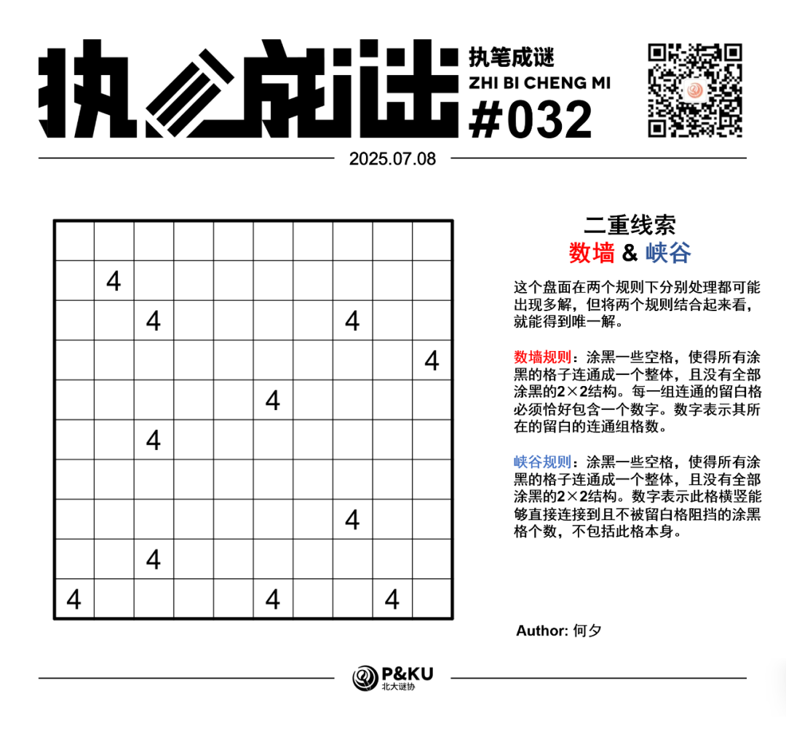
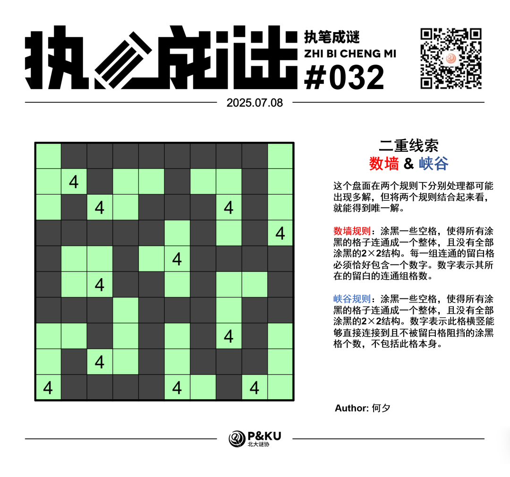

<WechatArticleLink
  href="https://mp.weixin.qq.com/s?__biz=MzkwMDc0MzAwNw==&mid=2247486207&idx=1&sn=a8e6e80249770bc7e6e9b9ff810067f2&chksm=c0be20cff7c9a9d90e7ae9c7284b803ad1b1bbabc86bf2f3d90b8e3bb17b4c99f112c62a39ed#rd"
/>

何夕老师为大家带来了一套由其编写的纸笔谜题，主题为 **Double Clue（二重线索）**。
**这一套谜题中，每一题在两个规则下分别处理都可能出现多解，但将两个规则结合起来看，就能得到唯一解。**
今天是该系列的第八题。也是本系列的最后一题。我们将会在下下周带来新一期。本题的规则是数墙(Nurikabe)+峡谷(Canal View)。

{/* truncate */}

## Nurikabe 数墙规则

涂黑一些空格，使得所有涂黑的格子连通成一个整体，且没有全部涂黑的2×2结构。每一组连通的留白格必须恰好包含一个数字。数字表示其所在的留白的连通组格数。

## Canal View 峡谷规则

涂黑一些空格，使得所有涂黑的格子连通成一个整体，且没有全部涂黑的2×2结构。数字表示此格横竖能够直接连接到且不被留白格阻挡的涂黑格个数，不包括此格本身。

## 做题链接

你可以[在 penpa 网站上进行尝试](https://swaroopg92.github.io/penpa-edit/#m=edit&p=7ZVtb9owEMff8ykmv62l5YksRNqLlELXjlLaghiJEAo0QNoEd3mgXVC/e++cVCQmrTRNmjppCj6O39nnOxv+xD9TN/KoLOFLNSi8w6PJBh+KofMhFc/QTwLP/EStNFmzCBxKL7tdunSD2KPnk3WvzazHE+vH1khsWz6V0jNpfNe9O7oOv5/5aiR3+8bgYnDhKyvrW/v4Su8c6YM0HiXe9iqUj+9G9nA5GK9ayq9O39Yy+1JqntvLz1tr9LXhFDVMG7usZWYWzU5Nh8iEEgWGTKY0uzJ32YWZ9Wl2AyFCDWC9fFIT3E7uKuCOeRy9dg5lCfx+4YM7AXfhR4vAm/VyMjCdbEgJ7nPMV6NLQrb1SFEHfl6wcO4j2KThMihgnN6y+7SYBrlImAaJv2ABixAie6aZlVd/81o9blpUr+6rRzevHr2a6rGpP65+7iZw0fHaf6hroVXfwjPczDU0MTMd7Ge0d429e2PuwPbNHdGauFKDpfn1EV0SgTjDkAXQEoEsKSJRxSyypomkqYtEP8isV1dBFzLvZcJtl1uF2yG0SjOV2xNuJW6b3Pb4nA63Y27b3Grc6nzOFzys3zrOv1COo+biUH2a/x6bNhxQERKzYBan0dJdeDPvyV0kxMyFrBypMPhRzz34wpdQwNhD4G/qMryGKtBfbVjk1YYQerert1JhqCbVnEW3Qk2PbhBUe+EiX0G5PFRQEsFvv/TZjSL2WCGhm6wroKQTlUzeRjjMxK2W6N67wm7h/jieG+SJ8OGo+Gf0X/I/ruTjLUkfTak+Wjn8C86id9RmHxRxjeYAfUd2StE6/obClKIiP5ATLPZQUYDWiApQUVcAHUoLwAN1AfaGwGBWUWOwKlFmcKsDpcGtymLjTBsv)

## 提交格式示例

例如对于上面的峡谷样例，请提交 **45266354**。

<AnswerCheck
  answer={'8357658455'}
  mitiType="zhibi"
  instructions={'依次输入每一行的黑格数目，只需提交个位。'}
  exampleAnswer={'45266354'}
/>

## 解答

<Solution author={'何夕'}>
  

</Solution>

### 步骤解析

  
查看步骤解析

  <Carousel arrows infinite={false}>
    <CarouselInner>
      对于左下角的4，只有两个相邻格，其必须在一个方向上看到4个黑格，在另一个方向上延伸出4个白格。由于临近处还有一个4，向右无法延伸出4个白格，得到下图。
      

        
      

    </CarouselInner>
    <CarouselInner>
      对于第9行第3列(简称r9c3，下同)的线索，其至多向右看到1个黑格，故其上方是黑格。同时r10c6的黑格已经看到4个黑格。由此得到下图。
      

        
      

    </CarouselInner>
    <CarouselInner>
      对r10c9的4进行类似分析，得到下图。
      

        
      

    </CarouselInner>
    <CarouselInner>
      若r9c7留白，会导致r8c78均涂黑，导致r8c9的线索不成立。由此得到下图。
      

        
      

    </CarouselInner>
    <CarouselInner>
      若r7c1留白，会导致r78c2均涂黑，矛盾。由此得到下图。
      

        
      

    </CarouselInner>
    <CarouselInner>
      若r6c8涂黑，最终会导致白格如图将盘面分为两部分，矛盾。由此得到下图。
      

        
      

    </CarouselInner>
    <CarouselInner>
      若r6c2涂黑，会导致r6c1的留白无法连至任一数字，矛盾。由此得到下图。
      

        
      

    </CarouselInner>
    <CarouselInner>
      r4c3留白会导致r6c3的4无法延伸出4格。进一步的r5c3不能涂黑，否则会导致r6c3的4看到5格黑格，由此得到下图。
      

        
      

    </CarouselInner>
    <CarouselInner>
      r34c12的白格只能由r2c2的4提供。得到下图。
      

        
      

    </CarouselInner>
    <CarouselInner>
      r1c12不能全涂黑，且其中的黑格需要延伸。经过一系列分析得到下图。
      

        
      

    </CarouselInner>
    <CarouselInner>
      r5c6所看到的黑格不能全向上，也不能右3上1(均迅速矛盾)。由此得到下图。
      

        
      

    </CarouselInner>
    <CarouselInner>
      r3c8的4需要向左看到黑格。随后便可得到最终答案。
      

        
      

    </CarouselInner>
  </Carousel>

