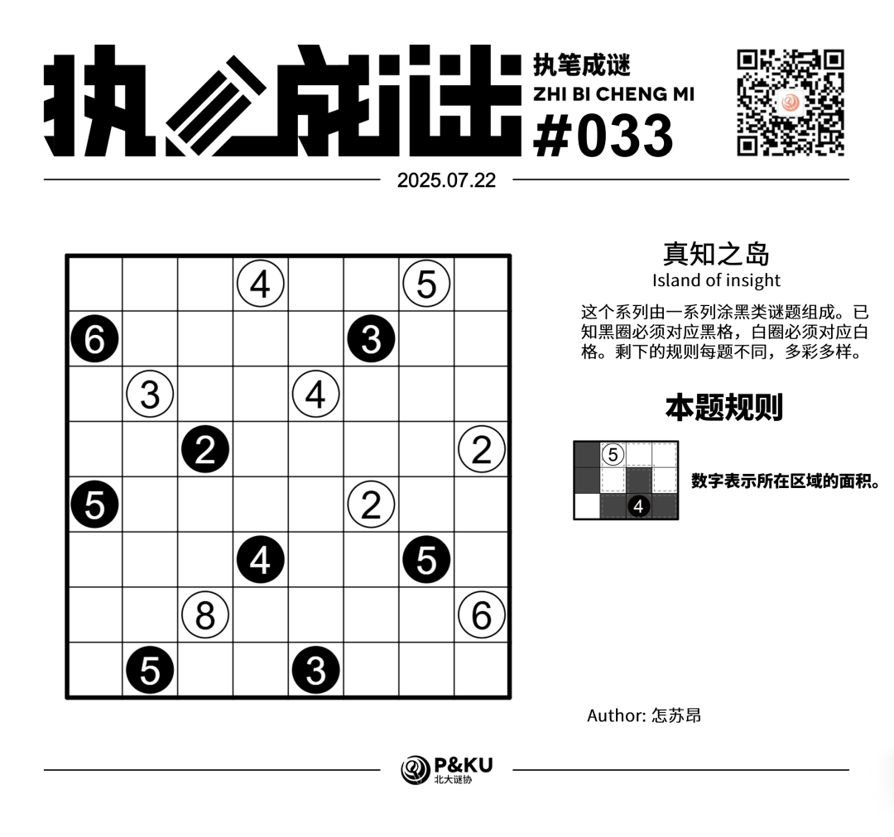
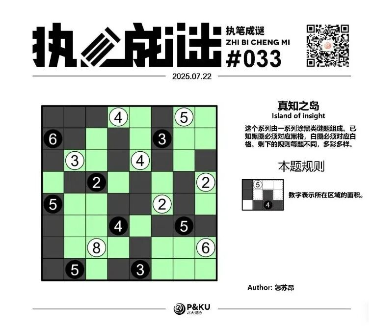

<WechatArticleLink
  href="https://mp.weixin.qq.com/s?__biz=MzkwMDc0MzAwNw==&mid=2247486252&idx=1&sn=db93c34d22b0d7373a7c030db8c2bcd0&chksm=c0be211cf7c9a80ad63daaddf2250cce5590c7389d4bb5ecc7f3c8068c9813615c9c49a57896#rd"
/>

怎苏昂老师为大家带来了一套由其编写的纸笔谜题，主题为 **真知之岛（Island of insight）**。
这个系列由一系列涂黑类谜题组成。已知黑圈必须对应黑格，白圈必须对应白格。剩下的规则每题不同，多彩多样。

今天是该系列的第一题。本题的规则称为 **逻辑网格（Logic Grid）**。

{/* truncate */}

## Logic Grid 逻辑网格规则

数字代表所在区域的面积。

## 做题链接

你可以[在 penpa 网站上进行尝试](https://swaroopg92.github.io/penpa-edit/#m=edit&p=7ZVdT+pMEMfv+RRmb93kdFsopcm5QASPHkAUCEcaQgoWqLasT1/QU8J3d3ZK7Qto4o2PFyfNTqa/mZ2d3S1//P9C07OoBo+iUYkyeJSyjEOWajik/TOwA8fST2g9DFbcA4fS61aLLkzHt+jV3ard4PXn8/qfjRaMx+xCCi+l0UPr4fTW/X1pKx5rdbVep9ex5WX9V+PsRm2eqr3QHwbW5sZlZw/D8WDRGy1r8t9md1yOxtdS5Wq8+LGpD3+WjH0Pk9I2qulRnUYXukEYoUSGwciERjf6NuroUZ9GfQgRyiaUuKET2HPucI8kLGrHE2Vwm6k7wrjwGjFkEvjd2K+Cewfu3PbmjjVtx4V6uhENKBFrn+Fs4RKXbyyxmOhNvM+5O7MFmJkBHJ+/sp8IVSDgh/f8MdynssmORvXP7QCKJDsQbrwD4f0vO6hNdju4nFvYw1Q3xHaGqaulbl/fgu3qWyLXxNQyoWp8g0SRBahkgCaACu3vQVkRQElBhe1BMqVSLhRVEcBXkkxRcVkASUYVM2DZJKNazNCSTpOMWtJpApgkCaKlc5hU2Tf/Rhg2m53FcOm3/cDBMDyeO7QttDLaAZwejRS052gltBW0bcxpoh2hbaAto1UxpyrO/1M39AXtGLKKkpM+la99n5QM0g+9hTm34HPvhu7M8k663HNNJ32Hn0vidlK3T0CNiM+dqR8XmFov5jwgeiyI2UiOrXF6DjmcPzn2+liFJJSD9nLNPetoSEDrfvleKRE6UmrGvftCT8+m4+T3gn8VORTLSQ4FHmhF5t30PP6cI64ZrHIgoyu5Sta6cJiBmW/RfDQLq7npcexK5IXgMBQqi5v+99fxjf86xEVJ302evls7+I1z7wPBSYNFfER2gH6gPJnoMf6OyGSiRX6gKKLZQ1EBekRXgBalBdChugA8EBhg72iMqFqUGdFVUWnEUgdiI5bK6o0xKb0C)。

## 提交格式示例

例如对于上面的样例，请提交 **123**。

<AnswerCheck
  answer={'44444524'}
  mitiType="zhibi"
  instructions={'依次输入每一行黑格数目，只需提交个位。'}
  exampleAnswer={'123'}
/>

## 解答

<Solution author={'孔明七星'}>
  

</Solution>

### 步骤解析

  
查看步骤解析

  <Carousel arrows infinite={false}>
    <CarouselInner>
      首先考察右上角白5的可及范围（局部上从白5出发可以延伸到的、不致矛盾的所有格子），即图中蓝色格所示，可以发现白5的可及范围只有6格。白5所在的区域为这6格中的5格，因此必定包含r2c8和r3c7至少其一，从而推出r3c8是黑格。类似地，右侧白2延伸到两个橙色格之一，就推出r5c7是黑格。
      

        
      

    </CarouselInner>
    <CarouselInner>
      接下来考察r5c6的白2。若其向左延伸，将导致下方的黑4和黑5通过黑格相连；若其向下延伸，则右侧的白6和白2所在区域只能如图所示，导致右侧黑5不成立。因此该白2只能向上延伸。
      

        
      

    </CarouselInner>
    <CarouselInner>
      由此可以确定右侧的白2和黑5。
      

        
      

    </CarouselInner>
    <CarouselInner>
      

        
      

    </CarouselInner>
    <CarouselInner>
      上方黑3若向左延伸，将导致上方的白4和白5通过白格相连，向右延伸则导致白5无法满足。因此其只能向上延伸，由此可以确定其两侧的白4和白5。
      

        
      

    </CarouselInner>
    <CarouselInner>
      左侧的黑2显然不能向上或向右延伸。若其向下延伸，将导致左上角白3所在的区域至少有4个白格，也矛盾。因此其只能向左延伸。
      

        
      

    </CarouselInner>
    <CarouselInner>
      由此不难解出左上角。
      

        
      

    </CarouselInner>
    <CarouselInner>
      最后考察下方黑4的可及范围（图中灰色区域），可以推出黑4上方一格必为黑格，从而确定了黑4所在区域。
      

        
      

    </CarouselInner>
    <CarouselInner>
      

        
      

    </CarouselInner>
    <CarouselInner>
      由此即可完成盘面。
      

        
      

    </CarouselInner>
  </Carousel>

