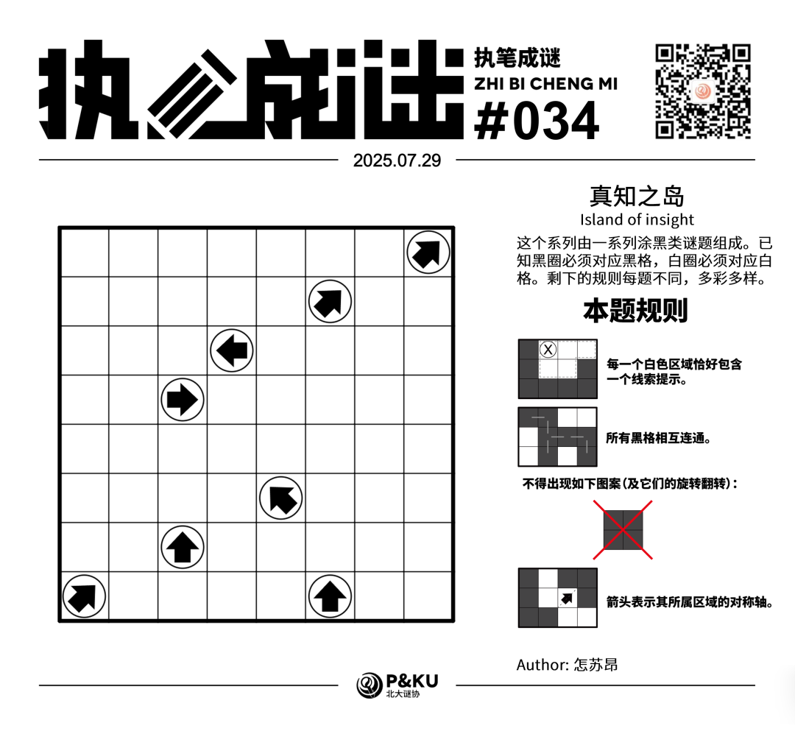
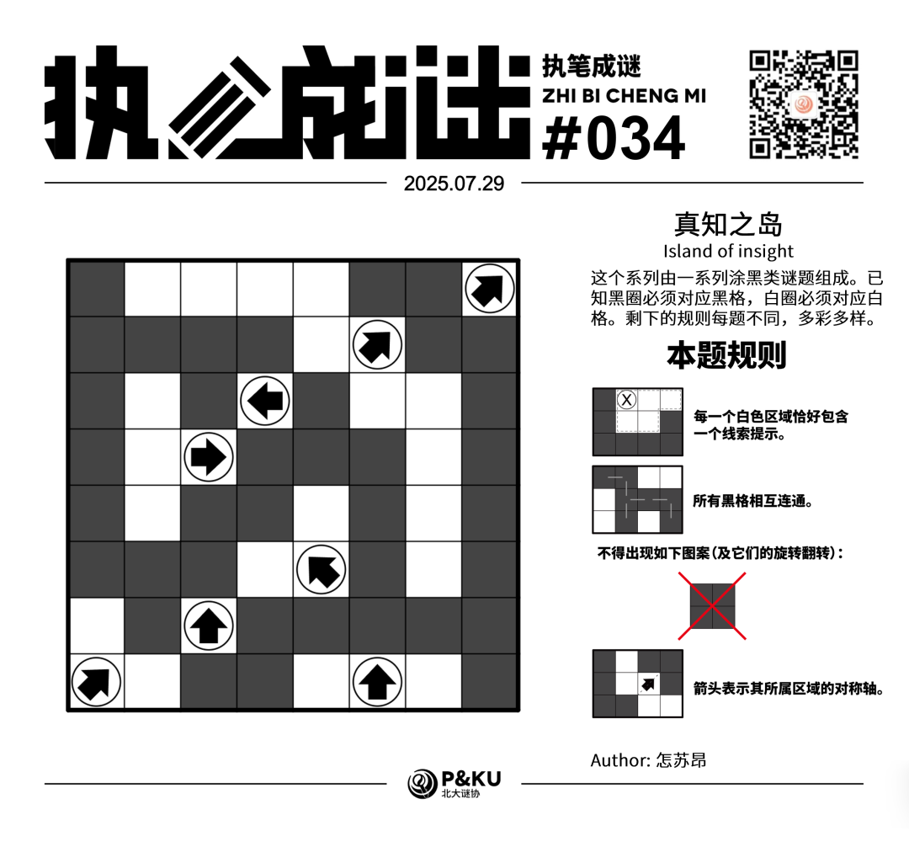

<WechatArticleLink
  href="https://mp.weixin.qq.com/s?__biz=MzkwMDc0MzAwNw==&mid=2247486287&idx=1&sn=4c7c4ef7c35e83b7f260f39317dce86f&chksm=c0be217ff7c9a869a621443ef94a6dee8d048048561f1eb2e8cfba4d88c85b49aece39fe2962#rd"
/>

怎苏昂老师为大家带来了一套由其编写的纸笔谜题，主题为 **真知之岛（Island of insight）**。
这个系列由一系列涂黑类谜题组成。已知黑圈必须对应黑格，白圈必须对应白格。剩下的规则每题不同，多彩多样。

今天是该系列的第二题。本题的规则称为 **逻辑网格（Logic Grid）**。

{/* truncate */}

## Logic Grid 逻辑网格规则

- 每一个白色区域恰好包含一个线索提示。
- 所有黑格相互连通。
- 不得出现全部涂黑的 2×2 结构。
- 箭头表示其所属区域的对称轴。

## 做题链接

你可以[在 penpa 网站上进行尝试](https://swaroopg92.github.io/penpa-edit/#m=edit&p=7VVbb+I8EH3nV6z8WkvNBdgQqQ/cWqlq2bLQZWmEkAFT0hrc5tJWQf3vHU+oyMVU+nbVT31YRR5NznHsOePkJHyMWcCpA5ftUIOacNlVC4dlNHAYu2voR4K732gzjlYygITSHz26ZCLk9Hx81+rcN5+7zd/HtRvbvu4tj+46/eu7xeiX2Tf848DoCWdzedVpiaOz5OZy1XziXV6/CuV8JThbsORmdP4iNqfO7Wppts9XbWfJNkb46AwbT63+yUnF29UxqWyThps0aXLmesQklFgwTDKhSd/dJpduMqbJAChCHcAu0kk2pN00tSAdIa+ydgqaBuS9NK9DOoaUBYF8ng5AbJTOvXK9ZEiJ2qqFC6iUrOUTJ7tS1P1crme+AvD5Ae5Nwngh7+PdNFM9FYvIn0shAwUq7JUmzVTA4GMBKk0FqEwjQNWqBMz9YC749AJ3/K/Vz1gE5x2u/Icdk5PQ0Et4hcP5CSKmrqf0XO9TZ58O3C3EHkYT49jdEtuGVaq01HVSPUTUFGFqiHoViJqGaBhAWBrCNBRj6xhTMbrtTbOmfQb0nKIqC+MQRNPExtjBaGCsYbzAOV2MI4xtjFWMdZzzXbXtLxsLbcq9DWlXS+h7S/Mo9rOEYjNLaNrJMoxt1MCqhwX4kxroWXX0t/1V+3/vJxUPzIuEUkzDOFiyOZ/yFzaPiJuaaJbJYZt4PePwkWUgIeWD8De6Fd6pHOjfbmTAtZQC+eL20FKK0iw1k8GiUNMzEyKvBf8uOSg95xwUBeA3mXv8nHLImkWrHJDxptxKfFNoZsTyJbJ7VthtvW/Ha4W8EBzwVVvqvP79ab7wn0YdlPHHtvjFXPqzysF3XAYfGM6eLMIa2wH0A+fJsDr8gMlk2CJechRVbNlUANX4CqBFawGo7C4AlgwGsAMeo1Yt2oyqqug0aquS2aitsn7jTSpv)。

## 提交格式示例

例如对于上面最下方的样例，请提交 **322**。

<AnswerCheck
  answer={'36455563'}
  mitiType="zhibi"
  instructions={'依次输入每一行黑格数目，只需提交个位。'}
  exampleAnswer={'322'}
/>

## 解答

<Solution author={'怎苏昂'}>
  

</Solution>

### 步骤解析

  
查看步骤解析

  <Carousel arrows infinite={false}>
    <CarouselInner>
      首先每个白色区域只有一个线索，得到一些涂色格子。注意到如果粉色格留白，黄色格就必须涂黑，黑格就被隔断了。
      

        
      

    </CarouselInner>
    <CarouselInner>
      考虑右下角的红色2x2区域，其中必须要有一个白色格子。考虑可及性，只有右上角那个红色标记的箭头是能够以对称的方式触碰到这个2x2区域并对称到一个可及的地方。具体见后面一张图。
      

        
      

    </CarouselInner>
    <CarouselInner>
      

        
      

    </CarouselInner>
    <CarouselInner>
      考虑黑格延伸和对称轴得到下图。
      

        
      

    </CarouselInner>
    <CarouselInner>
      继续延伸，同时注意到一个区域只能有一个箭头，以及涂色区域不能2x2得到：
      

        
      

    </CarouselInner>
    <CarouselInner>
      延伸左上角的黑格区域得到一个T字形的区域。接着运用对称轴和不2x2得到下图：
      

        
      

    </CarouselInner>
    <CarouselInner>
      最后考虑黑格联通性和右下角区域的确定得到最终答案。
      

        
      

    </CarouselInner>
  </Carousel>

