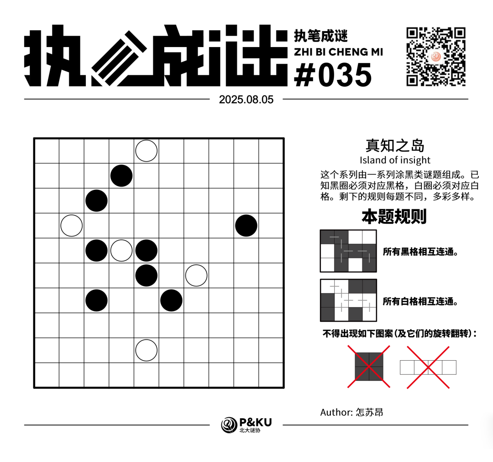
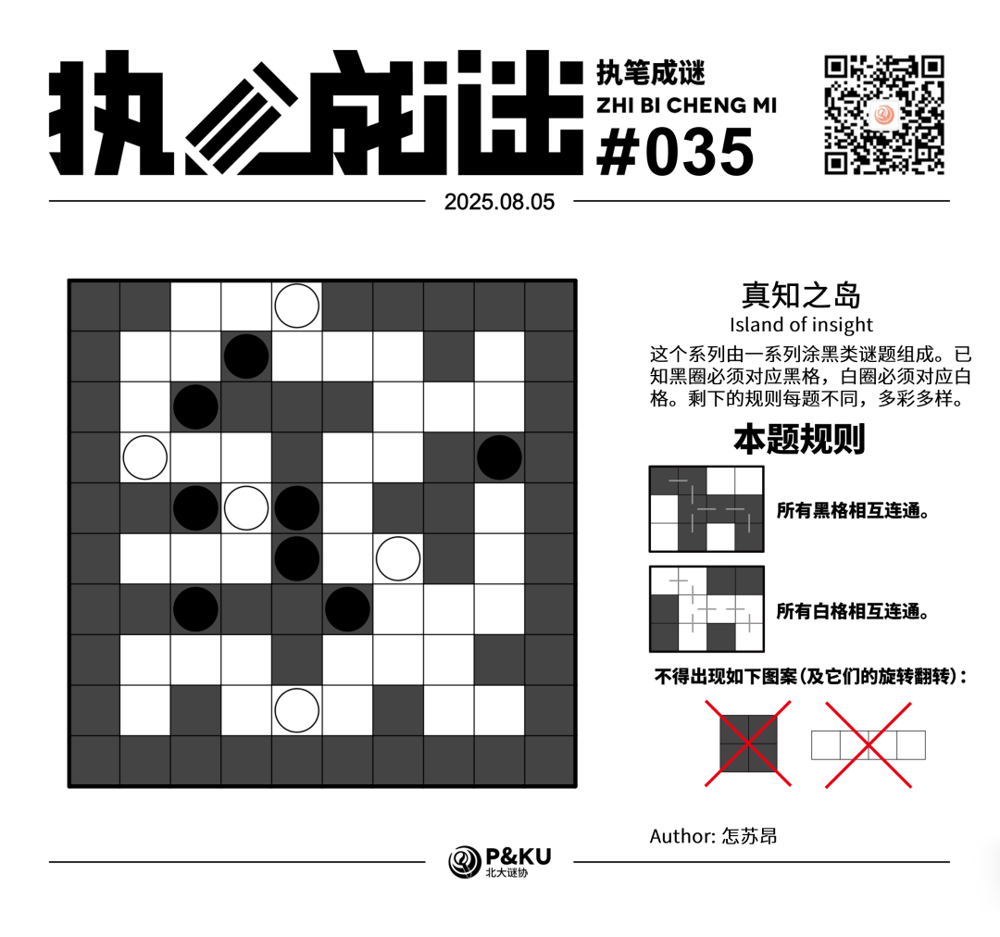

<WechatArticleLink
  href="https://mp.weixin.qq.com/s?__biz=MzkwMDc0MzAwNw==&mid=2247486318&idx=1&sn=1b74c1ec1b484c00e6931685ba7855a4&chksm=c0be215ef7c9a8483d8fd6711f3d81440a17b7858bf646114be95ae7b7d7e15a1a953004ebf6#rd"
/>

怎苏昂老师为大家带来了一套由其编写的纸笔谜题，主题为 **真知之岛（Island of insight）**。
这个系列由一系列涂黑类谜题组成。已知黑圈必须对应黑格，白圈必须对应白格。剩下的规则每题不同，多彩多样。

今天是该系列的第三题。本题的规则称为 **逻辑网格（Logic Grid）**。

{/* truncate */}

## Logic Grid 逻辑网格规则

- 所有黑格相互连通。
- 所有白格相互连通。
- 不得出现全部涂黑的 2×2 结构。
- 不得出现四个横向或纵向连续的白格。

## 做题链接

你可以[在 penpa 网站上进行尝试](https://swaroopg92.github.io/penpa-edit/#m=edit&p=7VXfb9owEH7nr6j8WkuLE36ESHugFLp2QGkBMYgQCtRA2gQzJ6FdEP97zw4IEtw+VKvUSVPw8eW7y/nuDF+C35HDKSaa+Bgmhm+48sSUSzeLcmm7q+uGHrXOcCUKF4wDwPi2XsczxwsovhksGlVWeb6s/Fqb4XBIrrToWus/1h/P7/2f167BSb1ltpvtpqvPKz+qF3fF2nmxHQW9kK7vfHLx2Bt2Z+3+vKz/qbWG+Xh4qxVuhrNv60rve87e1TDKbeKyFVdwfGXZiCCMdFgEjXB8Z23iphUPcNwBF8L5EUZ+5IXulHmMI8kRiGskDxIdcC3BAvZlgEDVXUABcCvBRYADgFOXTz06biSZ2pYddzESm1/IpwVEPltTsZsoTtxPmT9xBTFxQphfsHBXCBvgCKIH9hTtQsloi+NK0kJn3wJs8l4LkGTfgYBJBwLtO9AOHZT+Rgeeu6QviuLLo+0WDuYeyh9btuikd4DmAXasDdiWtETagbVBRh7SENjmuDSULwGrZ9mipmJLhiqDqYw1TSVbVmUoKzMQTRSsoIuqHIQI+jSaiB1P6bwiCcypLqelS9uFYeLYkPZSWk3agrQNGVOTti9tVdq8tEUZUxLH8fEDU43wk2q0jUSS0lfh3+NGORt1Ij5zphT+Va3In1B+1mLcd7zDPUxyD5sH2AHYWTgr8WCV+SsWuCFFoIQoYN44SJKO6YszDZGViPGxJ8UtZcoU5TG2En9sRYa9K0W68yXjVOkSJH2Yv5VKuBSpJow/ZGp6djwv3Yt8UaWo5NeXokIOMnV073DOnlOM74SLFHEkyqlMdJkZZuikS3SenMxu/mEc2xx6QXLZBtbF6f9/bX3R15Y4JO3DWvjFpPmzypG/b8bfEZuDM0srJAfYd1TnyKvi3xCYI2+WP1ETUeypoACr0BRgs7IC1KmyAHkiLsC9oS8ia1ZiRFVZlRFbnQiN2OpYa+xR7hU=)。

## 提交格式示例

例如对于上面最下方的样例，请提交 **212**。

<AnswerCheck
  answer={'7465747440'}
  mitiType="zhibi"
  instructions={'依次输入每一行黑格数目，只需提交个位。'}
  exampleAnswer={'212'}
/>

## 解答

<Solution author={'怎苏昂'}>
  

</Solution>

### 步骤解析

  
查看步骤解析

  <Carousel arrows infinite={false}>
    <CarouselInner>
      本规则非常类似于阴阳，以至于很多逻辑和阴阳都非常类似。比如阴阳中“最外圈最多出现一段黑一段白”，和“不能形成2x2的黑白交错”的定式，在此处都适用。结合白色不能形成1x4可以先得到一圈黑色。然后再通过黑色不形成2x2得到一些信息。
      

        
      

    </CarouselInner>
    <CarouselInner>
      而后考虑左下角。此处用x表示两个格子不能同为白色。然后已知白色不能沿着红色格子路径往上走，因此必须从右边钻出去。
      

        
      

    </CarouselInner>
    <CarouselInner>

      

        
      

    </CarouselInner>
    <CarouselInner>
      结合黑色不形成2x2和不能形成2x2交叉可以得到R8C2是白。然后通过白不1x4得到R8C5是黑，然后通过不交叉定式得到R9C4是白，进而R9C3是黑。
      

        
      

    </CarouselInner>
    <CarouselInner>
      白色不能从上面延伸出去（详见多打的两个x），所以从右边进一步延伸。
      

        
      

    </CarouselInner>
    <CarouselInner>
      进一步延伸，简单通过不能2x2交叉，白不1x4，黑不2x2得到下图。
      

        
      

    </CarouselInner>
    <CarouselInner>
      如果R4C5白，那么R4C4白，然后就会出现白色1x4，矛盾了。所以R4C5黑。因此R3C5黑。
      

        
      

    </CarouselInner>
    <CarouselInner>
      可以很清晰地看到左上角形成了一片要被隔断的区域了，于是延伸出去得到：
      

        
      

    </CarouselInner>
    <CarouselInner>
      只有左上角需要处理，简单通过延伸可以得到最终答案。
      

        
      

    </CarouselInner>
  </Carousel>

