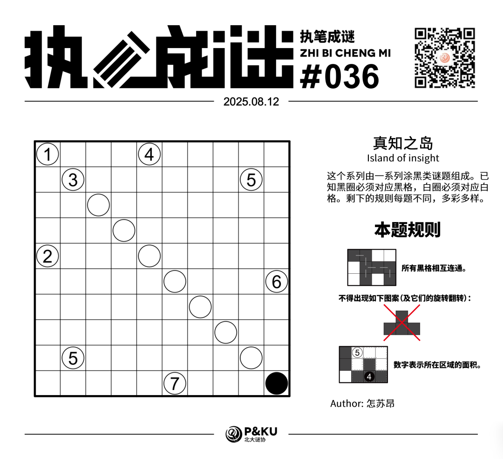
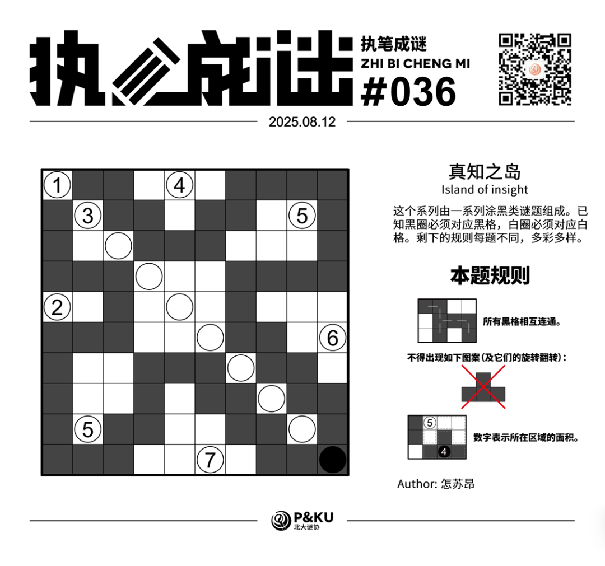

怎苏昂老师为大家带来了一套由其编写的纸笔谜题，主题为 **真知之岛（Island of insight）**。
这个系列由一系列涂黑类谜题组成。已知黑圈必须对应黑格，白圈必须对应白格。剩下的规则每题不同，多彩多样。

今天是该系列的第四题。本题的规则称为 **逻辑网格（Logic Grid）**。

{/* truncate */}

## Logic Grid 逻辑网格规则

- 所有黑格相互连通。
- 不得出现全黑的 T 形图案（包括其旋转和翻转）。
- 数字表示所在区域的面积。

## 做题链接

你可以[在 penpa 网站上进行尝试](https://swaroopg92.github.io/penpa-edit/#m=edit&p=7ZVtT+pKEMff8ylO9q2b2AfA0sQXPJoY5coRL1cbQhZYpLqw2gc1JX53Z7aQPq0m94WJJzkpOwy/KdOZ6ea/4XPMAk5NAz+2Q+EbrrrpqGU5TbWM/TX2I8HdX7QdR2sZgEPpP4MBXTERcnp++9DpPbZf++3/jht3tn0zXB099EY3D8vJv+bI8I8DYyic7eVVryOOzpK7y3X7hfd58yqUi7XgbMmSu8n5m9gOnPv1yuyer7vOim2N8NkZt146o9PTmrcvZFrbJS03adPkzPWISSixYJlkSpORu0su3WRIk2sIEWoCu0hvssDtZ+5ExdHrptA0wB/ufXBvwV34wULw2UVKrlwvGVOCz+mof6NLNvKFk30d+HshN3MfwZxFMK9w7T/tI2G8lI/x/l5ISDaxiPyFFDJAiOydJu20hetDC07Wgp21gG7aAnqaFrCzb26hpW/hHV7Pb2hi5nrYz03mOpl77e7ADt0dsY3DRNJ3SOw6gnoG6g0EdgYaFoJGBpwmAtgFB2AaLSTNHKnbpT+ZTRPJyYFAPaaq6vZQFfDC+NLSKlTVV6GqyAptavOeaDOoriq0pc1gGtoU6Ryq2NInsfVJ1OiquKFPosaqwZjbKmIY9kCN3FJ2DHuDJrayPWUNZRvKXqh7+spOlO0qW1e2qe45wd31v/Zf/q1/Uzmenepq8Wr8eWxa80B7SSjFLIyDFVvwGX9ji4i46RmQjxTYNt7MOShEDgkpn4S/1WU4hArQv9/KgGtDCPny/rNUGNKkmstgWarplQlR7EWdjwWUbt8CigIQy9xvFgTytUA2LFoXQE5YC5n4tjTMiBVLZI+s9LRNNo73Gnkjank2nuN/D8offlDiqzJ+mlz9tHLULpfBF5KTBctYIzxAv9CeXFTHP5GZXLTMK5qCxVZlBahGWYCWxQVQVV8AViQG2Ccqg1nLQoNVlbUGH1WRG3xUXnG8ae0D)。

## 提交格式示例

例如对于上面最下方的样例，请提交 **123**。

<AnswerCheck
  answer={'6657256666'}
  mitiType="zhibi"
  instructions={'依次输入每一行黑格数目，只需提交个位。'}
  exampleAnswer={'123'}
/>

## 解答

<Solution author={'怎苏昂'}>
  

</Solution>

### 步骤解析

  
查看步骤解析

  <Carousel arrows infinite={false}>
    <CarouselInner>
      首先根据条件，黑格不能出现T形分叉，同时黑格要全部联通，说明黑格应该形成一条不和自身接触（但可以对角接触）的蛇。根据左上角面积为1，说明周围都是黑格，由此蛇的首尾就确定了。然后通过联通性可以进行延伸得到下图。
      

        
      

    </CarouselInner>
    <CarouselInner>
      左上数字3，无论往右还是往下都会通到R3C3的白格，所以R4C3和R3C4都是黑格。
      

        
      

    </CarouselInner>
    <CarouselInner>
      不能形成T字和联通暗含了不能形成2x2的全黑的格子（只有一种例外，那就是2x2是唯一涂黑的四格）。于是左侧R5C1的2就确定了，进而R2C2的3也确定了。进一步延伸得到下图。
      

        
      

    </CarouselInner>
    <CarouselInner>
      R1C5的4只有两种可能，如果形成N形，那么蛇就会有三个头了，矛盾。所以应该是T形。
      

        
      

    </CarouselInner>
    <CarouselInner>
      如果R3C8是黑格，R3C9就是黑格了。和5的面积条件矛盾。所以R3C8是白格，于是R4C7是黑格，进一步结合蛇和5和6的面积条件得到：
      

        
      

    </CarouselInner>
    <CarouselInner>
      考虑R8C1的黑格的延伸方向。如果往右延伸，简易尝试之后可以发现如果要满足左下角的5的话，蛇就会延伸不出去，如上图所示。所以R8C1应该往下延伸。
      

        
      

    </CarouselInner>
    <CarouselInner>

      

        
      

    </CarouselInner>
    <CarouselInner>
      R9C2的5面积条件表明R7C4是黑格。进一步延伸蛇可以得到下图。
      

        
      

    </CarouselInner>
    <CarouselInner>
      最后整理5和7的白色区域面积条件可以得到答案。
      

        
      

    </CarouselInner>
  </Carousel>

