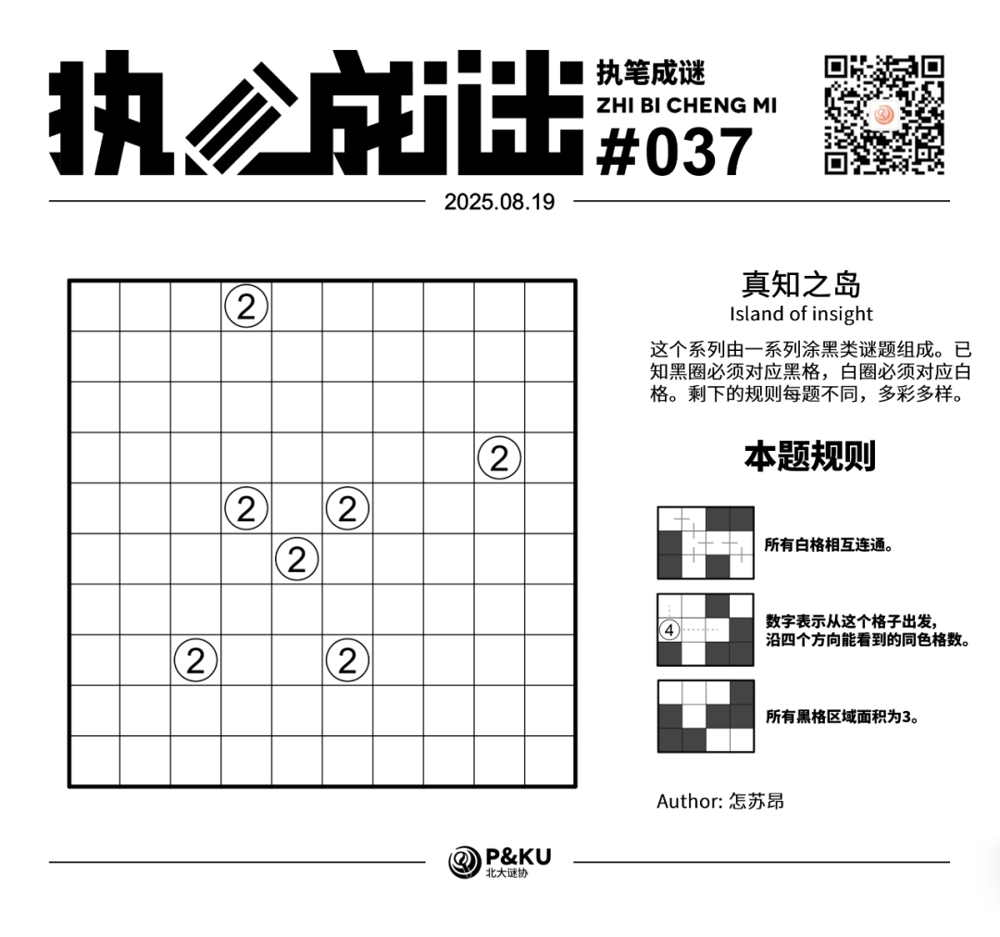
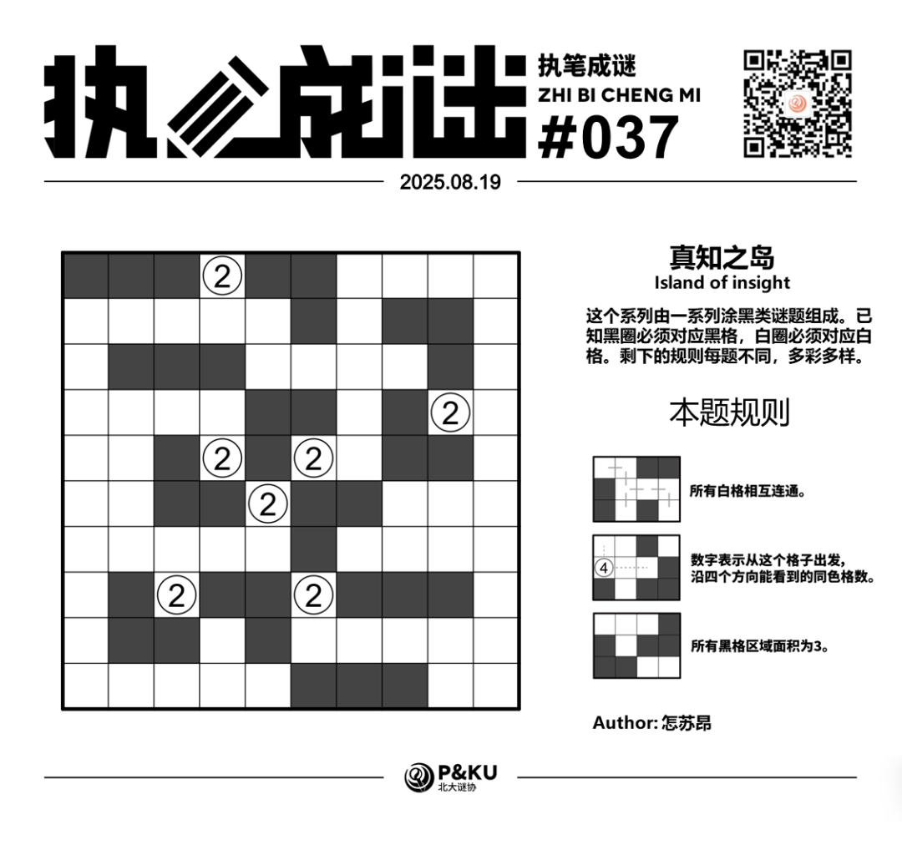

怎苏昂老师为大家带来了一套由其编写的纸笔谜题，主题为 **真知之岛（Island of insight）**。
这个系列由一系列涂黑类谜题组成。已知黑圈必须对应黑格，白圈必须对应白格。剩下的规则每题不同，多彩多样。

今天是该系列的第五题。本题的规则称为 **逻辑网格（Logic Grid）**。

{/* truncate */}

## Logic Grid 逻辑网格规则

> 原文文字简介写“所有黑格相互连通”，规则图写“所有白格相互连通”。以下按规则图整理完整规则。

- 所有白格相互连通。
- 数字表示从这个格子出发，沿四个方向能看到的同色格数（包括自身）。
- 所有黑格区域面积为 3。

## 做题链接

你可以[在 penpa 网站上进行尝试](https://swaroopg92.github.io/penpa-edit/#m=edit&p=7VRtT+JMFP3Or9jMVyfZTos8pcl+qAiuLiIqhJWmIQUHqLaMT1/QLeG/e+9UQztUE5PNxk0207mcnju9LzPMif9PvYhTpuFjmBR+YdSZKaduNuTUXsbATwJufaF2mixFBIDSi06Hzr0g5vTsZtltCfvx2P65NpPxmJ1o6ak2uuvcHVyFP059I2Kdntk/75/7+sL+3jq6bLQPGv00HiZ8fRmyo7vheDDvjxZN/Ve7N65n4wvt8Gw8/7q2h99qzksNbm2TNa3MptmJ5RBGKNFhMuLS7NLaZOdWdk2za3ARylxKwjRI/JkIREReuaybf6gDbO/gSPoRtXKSaYB7OW4AvAHoRZF4nHB/sUzytX3LyQaUYPojGQAhCcWaYz4sD99nIpz6SEy9BHYwXvoPhBrgiNNbcZ++LGXulmb2x5qAIK9NIMybQFTRBNaLTcz8aBbwSTcP9Ds7aLrbLZzPFfQwsRxsZ7iD5g5eWxuwPWtDDAM/hSNs5IdITE0lmgrRZArBtLrKGGoUpiSC9EwWcSNtR1pd2gHUSDND2mNpNWkPpe3KNW1pR9K2pK1L25Br/sMuP7QPf6Acx8jvdnkc/n2cW3NABEgsgkmcRnNvxif8yZslxMp1qOgpcas0nHK4QgUqEOIh8FdVEV5dJdJfrETEK11I8tvFW6HQVRFqKqJbpaZHLwjKvUiNLlH5FS5RSQT3s/AuparEhF6yLBGFu1yKxFfKZiZeuUTv3lOyhbvt2NbIE5HTMaiO5/VPsT+3YuNZaZ9Nrz5bOfJvLqJ3NGfnVOkK5QH2HfEpeKv4N3Sm4FX5PVHBYvd1BdgKaQFWVReg9gUGyD2NAe4NmcGoqtJgVarYYKo9vcFURclx3Noz)。

## 提交格式示例

例如对于上面最下方的样例，请提交 **132**。

<AnswerCheck
  answer={'5343441633'}
  mitiType="zhibi"
  instructions={'依次输入每一行黑格数目，只需提交个位。'}
  exampleAnswer={'132'}
/>

## 解答

<Solution author={'怎苏昂'}>
  

</Solution>

### 步骤解析

  
查看步骤解析

  <Carousel arrows infinite={false}>
    <CarouselInner>
      首先考虑中间紧挨着的三个2，如果2相接那么势必会造成如图所示的白色封闭结构。
      

        
      

    </CarouselInner>
    <CarouselInner>
      结合黑色区域面积为3得到下图。
      

        
      

    </CarouselInner>
    <CarouselInner>
      不妨假设R4C4是黑格，此时通过白色的视野线索和黑色面积为3可以得到下图。
      

        
      

    </CarouselInner>
    <CarouselInner>
      考虑白格联通性，R4C9的2必须往右。此时根据唯一解已经可以排除这种情况，但是还是接着往下看。
      

        
      

    </CarouselInner>
    <CarouselInner>
      考虑和R1C6对角联通的黑格组，它们不能接地了。于是进一步推演得到下图，得到橙色区域封闭。（很抱歉，本题Trial量确实蛮大的）
      

        
      

    </CarouselInner>
    <CarouselInner>
      所以R4C4白，R4C6黑。进一步延伸得到下图。
      

        
      

    </CarouselInner>
    <CarouselInner>
      考虑视野规则得到R4C8黑，考虑R4C9视野2可以得到R3C8,R6C8白。
      

        
      

    </CarouselInner>
    <CarouselInner>
      短试得到R7C6黑。进一步延伸得到下图。
      

        
      

    </CarouselInner>
    <CarouselInner>
      此时考虑白格联通性，已经有的黑格除了以R10C6的方式对角连接到边界以外不能再以别的方式对角连到边界。可以推出一些白格。
      

        
      

    </CarouselInner>
    <CarouselInner>
      考虑R1C4的2，为了避免联通性被打破，必须往下。进一步延伸R3C4的黑格得到下图。
      

        
      

    </CarouselInner>
    <CarouselInner>
      黑区域面积必须3，所以左侧两个格子和右下区域格子必须留白。最后接着R4C9的2得到R3C9黑，考虑联通性得到最终答案。
      

        
      

    </CarouselInner>
  </Carousel>

作者的话（by 怎苏昂）
某种程度上这题因为没法很快地排除R4C4是黑色的情况导致变得很难，但另一方面，就七个2的视野条件加上面积为3的Kurokodo就足以确定整个答案，不也是一件很神奇的事情吗？（笑）

