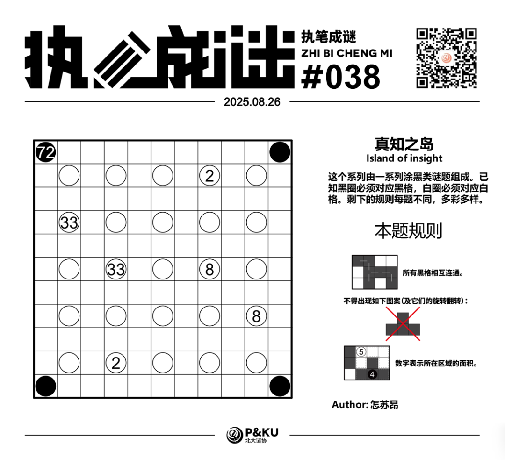
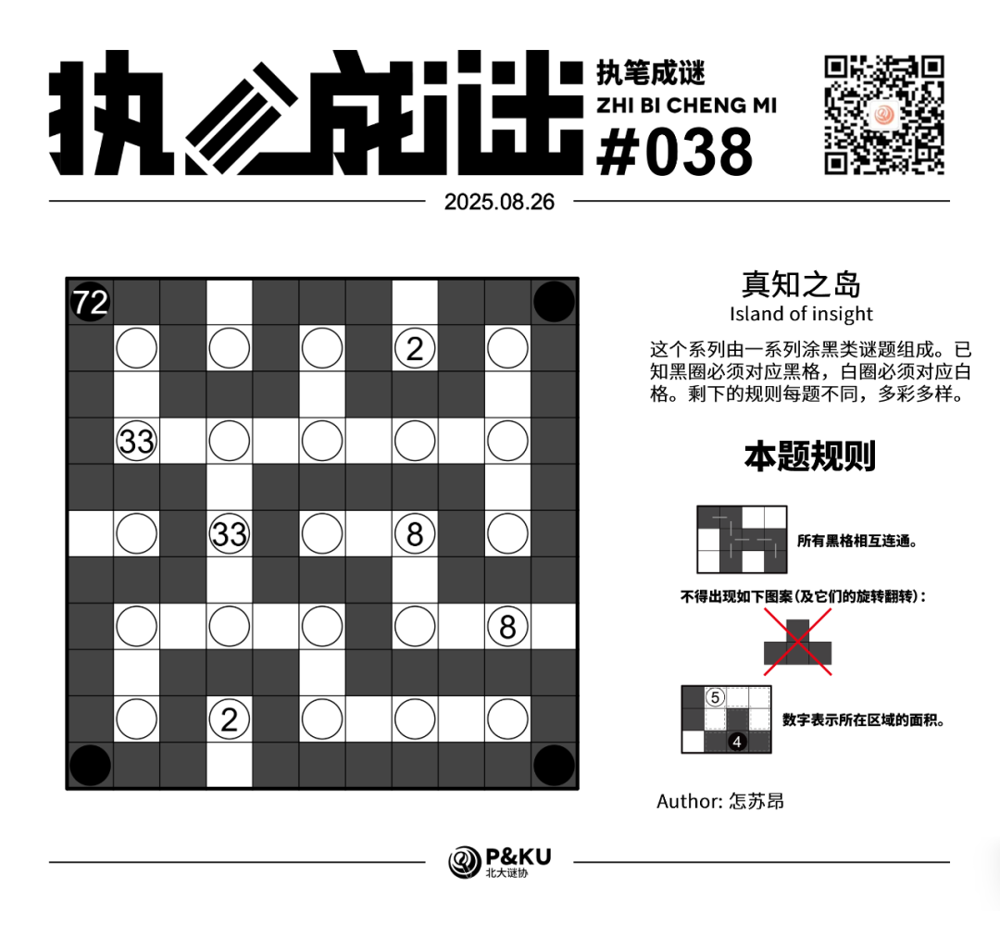

<WechatArticleLink
  href="https://mp.weixin.qq.com/s?__biz=MzkwMDc0MzAwNw==&mid=2247486398&idx=1&sn=c58658e06133ad59805ae2f1ac51372d&chksm=c0be218ef7c9a898528323b0d1d426fbe3f532659dc6ad975f4ef2e904bc11a32531a0b4ad18#rd"
/>

怎苏昂老师为大家带来了一套由其编写的纸笔谜题，主题为 **真知之岛（Island of insight）**。
这个系列由一系列涂黑类谜题组成。已知黑圈必须对应黑格，白圈必须对应白格。剩下的规则每题不同，多彩多样。

今天是该系列的第六题。本题的规则称为 **逻辑网格（Logic Grid）**。

{/* truncate */}

## Logic Grid 逻辑网格规则

- 所有黑格相互连通。
- 不得出现全黑的 T 形图案（包括其旋转和翻转）。
- 数字表示所在区域的面积。

## 做题链接

你可以[在 penpa 网站上进行尝试](https://swaroopg92.github.io/penpa-edit/#m=edit&p=7ZZdT/JKEMfv+RQne+smdikvpYkXvJoY5ZEjPhxtCFlgkWqh2hY1JX53Z7b49G00ORcm5uSkdDL8pt3/zO522vBpJwPFhcCfaXGDg8dr9YY+hajq0zgcYzfylP0Xb++itR+Aw/mvwYCvpBcqfnZz3+k9tF/67X+O67emeT1cHd33Rtf3y8lvMTLc48AYetb24rLX8Y5O49uLdftZ9VXjMvQXa0/JpYxvJ2ev3nZg3a1Xonu27loruTXCJ2vceu6MTk4qziGRaWUft+y4zeNT22GCcVaFU7Apj0f2Pr6w4yGPryDEuAB2nlxUBbefuhMdR6+bQGGAPzz44N6Au3CDhadm5wm5tJ14zBnqdPTd6LKN/6zYIQ/8v/A3cxfBXEYwX+HafTxEwt3Sf9gdroUB2WbnRe7C9/wAIbI3HreTEq4+SrDSEsy0BHSTEtAjSsDKvrmEFl3CGyzP31DEzHawnuvUtVL3yt6DHdp7ZlbxziYsYTNZRFavIQEgDqBpITDNlAhhlJG+zcqQWqNImvq2P0NDCkIncgOJ1DCRKlSfnTFWQ224Ok/rOE6Z4ghlinmVKeZWorrSErVINYtUs0g1i1QTBimXTC6BScFk3glMS5q0ZI2W1GtCYFpSr3cZN2hJvRcITEs2ackmLanXprSXRIvAsPsGeg9WtR3D88FjU9uetoa2dW3P9TV9bSfadrWtadvQ1zTxCftXz2D2MfimdBwT3iXEUf/v0mnFgTcVC31vFu6ClVyomXqVi4jZyRszG8mx7W4zV9BPM8jz/UfP3VIjfIRy0L3b+oEiQwjV8u6zoTBEDDX3g2Uhpxfpefla9NdEDiUbPYeiAF4tmf8yCPyXHNnIaJ0DmddQbiS1LUxmJPMpygdZUNuk0/FWYa9Mn46JXz3/f1b88M8KXCrjpzW2n5aO3uV+8EXLSYNFTDQeoF/0nkyU4p+0mUy0yEs9BZMttxWgRGcBWmwugMr9BWCpxQD7pMvgqMVGg1kVew1KldoNSmU7jjOtvAM=)。

## 提交格式示例

例如对于上面最下方的样例，请提交 **123**。

<AnswerCheck
  answer={'96829492940'}
  mitiType="zhibi"
  instructions={'依次输入每一行黑格数目，只需提交个位。'}
  exampleAnswer={'123'}
/>

## 解答

<Solution author={'怎苏昂'}>
  

</Solution>

### 步骤解析

  
查看步骤解析

  <Carousel arrows infinite={false}>
    <CarouselInner>
      首先本题是个数学题。N个正方形如果组成一条蛇需要2N+2个顶点，本题总共顶点数是12x12=144，黑色区域总面积72，所以说明黑色区域并不是一条蛇，是一条回路。而且是个6x6的全通过回路。
      

        
      

    </CarouselInner>
    <CarouselInner>
      考虑面积2的部分得到如下所示的图。
      

        
      

    </CarouselInner>
    <CarouselInner>
      8必须在回路外，所以得到下图。橙色格子在回路外，粉色格子在回路内。
      

        
      

    </CarouselInner>
    <CarouselInner>
      考虑全通过条件，将R7C11从两个角延伸出去。
      

        
      

    </CarouselInner>
    <CarouselInner>
      考虑面积8的摆放。
      

        
      

    </CarouselInner>
    <CarouselInner>
      最后考虑全通过回路的性质就得到了最终答案。（是的，本题的两个33实际上是多余条件。）
      

        
      

    </CarouselInner>
  </Carousel>

作者的话（by 怎苏昂）
本题是在做到Island of Insight的一道“数连”的时候想出来的题，一直在想有没有机会把一道“回路题”嵌合到涂黑题当中。然后联想到不是T的形状下还可能是个类似于全通过回路的形状，于是成功出出来了本题。和6x6的全通过回路等价这一点真的很奇妙！希望大家喜欢！

