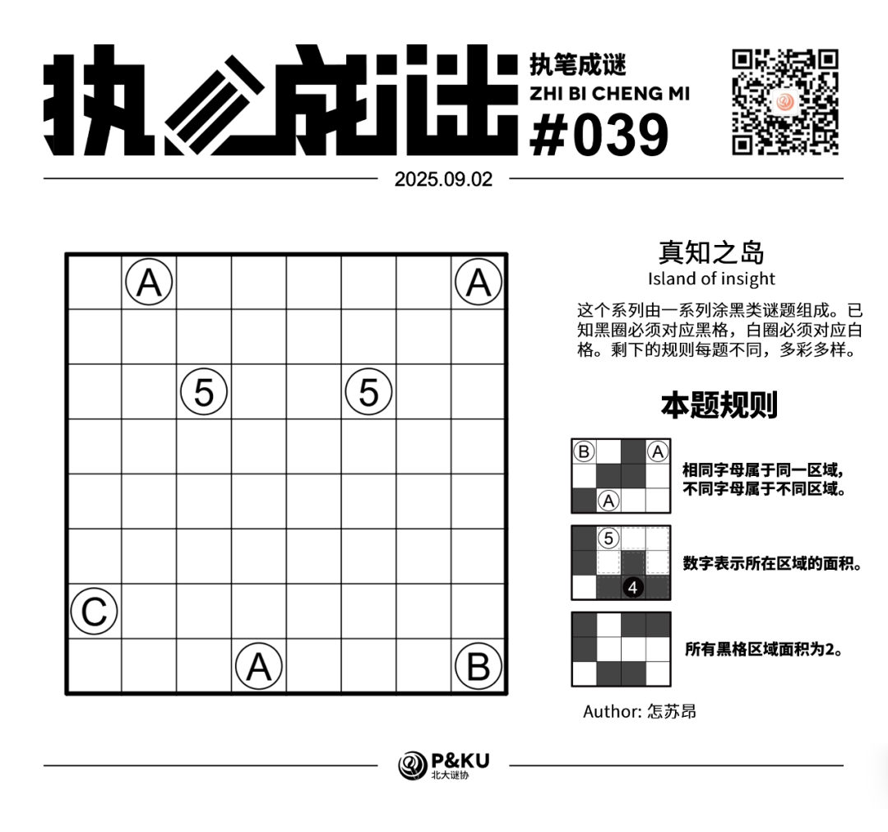
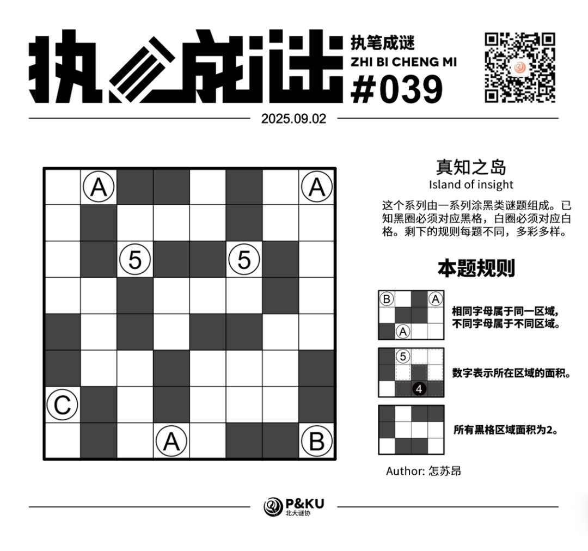

<WechatArticleLink
  href="https://mp.weixin.qq.com/s?__biz=MzkwMDc0MzAwNw==&mid=2247486460&idx=1&sn=53ab4d88b5a35c7bbed4ad9469659366&chksm=c0be21ccf7c9a8dae88ebc79e85040d45c98fb28515dddc53b63d12d0ef3fb3b71fc2a1f5fa6#rd"
/>

怎苏昂老师为大家带来了一套由其编写的纸笔谜题，主题为 **真知之岛（Island of insight）**。
这个系列由一系列涂黑类谜题组成。已知黑圈必须对应黑格，白圈必须对应白格。剩下的规则每题不同，多彩多样。

今天是该系列的第七题。本题的规则称为 **逻辑网格（Logic Grid）**。

{/* truncate */}

## Logic Grid 逻辑网格规则

- 相同字母属于同一区域，不同字母属于不同区域。
- 数字表示所在区域的面积。
- 所有黑格区域面积为 2。

## 做题链接

你可以[在 penpa 网站上进行尝试](https://swaroopg92.github.io/penpa-edit/#m=edit&p=7ZRfT+pMEIfv+RQne+smb7cVLE3ORUH06IuIAuFIQ0jBAtWW9fQPeEr87s5MMbSlmnhjvDjZdDJ9Zjs7s9v9hX9iO3C4DkPTucIFDO1YpUdV6vQou9F3I88xfnAzjpYyAIfz6w6f217o8Mu7Zbspzc2p+XutR6OROFfiC2X4cPZwdOv/f+FqgTjr6N2r7pWrLsxfzcZNrXVU68bhIHLWN75oPAxG/Xl3uKirf1ud0XEyulaql6P5f2tz8LNi7UoYV7ZJ3UhMnpwbFhOMMxUewcY8uTG2yZWRdHjSgxDjOrB2OkkDt5W6KrhDiqPXTKFQwO+kfg3cO3DtIJCbSQ/6jNK5XcNK+pzhUg1KgC7z5dphu1LwfSb9qYuAvu/R2iyM7+VjvJsm8KvYi9yZ9GSAENkLT8y0gd5bAzCxpAF00wbQK2kAa8UGZm4w85xJO030yeqndgRHHS7dp10k10K9vIUXOJxbaGJiWNjPYO/qe7dnbMF2jC1TT/BLE7Y8PUGmaQVQVRFUM6BaAHUdQXMPhCgmEYLWabwRWF1QDXdkz8iqZPtQIk80sqdkFbJVsm2a0yI7JNske0y2RnNOsMlPbcMXlGOpNbrW+1H92vdxxYKLy0LpTcI4mNszZ+I827OIGal2ZCM5tor9qQM/WAZ5Uj557qosw1soB93FSgZOaQihc794LxWGSlJNZXBfqGlje16+FxLVHEqvYw5FAdy1zDtJRo74drTMgcy9zGVyVoXNjOx8ifajXVjN32/HS4U9M3osjat4Xv9U9hurLB6U8t1E5ruVQ/+4DD4QnH2wiEtkB+gHypOJlvF3RCYTLfIDRcFiD0UFaImuAC1KC6BDdQF4IDDA3tEYzFqUGayqqDS41IHY4FJZvbHGlVc=)。

## 提交格式示例

例如对于上面最下方的样例，请提交 **312**。

<AnswerCheck
  answer={'32424333'}
  mitiType="zhibi"
  instructions={'依次输入每一行黑格数目，只需提交个位。'}
  exampleAnswer={'312'}
/>

## 解答

<Solution author={'怎苏昂'}>
  

</Solution>

### 步骤解析

  
查看步骤解析

  <Carousel arrows infinite={false}>
    <CarouselInner>
      本期题目需要用到的性质是：这样的5摆放只可能是5呈现Z形的摆放。
      

        
      

    </CarouselInner>
    <CarouselInner>
      于是上面的5只有两种摆放可能，如下所示：
      

        
      

    </CarouselInner>
    <CarouselInner>

      

        
      

    </CarouselInner>
    <CarouselInner>
      在摆放了字母条件之后可以排除一种情况。
      

        
      

    </CarouselInner>
    <CarouselInner>
      于是在盘完面积5之后可以很轻松地得到答案。
      

        
      

    </CarouselInner>
  </Carousel>

