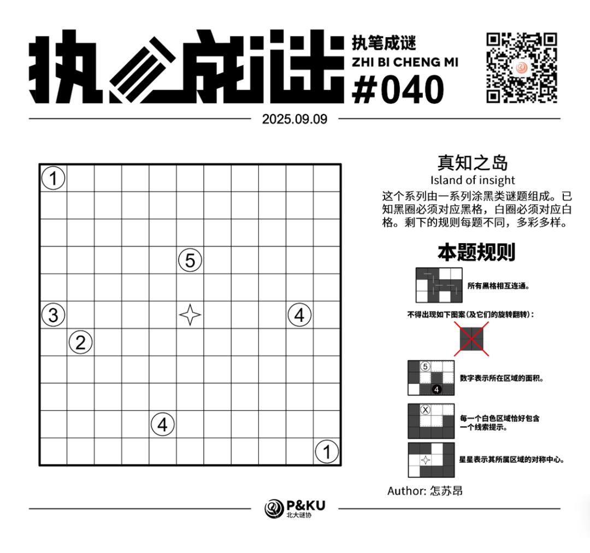
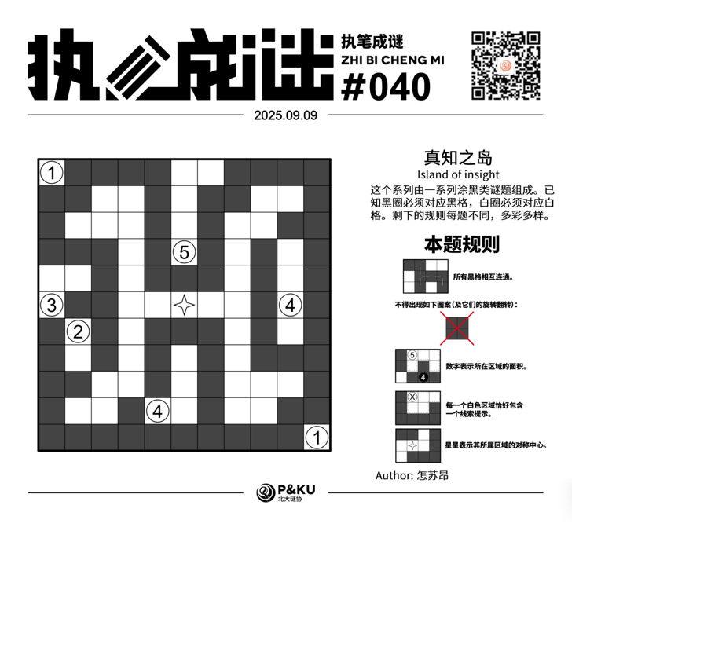

<WechatArticleLink
  href="https://mp.weixin.qq.com/s?__biz=MzkwMDc0MzAwNw==&mid=2247486524&idx=1&sn=7e401a92668ca3a09449f3cee4c59d9c&chksm=c0be260cf7c9af1abfff08c23097a6d4e93a5b602c4ffb795f1420d34f8e526e1180091f4a54#rd"
/>

怎苏昂老师为大家带来了一套由其编写的纸笔谜题，主题为 **真知之岛（Island of insight）**。
这个系列由一系列涂黑类谜题组成。已知黑圈必须对应黑格，白圈必须对应白格。剩下的规则每题不同，多彩多样。

今天是该系列的第八题。也是本系列的最后一题。本题的规则称为 **逻辑网格（Logic Grid）**。

{/* truncate */}

## Logic Grid 逻辑网格规则

- 所有黑格相互连通。
- 不得出现全部涂黑的 2×2 结构。
- 数字表示所在区域的面积。
- 每一个白色区域恰好包含一个线索提示。
- 星星表示其所属区域的对称中心。

## 做题链接

你可以[在 penpa 网站上进行尝试](https://swaroopg92.github.io/penpa-edit/#m=edit&p=7ZRvb9owEMbf8ykmv62lxQmkEGmaUgpdu5bSFsRKFFWBBkib4M5JaBfEd++dQ5c/pJUqbdK0TSGny++c82ObPOH32BEuZQx/WpMqFDJab+jyZkyVt7K9Bl7ku8YHasbRggtIKD3vdunM8UOXnlwvTtvcfDw0v62a0XjMjpT4WBndde/2LoOvx54mWLfX7J/1zzx1bn5pH1zonT29H4fDyF1dBOzgbjgezPqjeUv90emN68n4XGmcjGcfV+bwU83aarBr66RlJCZNjgyLMEKJCjcjNk0ujHVyZiRXNLmCEqHMpiSI/cibcp8L8sKS0/RFFdJOlo5kHbN2CpkCeS/NdUivIQ0jR6RN+oaVDCjBeQ/km5iSgK9cnAh14fOUBxMPwcSJYOvChfdAqAaFML7l9/F2KLM3NDHfpx6avKjHNFWPWYV6XFSmHp9+pfqWvdnAoVyC/hvDwqUMs7SZpVfGGmLPWBNN3b6qpydHmhI0MsCUfSRajjAdST1HVA0JHP9Pss/KY1rFqUAAkzKuQQb8s6FYh+VsTxV4V1ZVGQegmyaajIcyKjI2ZDyVYzoyjmRsy1iXUZdj9nHl79qbvMDfJMfS4KOuuBp/L7VrFvgGCbl/E8Zi5kzdG/fJmUbESK0rXymwZRxMXPj4csjn/MH3llUdXkoF6M2XXLiVJYTu7fy1VliqaDXh4rak6dHx/eJapK0X0NQTU7+IIgFfd+7ZEYI/FkjgRIsCyDlBoZO7LG0mflKF3vdOabYg245NjTwReVsahX/nf5P/I00eD0h5n9VvjfxzlQH/G3ab2g4XbzhPVizjCv8B+oYF5apV/BW3yVXLfMdaUOyuuwCtMBigZY8BtGszAHecBtgrZoNdy36DqsqWg1PtuA5OlTcey649Aw==)。

## 提交格式示例

例如对于上面最下方的样例，请提交 **313**。

<AnswerCheck
  answer={'86576477550'}
  mitiType="zhibi"
  instructions={'依次输入每一行黑格数目，只需提交个位。'}
  exampleAnswer={'313'}
/>

## 解答

<Solution author={'怎苏昂'}>
  

</Solution>

### 步骤解析

  
查看步骤解析

  <Carousel arrows infinite={false}>
    <CarouselInner>
      根据数墙的一些基础定式得出一些格子之后，右上角红色2x2区域必须要有一个白色格，但是只有中心星系可以达到那个区域。而后因为星系处于全盘中心，如果伸到边界势必会导致盘面分割。因此只有R2C10是白。
      

        
      

    </CarouselInner>
    <CarouselInner>

      

        
      

    </CarouselInner>
    <CarouselInner>
      考虑星系延伸到左下角区域的方式（用橙色表示“星系不可及区域”），得到红色区域留白。
      

        
      

    </CarouselInner>
    <CarouselInner>
      利用和第一步类似的逻辑，结合左上红色区域只有星系可以够到+黑格联通可得到R3C2是留白的。对称到右下角。
      

        
      

    </CarouselInner>
    <CarouselInner>

      

        
      

    </CarouselInner>
    <CarouselInner>
      注意到左下角被面积为2、3的区域加上星系区域隔断了，必须从最后一排延伸出去。同时大概可以得知全局联通性是左下连接到右下，再顺到右上，最后是左上。
      

        
      

    </CarouselInner>
    <CarouselInner>
      而后考虑星系的联通得到R5C8白格。
      

        
      

    </CarouselInner>
    <CarouselInner>
      可以确定右侧4的位置。
      

        
      

    </CarouselInner>
    <CarouselInner>
      此时已经可以大致判断答案的雏形，结合数字面积的条件和星系的延伸可以得到最终的答案。
      

        
      

    </CarouselInner>
  </Carousel>

