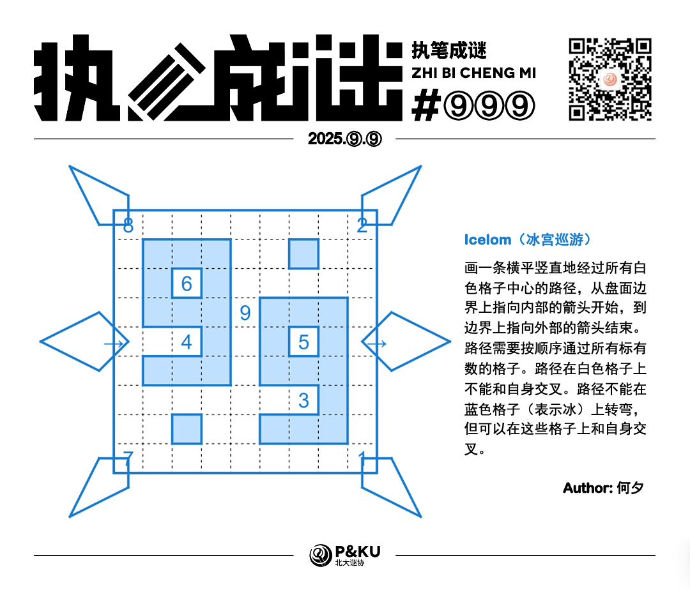
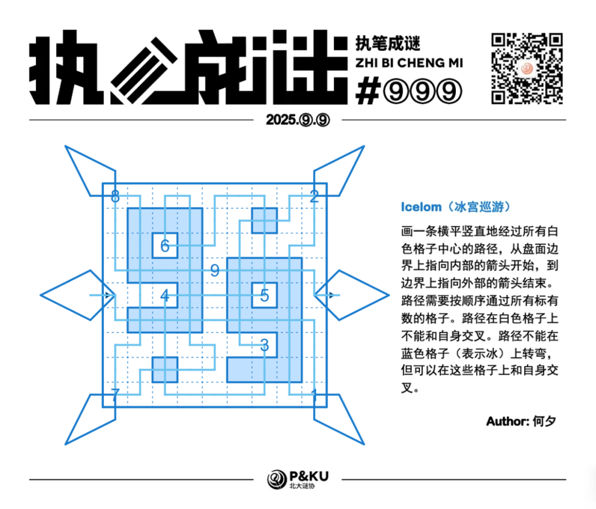

<WechatArticleLink
  href="https://mp.weixin.qq.com/s?__biz=MzkwMDc0MzAwNw==&mid=2247486494&idx=1&sn=380db0051a4423fd4cb3c4ba1f24cdbd&chksm=c0be262ef7c9af38d12fa83821fffecfc6f4f2d1618233561c4ecad21d4798fa80ddcceeb20e#rd"
/>

今天是⑨月⑨日，⑨分钟内做出这道题，就能获得智商+⑨的增益！
今天也是国际数独日！所以何夕老师带来了一道不是数独的谜题。

<figure style={{ maxWidth: 320, margin: '0 auto 1rem' }}>
  
  <figcaption style={{ textAlign: 'center' }}>何夕的头像</figcaption>
</figure>

{/* truncate */}

## 冰宫巡游(Icelom)规则

画一条横平竖直地经过所有白色格子中心的路径，从盘面边界上指向内部的箭头开始，到边界上指向外部的箭头结束。路径需要按顺序通过所有标有数的格子。路径在白色格子上不能和自身交叉。路径不能在蓝色格子（表示冰）上转弯，但可以在这些格子上和自身交叉。

## 做题链接

你可以[在网站上进行尝试](https://pzplus.tck.mn/p.html?icelom/a/9/9/00sh83n1aes08jg008m2q6p9l4i5w3q7m1/22/31)。

本题不设置后台验证，不记录首杀，欢迎加入谜协相关群聊讨论题目。

## 解答

<Solution author={'怎苏昂'}>
  

</Solution>
