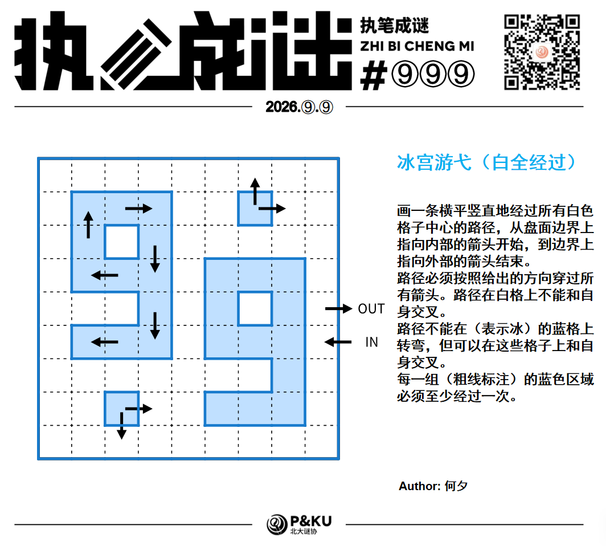

今天是⑨月⑨日，⑨分钟内做出这道题，就能获得智商+⑨的增益！
今天也是国际数独日！所以何夕老师又带来了一道不是数独的谜题。

<figure style={{ maxWidth: 320, margin: '0 auto 1rem' }}>
  
  <figcaption style={{ textAlign: 'center' }}>何夕的头像</figcaption>
</figure>

{/* truncate */}

## 冰宫巡游（白全经过）(Icelom)规则

画一条横平竖直地经过所有白色格子中心的路径，从盘面边界上指向内部的箭头开始，到边界上指向外部的箭头结束。路径需要按给出的方向通过所有箭头。路径在白色格子上不能和自身交叉。路径不能在蓝色格子（表示冰）上转弯，但可以在这些格子上和自身交叉。每一组（粗线标注）的蓝色区域必须至少经过一次。所有白色格子必须经过。

## 做题链接

你可以[在网站上进行尝试](https://swaroopg92.github.io/penpa-edit/?m=solve&p=zVZRc9M4EH7Pr2D8iuaQLMuWMsNDS3scDAQK7fXAk+m4iUsCbgxOAh134LfzrbShsRM47u0msfX5k7z6dldraflpXTSlUIr+2gopgERiUn8pFftL8u90vqrK4b0nk/KyaBbiYL2a1c3w3l/lzVyI16tiMS2a6ab7XrOuyuUf4sVIXBXVshRP37w/PPpw8OX44J8H5q3WZ6Or+++PTs7eT8//Vidy/qCRo8ounr88OqzuP27fPp8dfC6Py/Tlsp7MqrKYFu3b86c31eJP+252pR49nT2yV8VCLj/ZU/f58OThw0HOSseDPIoj4S8Vjb+1z77lAMKNB7ftq+FtezHMx19Fe3YH7R18PbyN0iQaGhGlJjRpaJxvstBY5RsXRrow0oWRzoYmjFRShlaFV5TS3IaXVBxsqHjzHKyoOJhRMdvRbCfhcWbT8jjD41IaB09G8CRzcTTMoxdnpxFSG6XRGNJlRtyT0YbCWDW8xf0N3jAScnItoqJp6i8Xo4vDSMR4y6hdXhGv4Vae7fLpfj6VkL2HzxLIzqF/h6d5uzzpySgfORzoj3c0757xlI49461EuHs8jbcU7h09CNIp1olotb8f+bv0d+Pvz3wgjxHI2GQiptw4LEVjgSHAYydiyhHhVAJDsMcKGOnyOAbGOvFYAyMIHifACKDHBhjiPU5FTEuSsIUdWomEXSo0rTtgtELT2iIcg0+YT8Ab5lH3OmM+o48C8xbfBBn4RMofWDsHHHzRzgo8M86Ag++aNDgsOY8NMNt0CXDwRTsNHHzULgYOvuuM7ISYaMQEz6wZPMdKa/AJ8wq8Zl6CV4GPLXjJsc0QW8s85Shj3kK/5JhniG3GMcwQ84xjniEXGeeCsGUfJfQrxgp2FMdBOcSc4xNLaGN/NcZr9lcjDtt8wnYS2EnYTgI7hu0Y2DEcf43YbnCMfGmOrQQf83pw4GmRe81YJ1Qg3l+sQ8frEFhT4ft3oYeK1L+LuRhriTGKNUiKFWuTFNtNHIBjjn+M+GvOiwZvmDfgDefXwF/D8xrMS0Xtcw37PzDlmu0TtmzHwo5lOxZ2LNuxsGNZcwb9G2yw9jLWn1AMmY/B08fH5ws8fYc9D5v0bd5gzRqwU2rN2mLKHdd1hhqn3WGDeQ2jBd6sGYo520Qta65lj/ldtNDMelDjAeOjcu4/LY/8PfH31H9yMtq4BoMc64X27+1f9v9isDNjD46WdXWxXDdXxaS8KG+KySoahkPCdk+HW6yvL8umQ1V1/bGaL35YWDXrXk9n+Pzdom7KvV1EltN3+7RsuvaYuqybaU/Sl6Kquq74A1aHmsybSdWlVs288+w3nA5zXaxmHeKyWOEwtpzNP3YtlYteLFdFV2LxoejNdn0Xjq+D6CbyF/b5WCR0XnLD9kC0j3Fe2DpSifYEB6bnw/YZnZfyKBIGO+b1ulrNJ3VVY0risLtiO/RHLw14HKADPPf92GWxmj2pJPAIOPVnklc0xRs8dvfk9uUwb09FRL2H3gTB6Lr+DA+8Hf88qa8v4WMeUTiWfvJouZ7WH9Y8ym/jBz0P6CzwCw9INntAzgQPCPU9ACapPfVk6T+q38rxrgtu/DVkS/7mmTacB7dPer9/lPnXb88NF3Xd/KKu7zr79J7qBtsv8P29+/ifFPNWb5/fqVwSu1u8YPfUL9h+CYParWKQO4UM7ie1TFb75Uyq+hVNU+0UNU21Xdf5ePAd&a=RZPbDcMwDAN36bc/QsevzFJ0/zV6gmgHKKADK5GyA3+/v/L96FKRRnk+BV5F1/NyvZN10aOXazfHbH252gdN2rM33F6uy9xgZ5EvzWQyVd1PPVnU4x/cLjOzdc/CzXuiqXk3MtW8D5lq9r/Z+XZPcLP/Tf/t3YK7Z9HUPUu+uncj82SRo+4zkqO2e2Jn++On4R78jg9VfffA02dE0/S5Oufa/sHTuWjq3jl4emc0DftQNexD1XQWu2h4lnpyyTz++Gn67FRN70zdPm2Vli7QyHyEkVP9Kj2zoZHTCCNney2+ZWjk90TwLXFJviPImyL4rii+HUKdRnEGNHMCwWnQyjMiOA1admF7TzzFdwGtdEZY6UzoSr+5dgb05DkQnBF/5WwE5MSqZWUf9OQGIeR5iXIGAfFEA8M3bSj7nYaSnVHSm7KfayhpjnO+SV79+/v9AQ==)。

本题不设置后台验证，不记录首杀，欢迎加入谜协相关群聊讨论题目。
