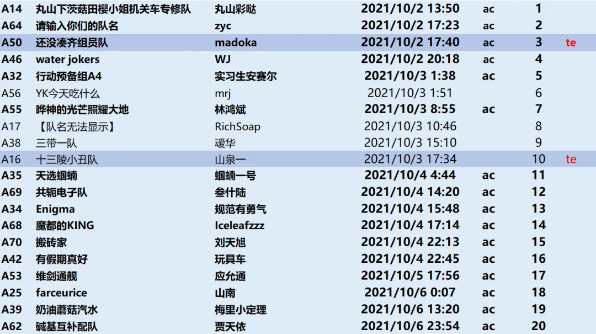
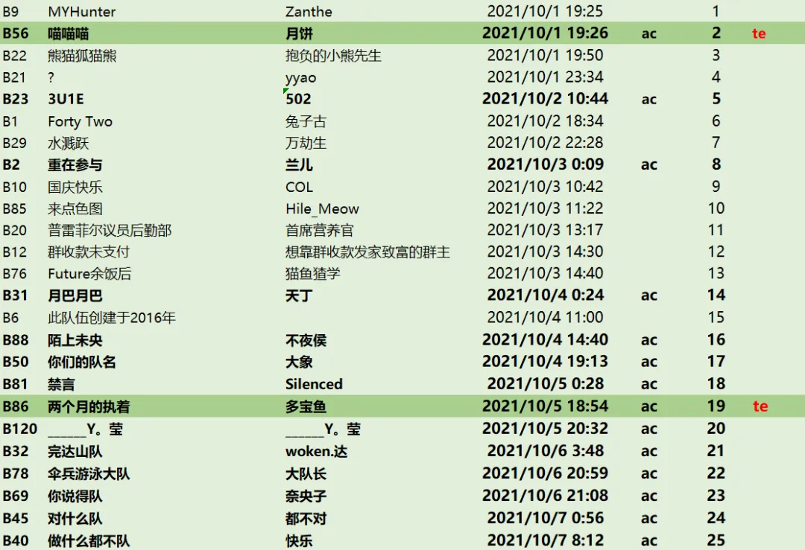

import WinfridWords from "@site/src/components/pnku0/WinfridWords";

# 完赛总结一览

<WinfridWords>
这次Puzzle and Key Universe: Zero的比赛也圆满地举办完成啦！

感谢所有工作人员和选手的支持和参与！
</WinfridWords>

本次活动共有 191 支队伍参赛，其中校内组 70 支，校外组 121 支，共有 441 位选手。
最终有 **20 支校内组和 25 支校外组**完赛，而共有 **2 支校内组和 2 支校外组达成了True Ending\~**

校内组前三分别是**丸山下茨菇田樱小姐机关车专修队**（29 小时 35 分钟）、**请输入你们的队名**（33 小时 8 分钟）、**还没凑齐组员队**（33 小时 25 分钟）。
这三支队伍都达成了 All Combo 的成就（在完赛前完成全部小题）

值得一提的是，**还没凑齐组员队**也完成了 True Ending 的触发。
另一支触发 True Ending 的队伍是**十三陵小丑队**，他们在解出 Normal Ending 前通过枚举误打误撞进了 TE。造化弄人\~

校外组前三分别是 **MYHunter**（11 小时 10 分钟）、**喵喵喵**（11 小时 11 分钟）、**还熊猫狐猫熊**（11 小时 35 分钟），同时也是校内校外合榜的前三。
MYHunter之前进度一直很快，但一直没有拿到首杀，最终在夜色的庇护下奇袭以不到一分钟的优势砍下第一。

 

不过，**喵喵喵**是比赛第一个拿到 AC 的小队，同时也是第一个解锁 TE 的小队！与此同时，**两个月的执着**也拿下了 TE。

Q：TE？

A：在Ending的剧情里点击“阅读原文”即可——这是新时代的隐写术。

---

Puzzle and Key Universe 这个名字是我们当时最早定下来的内容，Zero 是后面整个剧情的一个楔子——我们想要让之后的剧情都发生在女主幻想的想象世界，也就是“谜和解的宇宙”中。

 

我们在报名问卷和零推提到了这个词组，但是最终的参赛群都是以 Zero 为标题，也是为了在最后 finalmeta 以一个之前有过印象的答案震惊大家。

 

不出意外的话，明年应该还会在 5-6 月有一次 puzzlehunt，应该会有网站，应该还是不出 30 题的体量，应该会比这次难，但依然会有充足的提示（甚至更充足），应该。再未来的事——虽然也可以构想很多，比如是一年两次还是一年一次——暂时还是不作构想了。
