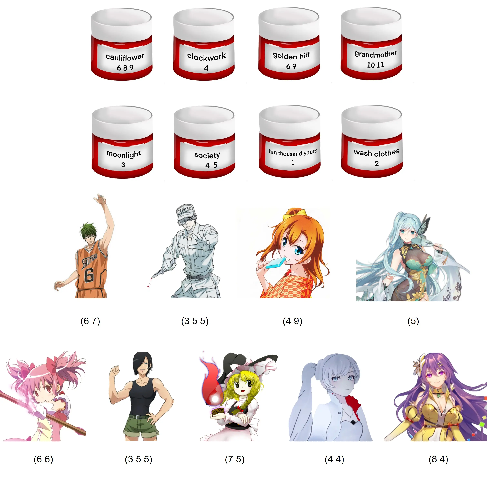
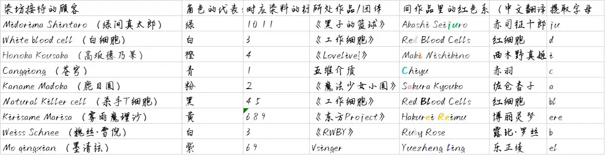
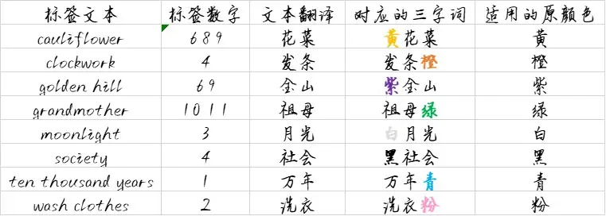

# 谁寻染朱痕

## 题面

染就的光鲜千篇一律，褪去的色彩大相径庭……看着染坊的秘方和接待记录，我如是感慨道。

咦，好像最近**这种**颜色很流行呢……

## 答案

JUDICABLE REBEL

## 解析

首先，需要注意到的是，每一种染料都是把东西染成同一种颜色，但是它们对应的原颜色并不相同。

而这种颜色正是红色，也就是说，文本的“这种颜色”对应的就是文字自身的颜色。此外，也可以从颜料的色彩和标题的“朱”等看出。

观察染料。注意到其顺序是字母序，因此其顺序是无关紧要的，关键在于其内容。

尝试把每段文本都翻译成中文，联系“染坊”的主题，不难发现翻译出来的二字词语都可以和一种色彩的字组合成一个意思完全不一样的三字词语。而这正决定了其适用的原颜色。

考虑完染料后，再考虑“染成红色”的含义。这些人物都有明显的所处的色系。再查阅一些人物所处的作品就能发现，他们都有一个红色的同作品角色。

于是根据这些顾客对应的染料上的数字，从这些顾客对应的红色系角色的名字提取，按照这些顾客的原顺序排列，就可以得到答案了。

于是得到答案：judicable rebel

## 作者

Winfrid
