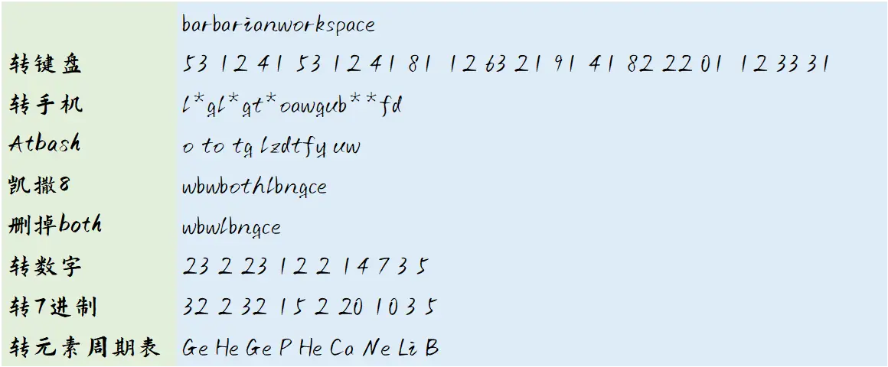

# 密码恐惧症与倒霉蛋

## 题面

记忆里忽然钻进了一道谜题的解析，看着它，我第一次意识到了密码恐惧症。难道这道题的作者出题就是为了难住所有人满足自己虚荣心吗？

    
查看解析

    这道题的解法并不复杂，是一道非常适合初学者的题目。

    题面是两个9字母单词组成的18字母的字符串，于是我们用最常见的键盘密码，也就是（A=12，B=53）这种类型，把它转换成18组数，每组数由2个数字组成。

    这个时候通过这种两两组合的数的形式，很容易联想到手机九键密码。所以我们进行解密。但是需要注意的是，其中的第2、5、8、15、16组数是没有办法转换成九键密码的。所以我们忽略掉它们，就得到了13个字母的字符串。

    下面就简单了，这个时候根据题面的“@80”联想到atbash密码，这是一种把A变成Z，B变成Y的单表密码。

    Atbash密码转换完成之后，题目描述里的“两个K炸弹”能联想到是八张K，所以暗示了凯撒八位，也就是把A变成I，把B变成J的密码。所以转换之后，能够得到另外一个13字母的字符串。

    这个时候，会发现这个字符串的第4-7位正好拼出了单词both。所以这就是这个密码的第一层答案。

    把它删掉，得到9字母的字符串。这个时候我们没有什么头绪，就可以把它按照A=1，B=2的方式转换成九个数。转换之后如果你还是看不出什么，那是因为你没有把它转换成七进制下的数（题面的彩虹暗示了这里是七进制），比如Z你不能转换成26，而是应该转换成35（七进制下的35才是十进制下的26）。

    转换成七进制下的数之后，我们发现它们作为十进制也可以阅读，所以我们最后发现，可以去从元素周期表里找到对应的元素，比如刚刚的Z，转换成35之后，我们可以去找第35号元素Br。当然这里，我们可以发现，能够得到的一串元素是：
    Ge He Ge P He Ca Ne Li B

    这里，前五个元素的含义非常简单……就是“隔阂？隔p阂！”是非常粗犷的一个回应，因为这是我在学习鲁迅的《故乡》的时候，里面看到那个“厚障壁”有感而发的……

    然后后面四个元素，实际上我想写的是“can lib”但是写错了，意思是我很能泡在图书馆里……但是我的同桌以为我说的是“钙奶里皮”，以为我在小卖部买的钙奶里有什么皮，但是Be才是皮啊……诶，就这样吧。

## 答案

BARBARIAN WORKSPACE

## 解析

因此，答案是barbarian workspace。顺带一提，“你出题就是为了难住所有人满足自己虚荣心吗？”这句话并非我所独创，而是一个梗，233333.

## 作者

Winfrid

