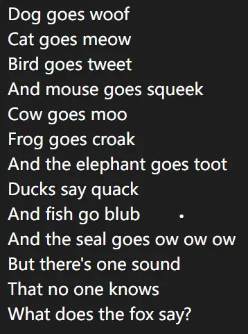

# 符文之地：织曲点睛

## 题面

据说，这份古老的歌谣之中，点睛之笔就是这些声音……大概如此。

## 答案

GOLDFINCH BABBLING

## 解析

pdf有7页。1\~6页的每一页都是谜题，各自有一个答案且其为英雄的名字，而且它们都与一种动物相关。分别为：

* 蓝色-Nasus-沙漠死神（狗头）-狗
* 绿色-Fizz-潮汐海灵（小鱼人）-鱼
* 青色-Xayah-逆羽（霞）-鸟
* 褐色-Ahri-九尾妖狐（阿狸）-狐狸
* 紫色-Twitch-瘟疫之源（图奇）-老鼠
* 黄色-Yuumi-魔法猫咪（悠米）-猫

来到第七页的meta。然后联系题干里的“歌谣”和“它们的声音”以及“What does they say”的提示，发现（或搜索得到）这实际上是一首曾经很流行的歌《狐狸叫》，其中的颜色正好能对应上这首歌对应位置的动物。题目涉及的那部分的歌词为

分别按顺序取黑色和红色的部分，得到答案goldfinch babbling，也很符合这里的“动物叫声”的选题。另外，这也使得解出meta关键在于意识到这里的答案都是一种动物，并不需要全部解出。

具体的各小题解法如下：

**第一页：**给出了英雄原画、语音以及语音触发条件。以及明明只需要取五个字母，却给出了七个角色——从中可以看出这些角色都符合七宗罪的一条：佐伊-嫉妒（envy）、剑魔-愤怒（wrath）、薇古丝-懒惰（sloth）、大嘴-饕餮（gluttony）、伊芙琳-色欲（lust）、琪亚娜-傲慢、希维尔-贪婪。于是根据其罪行和给出的数字提取字母，得到Nasus。

**第二页：**通过解其它答案意识到这道题答案是英雄名字，于是可以意识到这是用四个字母的英雄名字来作为每次的猜测的wordle。根据规则不断尝试，发现答案是Fizz是符合的。

**第三页：**英雄“霞”的原画经过风格化处理的图像，Xayah。

**第四页：**根据提示，发现上方讲述的是五种控制效果：逃跑、魅惑、致盲、近视、禁锢。对于每个英雄，找其是否具有这五种控制效果，能够得到五位二进制数，转字母得到答案Ahri。

**第五页：**“围棋”和1\~5暗示了这道题是棋盘密码，“国家”暗示了依据是所属国。而1、2、3、4、5标的位置都是不同的国家（弗雷尔卓德、艾欧尼亚、诺克萨斯、德玛西亚、恕瑞玛），找到每组英雄所处的国家，转换得到Twitch。有趣的是，地图作为背景构成了“藏木于林”的效果。在其它题目里也作为背景出现，但只有这一题里的地图背景才是有用的部分。

**第六页：**“断断续续”和每段多寡不一的技能名字数量都暗示了morse。而如果看过这些技能的实际效果的话，很容易发现技能的效果都明确地指向点/线。例如，赵信的新月护卫和格温的丝缕缠流都是一个圈状的效果（也因此在现实里被称为“双圈体系”），而拉克丝的终极闪光是贯穿全图的光柱。因此表示为点和线用摩斯密码转换得到Yuumi。

## 作者

Winfrid
