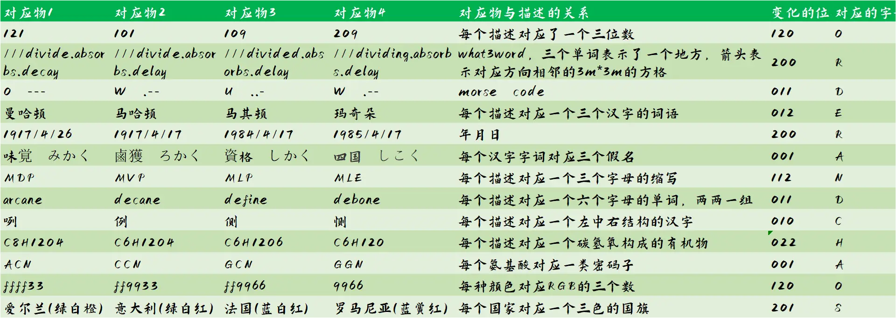

# 012

## 题面

奇怪的对话。

> **这是什么？是那个奇平方数吗？**
> 不，你说的那个是███
> **那个不是一个模3为2的瓦格斯塔夫数吗？**
> 那是███
> **啊？我一直以为那个是一个中心三角形数啊？**
> 那个是███
> **咦？你说的这个难道不是在六进制、九进制及十三进制下都是回文数的三位数吗？**
> 那是███

> **这是什么？是///deflate.sake.sending ←吗？**
> 不，你说的那个是███
> **那个不是///revival.convert.dust →吗？**
> 那是███
> **啊？我一直以为那个是///blunt.soak.confused ↑啊？**
> 那个是███
> **咦？你说的这个难道不是///fraction.quite.rivers ↓吗？**
> 那是███

> **这是什么？是O吗？**
> 不，你说的那个是███
> **那个不是W吗？**
> 那是███
> **啊？我一直以为那个是U啊？**
> 那个是███
> **咦？你说的这个难道不是W吗？**
> 那是███

> **这是什么？是纽约市的一个行政区吗？**
> 不，你说的那个是███
> **那个不是Coloratura搬去以发展她的事业的地方吗？**
> 那是███
> **啊？我一直以为那个是巴尔干半岛上的一个地理和历史区域啊？**
> 那个是███
> **咦？你说的这个难道不是一种咖啡吗，焦糖什么来着？**
> 那是███

> **这是什么？是建筑师贝聿铭出生了吗？**
> 不，你说的那个是███
> **那个不是列宁发表四月提纲吗？**
> 那是███
> **啊？我一直以为那个是英国和利比亚断交啊？**
> 那个是███
> **咦？你说的这个难道不是提出尤里卡计划这件事吗？**
> 那是███

> **这是什么？是味覚吗？**
> 不，你说的那个是███
> **那个不是鹵獲吗？**
> 那是███
> **啊？我一直以为那个是資格啊？**
> 那个是███
> **咦？你说的这个难道不是四国吗？**
> 那是███

> **这是什么？是常用于强化学习里的那个和序贯决策有关的概念吗？**
> 不，你说的那个是███
> **那个不是用来形容一场比赛里表现最出色的选手的吗？**
> 那是███
> **啊？我一直以为那个是那个有很多友善的四足动物的美国子供向动画啊？**
> 那个是███
> **咦？你说的这个难道不是利用已知的样本结果信息反推最具有可能的模型参数值的估计方法吗？**
> 那是███

> **这是什么？是斩获第49届安妮奖九大奖项的那部作品吗？**
> 不，你说的那个是███
> **那个不是癸烷吗？**
> 那是███
> **啊？我一直以为那个是下定义啊？**
> 那个是███
> **咦？你说的这个难道不是将什么东西去骨吗？**
> 那是███

> **这是什么？是伸展嘴角吗？**
> 不，你说的那个是███
> **那个不是用来作为依据的事物吗？**
> 那是███
> **啊？我一直以为那个是一个物体的左右两面啊？**
> 那个是███
> **咦？你说的这个难道不是悲伤吗？**
> 那是███

> **这是什么？是二乙酰乙酸乙酯吗？**
> 不，你说的那个是███
> **那个不是2,2-二羟甲基丁酸吗？**
> 那是███
> **啊？我一直以为那个是葡萄糖啊？**
> 那个是███
> **咦？你说的这个难道不是异丁基乙烯醚吗？**
> 那是███

> **这是什么？是Thr吗？**
> 不，你说的那个是███
> **那个不是Pro吗？**
> 那是███
> **啊？我一直以为那个是Ala啊？**
> 那个是███
> **咦？你说的这个难道不是Gly吗？**
> 那是███

> **这是什么？是electric yellow吗？**
> 不，你说的那个是███
> **那个不是deep saffron吗？**
> 那是███
> **啊？我一直以为那个是atomic tangerine啊？**
> 那个是███
> **咦？你说的这个难道不是green-cyan吗？**
> 那是███

> **这是什么？是爱尔兰吗？**
> 不，你说的那个是███
> **那个不是意大利吗？**
> 那是███
> **啊？我一直以为那个是法国啊？**
> 那个是███
> **咦？你说的这个难道不是罗马尼亚吗？**
> 那是███

## 答案

ORDER AND CHAOS

## 解析

这是由一个互联网的梗演变而来的题，原帖子表达的大概和如下对话类似：
_“那是拉普拉斯”“那个不是魔兽的一个地名吗？”“那是艾泽拉斯”，“那个不是和虚空有关的一个地方吗？”“那是艾卡西亚。”_
如你所见，大致的含义是一方总是会把一个相似的名称以为成另外一个名称，并用自己的理解加以叙述。本题也大致如此。

研究后可以发现，每一段话里，每个描述都是一个长度为“3”内容，且相邻两个描述对应的内容总是会对其中的一个进行变化。例如——
“纽约市的一个行政区”是曼哈顿；
“Coloratura搬去以发展她的事业的地方”是马哈顿；
“巴尔干半岛上的一个地理和历史区域”是马其顿；
“一种咖啡吗，焦糖什么来着”是玛奇朵。

根据“012”的提示，通过观察相邻两个变动的位次，组合成三位三进制数，得到答案order and chaos.

## 作者

Winfrid
