# 你画我猜

## 题面

人工智能间也能够相互理解吗？
Player 1: [wombo dream](https://www.wombo.art/)
Player 2: [squeezenet-v1.1](https://transcranial.github.io/keras-js/#/squeezenet-v1.1)

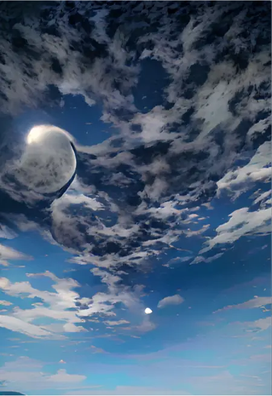 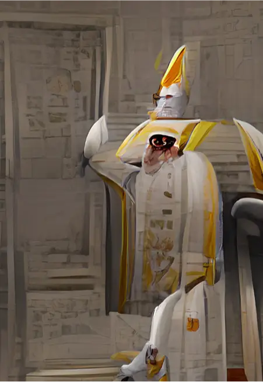 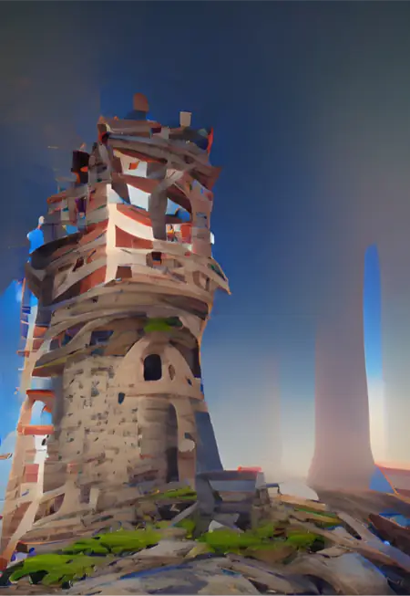 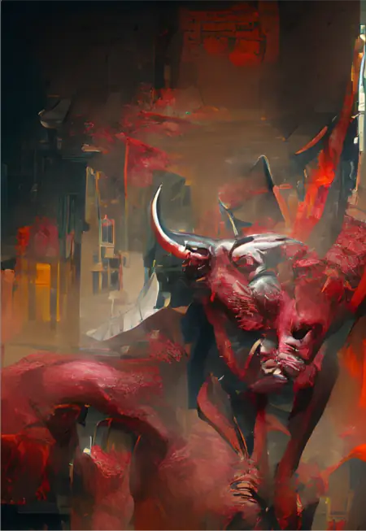  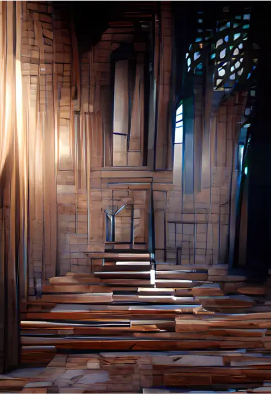 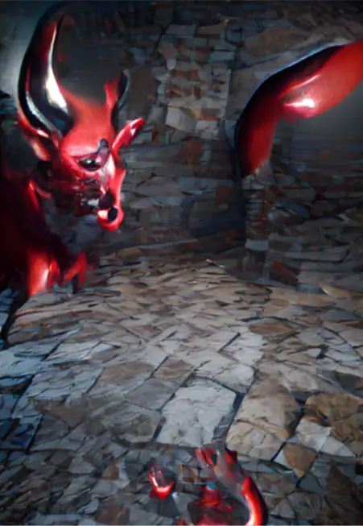 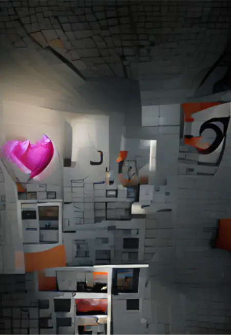 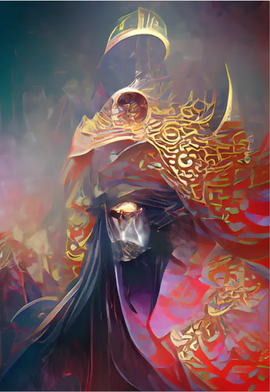 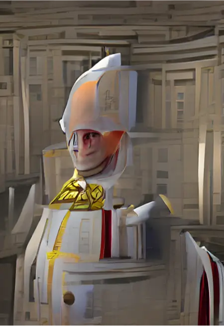 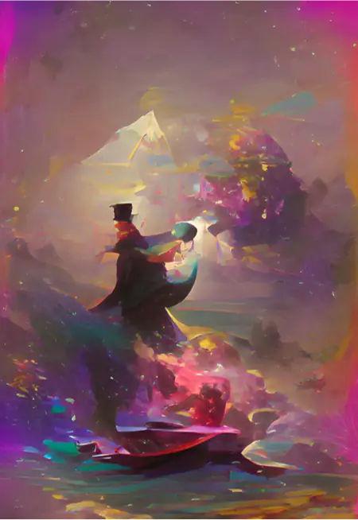 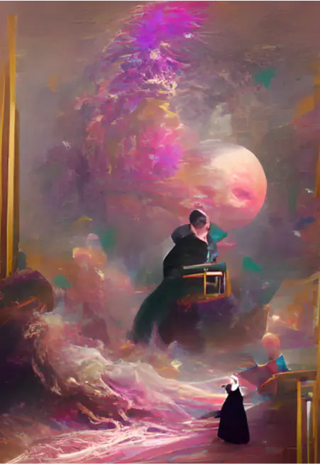 

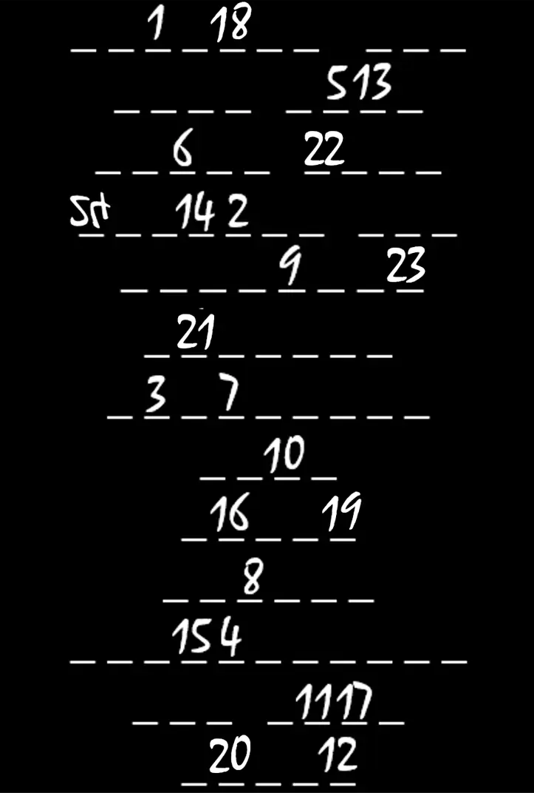

## 答案

REPORT OF DEATH

## 解析

这是一个“你画我猜”，但是画的玩家和猜的玩家都是AI。前者就是wombo dream，后者是squeezenet-v1.1.

首先先把这些画作交给后者去识别，取首选项，分别得到了如下的答案：

* flamingo
* feather boa
* mask
* organ
* stage
* screwdriver
* sea slug
* coral reef
* jellyfish
* gasmask
* bathing cap
* paddle
* bell cote
* jigsaw puzzle

然后按照首字母顺序排列好，就得到了最后一张图的结果。接着提取，得到the world is letter u in tarot，实际上是在暗示塔罗牌的第21张牌“世界”对应第21个字母U。

因此，我们可以发现，实际上AI can't understand AI。画画的AI明明画的就是一堆塔罗牌！还需要人类来进行肉眼识别。

可以看出，原来的AI画的分别是The Moon, The Pope, The Tower, The Devil, The Moon, Judgement, The Devil, The Lovers, The Emperor, The Pope, The Magician, Judgement, Strength（如果不确定，其实可以先把塔罗牌的牌面作为关键词交给wombo dream去画，从而判断有没有什么已经得到的画作是与之类似的）

本题中，第一个网站需要翻墙，但在解谜过程中其实用处不大，却合上了“你画我猜”这一逻辑。

转换成字母，得到report of death.

## 作者

Winfrid
