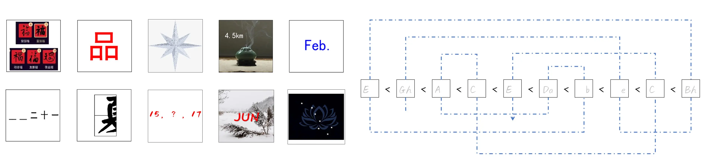
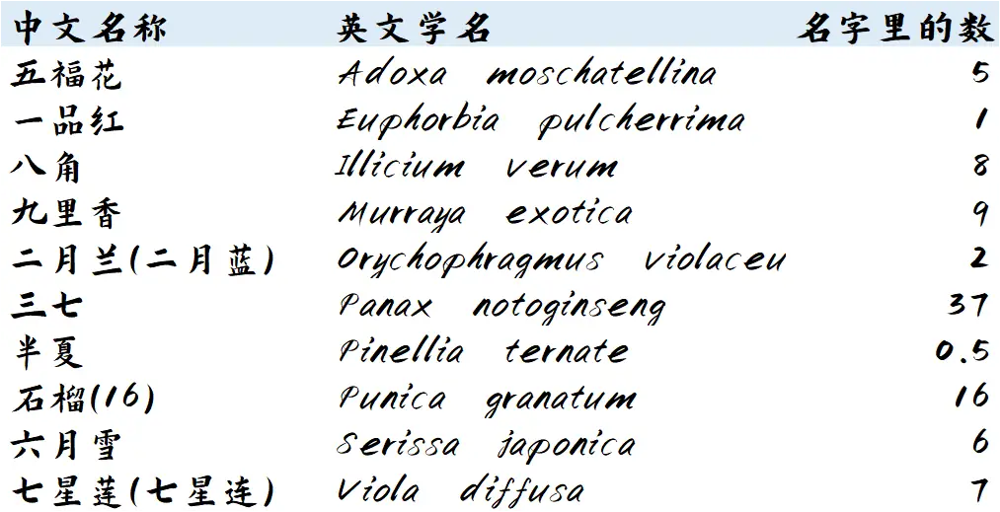
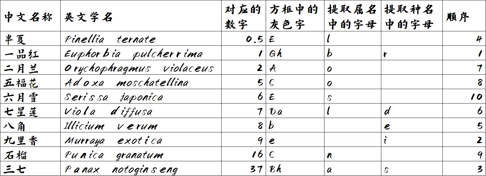

# 多吕

## 题面

我翻到蓝色书签夹着的、相册里的这一页。似乎，我还是不知道在那一天看见的这些图片都代表什么……

（解题中需要的信息，以百度百科为准）

## 答案

BALLOONS RISED

## 解析

通过对于下面图谜的识别，或者通过“‘多吕’可以组装成两个‘名’，暗示了双名法”的提示，能够知道需要找到每个图片谜的隐藏的花对应学名。 另外，文案隐晦地neta了"我们仍未知道那天所看见的花的名字。"（未闻花名）及其片头曲《蓝书签》，也暗示了这道题是和花名有关的。

值得一提的是，两个小细节可以帮助确认答案：中文名都含有“数字”相关内容（或谐音），所给花的顺序是按学名首字母字母表顺序排列的。

按照下方的指示，将其按数字升序排列。同时，方框中灰色的字暗示了提取哪一个字母。注意在双名法中，第一个单词的第一个字母需要大写，而第二个单词的第一个字母需要小写。因此根据大小写字母分别取属名、种名中的字母。

最后再次将属名、种名中的字母各自组合成单词，得到balloons rised.

## 作者

山南
