# 岛屿：2021文字密码谜题

## 题面

这里流淌着属于过去的文字……

请前往微信公众号Rivenux，在公众号后台回复【2021文字密码谜题】以开始。

## 答案

SUSPICIOUS

## 解析

首先，回复可以得到如下推送。

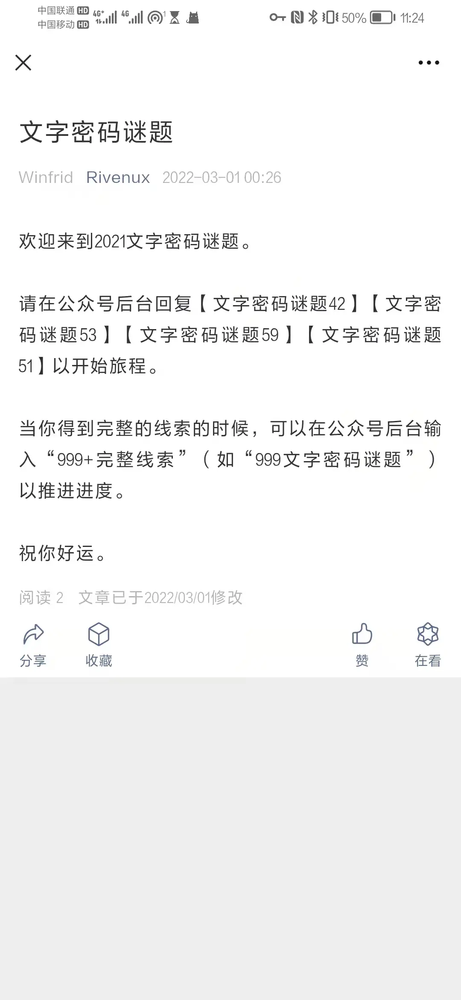

然后，回复相关内容开启四个小题。如果之前有过相关经历就可以知道，这些内容都是在neta公众号【2022文字密码谜题】的往期谜题。

#### 文字密码谜题之四十二

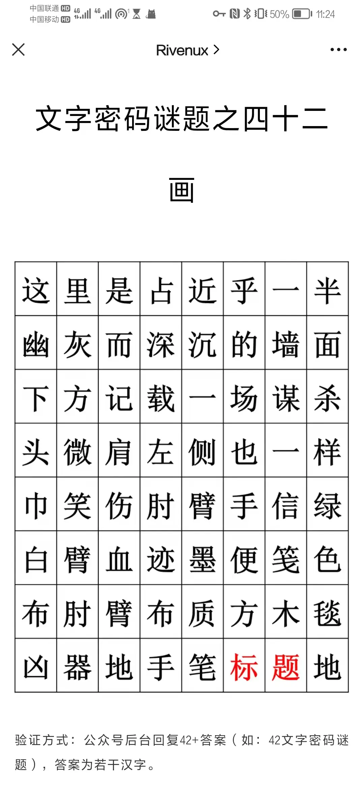

与原题将汉字作为笔画的载体所不同，这里的确是在用字阵表示一幅著名的画《马拉之死》，汉字表示的就是相应格子里的画面内容。因此，按照红色字体指示，答案就是“马拉之死”。

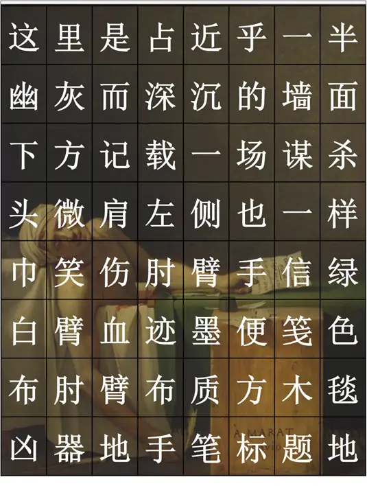

回复【42马拉之死】，得到线索碎片。

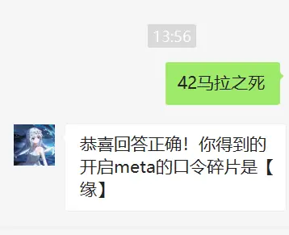

#### 文字密码谜题之五十三

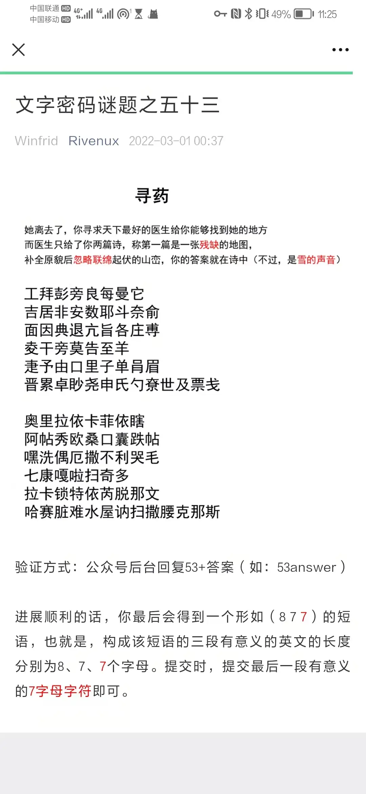

“残缺”的提示，加上对于汉字的敏感度，就能够发现每一行的所有汉字都可以加上同一个部首变成新字。 不难发现，每行都可以组成一些词语，而且是“联绵词”。

江湃澎滂浪海漫沱→澎湃、滂沱、浪漫
拮据排按擞揶抖捺揄→拮据、按捺、抖擞、揶揄
腼胭腆腿肮脂胳脏膊→腼腆、胭脂、肮脏、胳膊
棱杆榜模梏桎样→模棱、桎梏、榜样（模样不是联绵词）
婕妤妯如娌好婵娟媚→婕妤、妯娌、婵娟
缙缧绰缈绕绅纸约缭绁级缥线→缧绁、缙绅、绰约、缥缈、缭绕

忽略联绵词，取未形成联绵词的汉字，并在下方找到对应的字：奥菲秀厄康特芮文讷克斯

根据提示，这是“雪的声音”（“雪”是一个特别喜欢谐音梗的谜题设计者），于是根据题目信息尝试把它转为形如(8 7 7)的英文，得到official account Rivenux（Rivenux是本公众号的名称）

回复【53rivenux】，但发现第一次（可能）没得到线索碎片。根据指示多试几次即可。

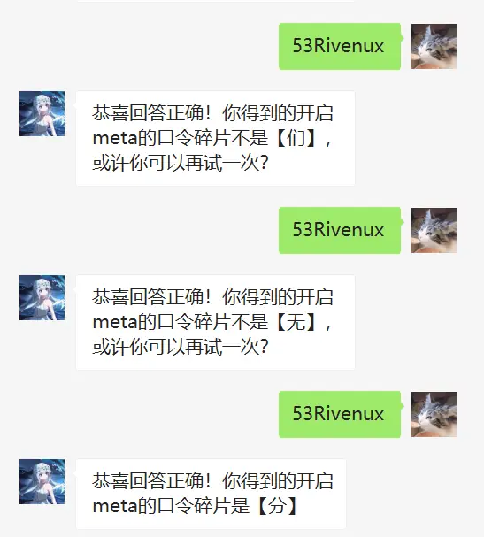

#### 文字密码谜题之五十九

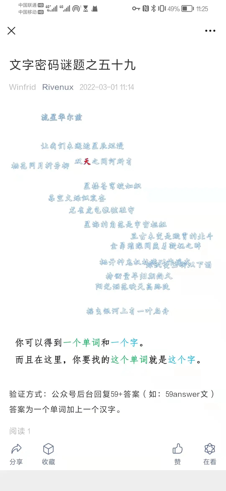

见到题目这么乱七八糟，就让人怀疑可能是利用几何关系提取。果不其然，按照“双天之间何所有”，把两个“天”连起来，发现穿过了七个汉字。

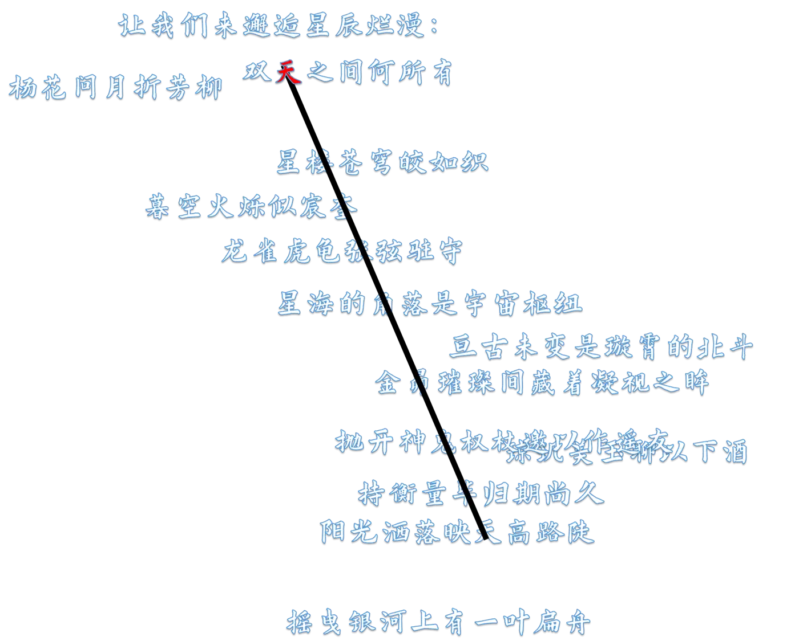

通过搜索或者常识可以发现，这七个汉字都是二十八星宿之一，而根据诗句中“龙雀虎龟”的顺序按照青龙-朱雀-白虎-玄武的次序编号，可以自上而下将其替换为数字：16 15 12 1 18 9 19，转为字母得到polaris，即“北极星”。根据提示，我们要找的汉字也就是北极星。查阅资料发现北极星是天璇向天枢延长线上五倍距离处。找到诗句中的“枢”和“璇”及其它北斗星，可以找到北极星的位置“折”或者“月”（由于偏差的存在）。

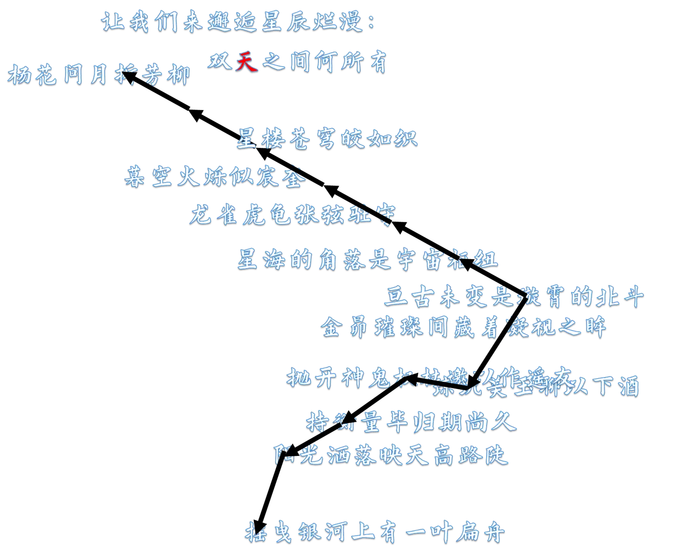

回复【59polaris折】或【59polaris月】，多尝试几次可以得到线索碎片。

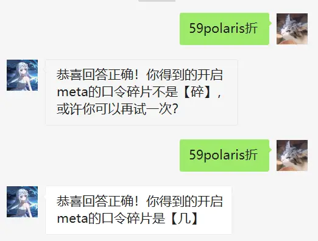

#### 文字密码谜题之五十一

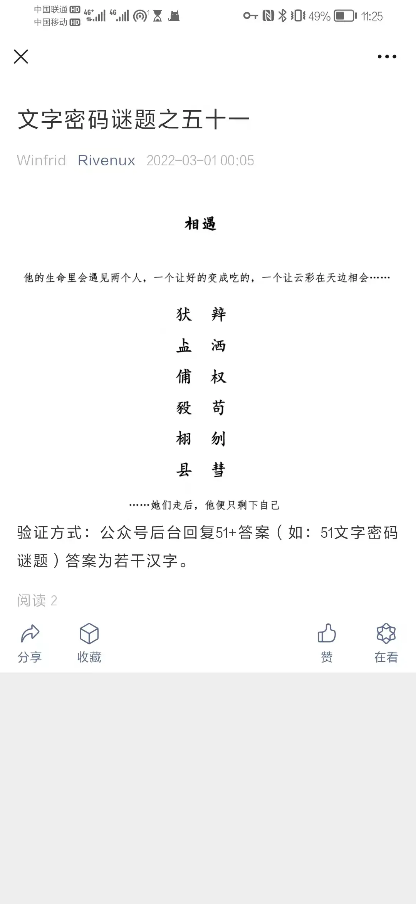

和所neta的原题相映成趣，这里并非添字组词，而是添部件组字。第一行极度有辨识度的两个字暗示了这一点。另一方面，题干里的“让好的变成吃的”“让云彩相会”暗示了添加了“人”后，“良→食”、“云→会”的过程。

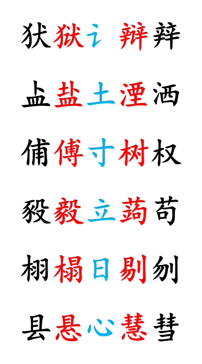

将得到的组件拼在一起，可以得到“诗意” （虽然按道理，“意”的内部是“曰”而非“日”，但应当不影响做题进程，因此没有调整）。 回复【51诗意】并反复几次，得到线索碎片。

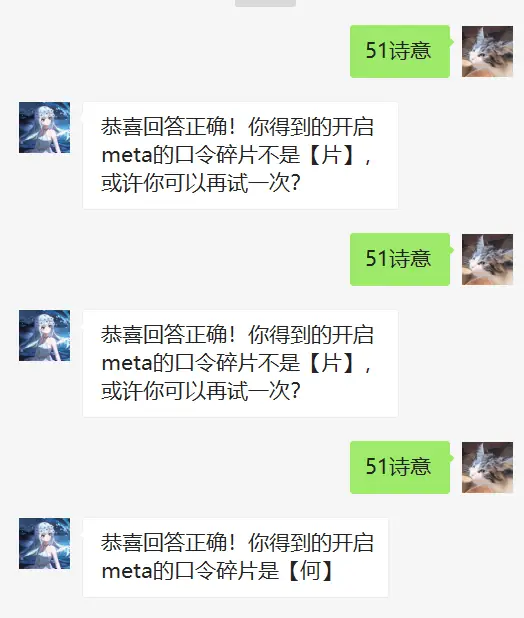

拼在一起，得到“缘分几何”，于是回复【999缘分几何】，开启meta。

#### 文字密码谜题之一千

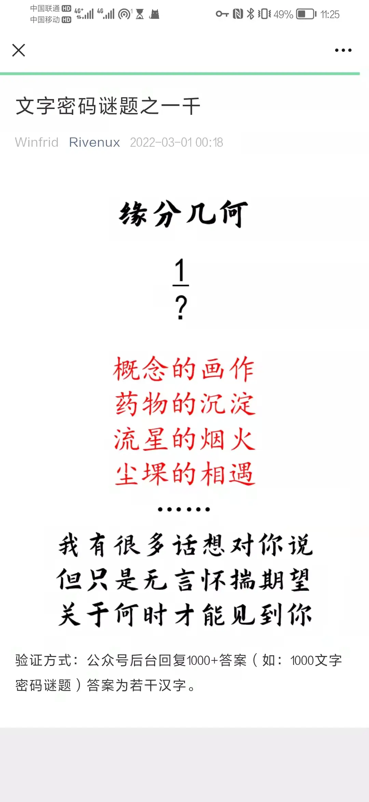

“缘分”、“期望”以及最上侧的分数，联系之前回复中出现的奇怪现象，可以意识到是分数就是每一次回复能够获得线索碎片的概率。通过收集没拿到口令的碎片得到完整的话“我们是无用的碎片”，并且可以发现这四者的触发概率分别是1/1、1/5、1/4、1/2 。 取对应位置的汉字得到“概淀烟堁”，这四个字的部首分别是“水木火土”，去掉后得到有意义的话语“既定因果” 回复【1000既定因果】，得到最后的meta。

#### 文字密码谜题之一千零一

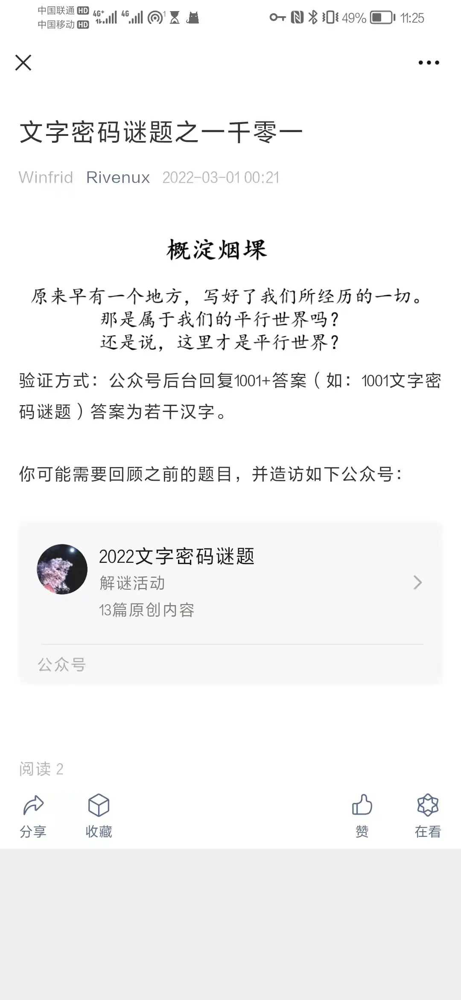

这里的标题还是很诡异地呈现出带有木水火土四个偏旁的形式，并且提示语去指引我们回顾之前的题目，回溯后发现对应的题目中都有对应的五行！再去找到neta的原题：

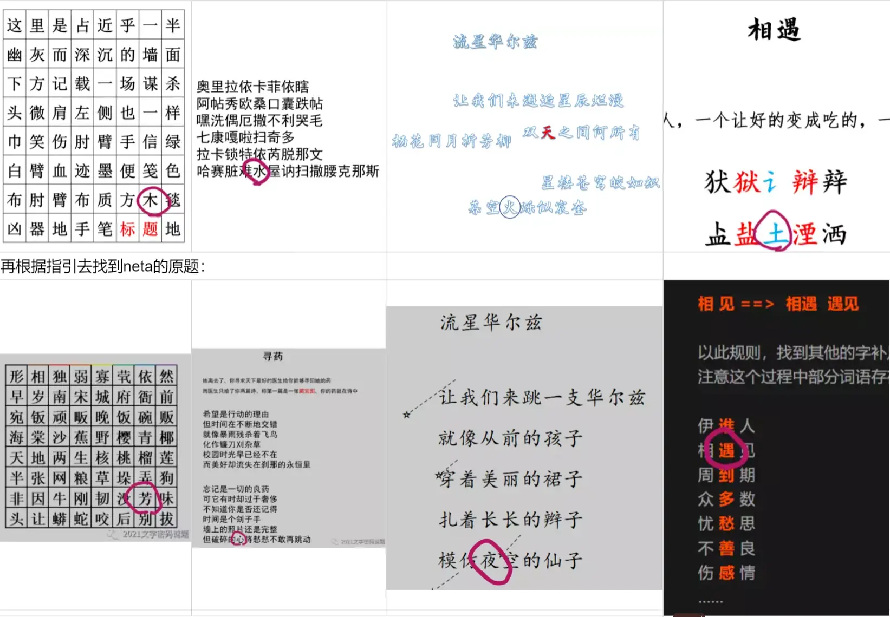

因此得到答案“芳心夜遇”，回复【1001芳心夜遇】即可获得需要填入网站答题框的答案suspicious。

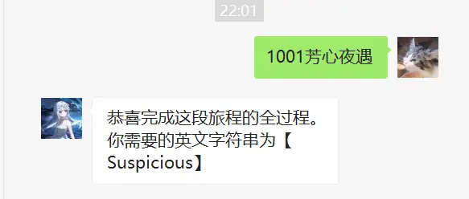

## 作者

Winfrid
