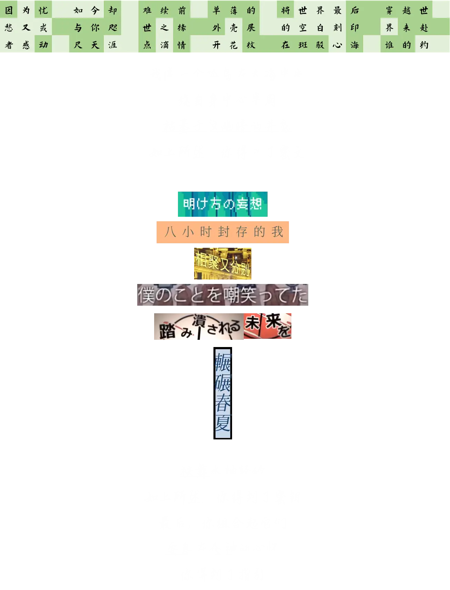
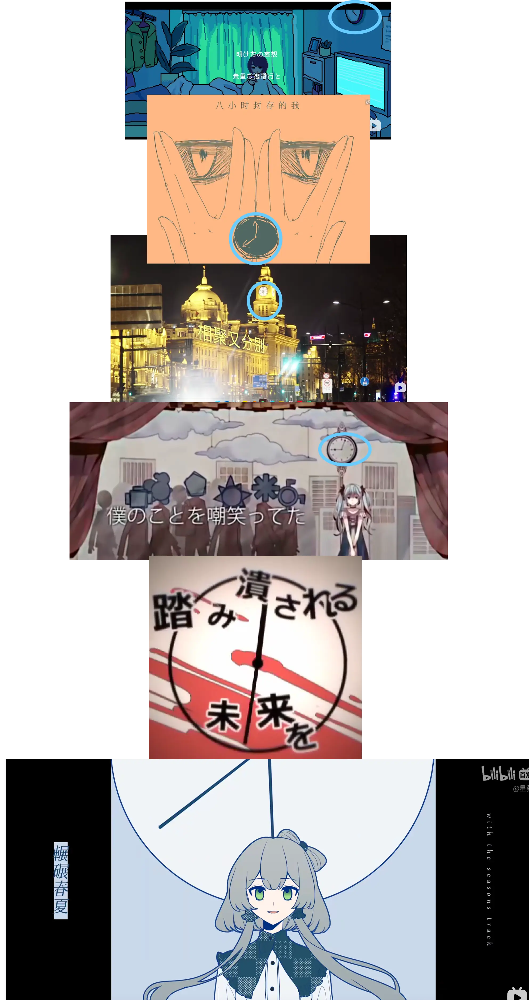
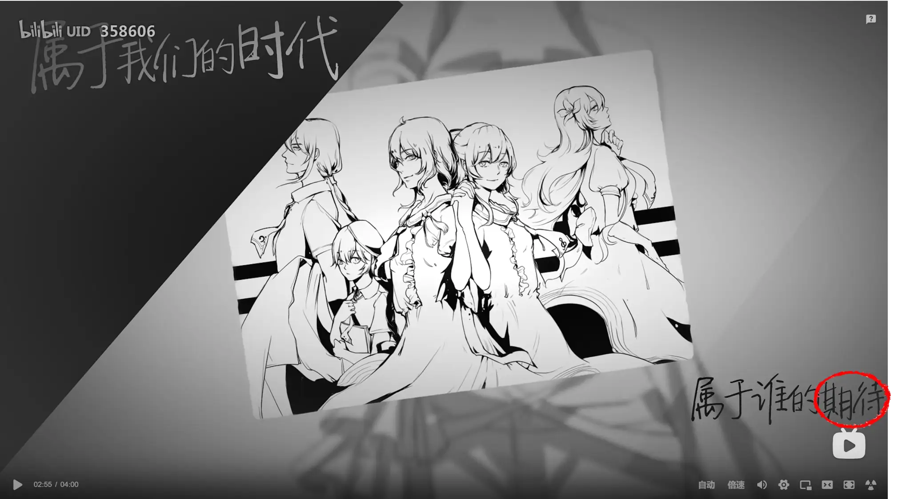

# 岛屿：为了你唱下去

## 题面

你是在问支撑起这种表达欲的支柱吗？嗯……我想一想……
我是在…为了什么而唱下去？

## 答案

EXPECTANCY

## 解析

一道专门为vocaloid而设计的题，所有歌曲均可以点击造访原链接，因此这里的staff信息只保留核心staff（曲/词/歌姬）。

标题就是一首歌：[COP/洛天依《为了你唱下去》](https://www.bilibili.com/video/BV1ts411y7FY?spm\_id\_from=333.337.search-card.all.click)，不过只是个小小的彩蛋，只起到主题提示作用。

### 第一部分

“我像一个孤岛在大海中央”：[乱心/流绪/洛天依《我在雨中旋转》](https://www.bilibili.com/video/BV1bB4y1c7X4?spm\_id\_from=333.337.search-card.all.click)（这首歌的pv可以用WASD的键进行旋转），暗示了“雨中”的文字要旋转半周。

这个长方形里的歌词的原曲如下（可以用搜索引擎/萌娘百科/音乐软件）：

“因为忧愁又或者感动”：[DELA/雨狸/洛天依feat乐正绫《永昼》](https://www.bilibili.com/video/BV1bB4y1c7X4?spm\_id\_from=333.337.search-card.all.click)
“如今却与你咫尺天涯”：[砖厂浪人/洛天依、言和《长夜雨》](https://www.bilibili.com/video/BV12s411U7k9?spm\_id\_from=333.337.search-card.all.click)
“难续前世之缘点滴情”：[Wing翼/洛天依《三月雨》](https://www.bilibili.com/video/BV1vx411F7Ey?spm\_id\_from=333.337.search-card.all.click)
“单薄的外壳展开花纹”：[LS/果汁凉菜/洛天依《夏虫》](https://www.bilibili.com/video/BV1Hf4y1L7MF?spm\_id\_from=333.337.search-card.all.click)
“将世界最后的空白刻印在斑驳心海”：[COP/洛天依《凉雨》](https://www.bilibili.com/video/BV12x411y7SN?spm\_id\_from=333.337.search-card.all.click)
“穿越世界来赴谁的约”：[ilem/星尘、徵羽摩柯《看星星》](https://www.bilibili.com/video/BV1oc411h7mR?spm\_id\_from=333.337.search-card.all.click)

“永昼”“夏虫”“看星星”一看就不是下雨的日子。所以把《三月雨》、《凉雨》、《长夜雨》的格子旋转半周：

“枯萎于这幽暗的井底”：[JUSF周存/Sya/洛天依《盲》](https://www.bilibili.com/video/BV13s411d7RM?spm\_id\_from=333.337.search-card.all.click)，暗示了盲文。

据此，用盲文解读，得到的密文为：AOTBVRFVLCNYH

### 第二部分

“袂舞水袖轻纱”：[闹闹/LS/St/洛天依、乐正绫《扬旗鸣鼓》](https://www.bilibili.com/festival/VSF2022live?bvid=BV1mb4y1E7RF\&spm\_id\_from=333.337.search-card.all.click)，暗示了旗语。

给出的pv画面截图与其对应的时间如下（日文vocaloid的歌曲这里给出bilibili搬运的视频，原作信息可以在其简介找到）：

“明け方の妄想”：[Ayase/初音ミク《シネマ》（cinema）00:36](https://www.bilibili.com/video/BV1dN411f7TZ?spm\_id\_from=333.337.search-card.all.click)（注意后方窗帘的颜色限定了时间点）
“八小时封存的我”：[Sya/JUSF周存/洛天依《自暴自弃》00:36](https://www.bilibili.com/video/BV19b411m7mq?spm\_id\_from=333.337.search-card.all.click)
“相聚又分别”：[ilem/洛天依《夜间出租车》02:52](https://www.bilibili.com/video/BV1vb411Y7A6?spm\_id\_from=333.337.search-card.all.click)
“僕のことを嘲笑ってた”：[40mP/初音ミク《からくりピエロ》（活动小丑）01:04](https://www.bilibili.com/video/BV1TD4y1Q78b?spm\_id\_from=333.337.search-card.all.click)
“踏み潰される未来を”：[じん/初音ミク，IA《コノハの世界事情》（konoha的世界事情）02:00](https://www.bilibili.com/video/BV1zx411w7KC?spm\_id\_from=333.337.search-card.all.click)
“辗碾春夏”：[星葵/SuyaTrace/洛天依《滴答滴答》）01:59](https://www.bilibili.com/video/BV13L4y1p7y3?spm\_id\_from=333.337.search-card.all.click)（这首歌的pv有摩斯密码的彩蛋）

并非巧合地，这里的pv对应的画面都有一个时钟，联系“扬旗鸣鼓”暗示的旗语，很显然能够意识到是要用旗语把表面转化为字母：VKNQDA

### 第三部分

“安息在众神的心怀”：[JUSF周存/洛天依《恺撒》](https://www.bilibili.com/video/BV1zP4y1G7FM?spm\_id\_from=333.337.search-card.all.click)，暗示了Caesar密码。

总之，先用VKNQDA作为密钥对AOTBVRFVLCNYH的密文解密，再进行位移，能够得到有意义的字符串BACHONGHUIGUI：[DELA/雨狸/洛天依，乐正绫《八重回归》](https://www.bilibili.com/video/BV1Hx411C7xF?spm\_id\_from=333.337.search-card.all.click)

浏览其pv，能够在02:54看到题中最后的画面。

因此，答案为“expectancy”。（输入“期待/qidai/expectation/expect”都可以得到“试一试expectancy”的回复）

## 作者

Winfrid

## 附言

设计这道题的动机，一方面是把自己喜欢的歌（《八重回归》）以一种强迫解题者看完的方式安利出去（。），另一方面也是能让更多的人了解到vocaloid/虚拟歌姬这件事——和《文学少女》那题的初衷是类似的。
