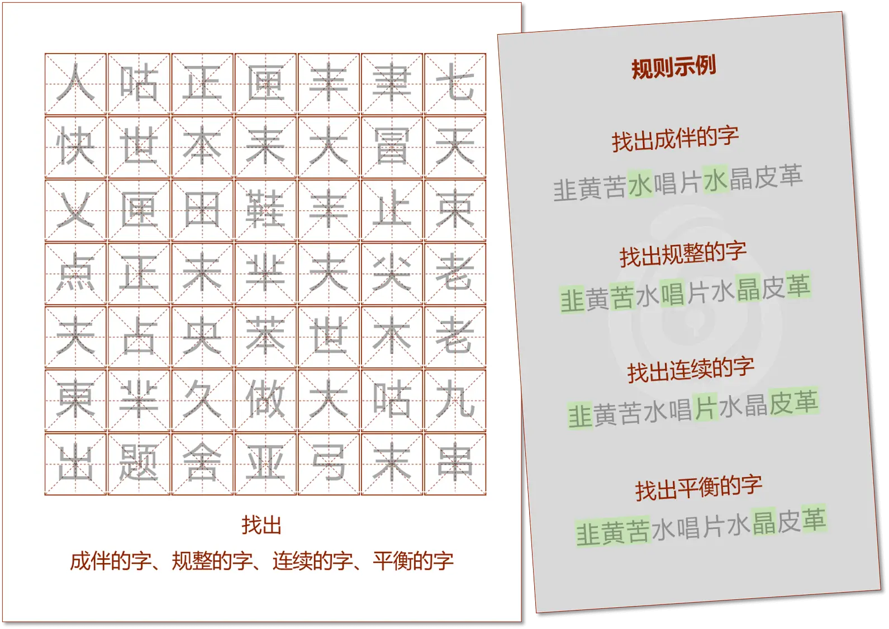
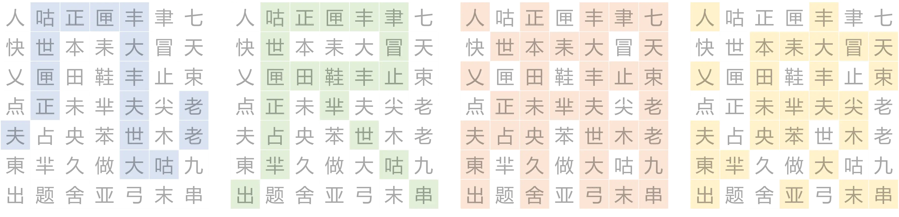

# 字帖

## 题面

:::info
[P&KU2：字帖](https://pnku2.pkupuzzle.art/#/game/miyu/prob_02)
:::

_“微软雅黑？谁会练这种字体啊？”_

_“别动别动，改了字体题就不对了！”_

_——毕竟，这可是个不认识汉字的人也可以做的题啊。_

## 答案

几尺湘波

## 解析

这道题的题图分为两个部分，右侧是“成伴、规整、连续、平衡”的规则示例，左侧则要在一张字帖里找出符合各自这四种规则的字。
因此，我们需要根据右边的规则示例，分析出这四个词各自代表的是什么规则。

值得一提的是，这道题所配文案（flavor text）里提到这道题是“不认识汉字的人也可以做的题”，而且所有的字都是微软雅黑，“改了字体题就不对了”，
**这些都明示着这道题和汉字的读音字义都无关，而要将汉字视作一个个图案来看待**。

因此，我们可以很轻松地得到：

- 成伴：此字在字帖中存在完全相同的另一个字
- 规整：此字的图案只由水平和垂直的线组成
- 连续：此字的图案的所有线条是连通的
- 平衡：此字的图案是轴对称图形

在理解了规则的基础上，我们标出左侧符合要求的字就可以得到答案 **“几尺湘波”**。（注意“芈”和“羋”是两个不同的字！）

一个彩蛋：这四种规则都不符合的字正好有四个，连起来是“快点做题”。

## 作者

Winfrid（设计与美工）

## 附言

### Winfrid

小西门外有一家叫羋重山老火锅的店，由于其名字所以成为了和五月经常去的馆子。但可惜这个羋不是连续的。

“芈”这个字确实太优雅了，连续平衡而规整，如同这个字的本义一样，如温顺的羊鸣。
