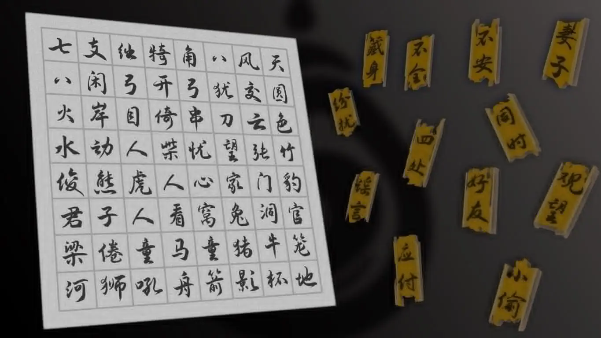
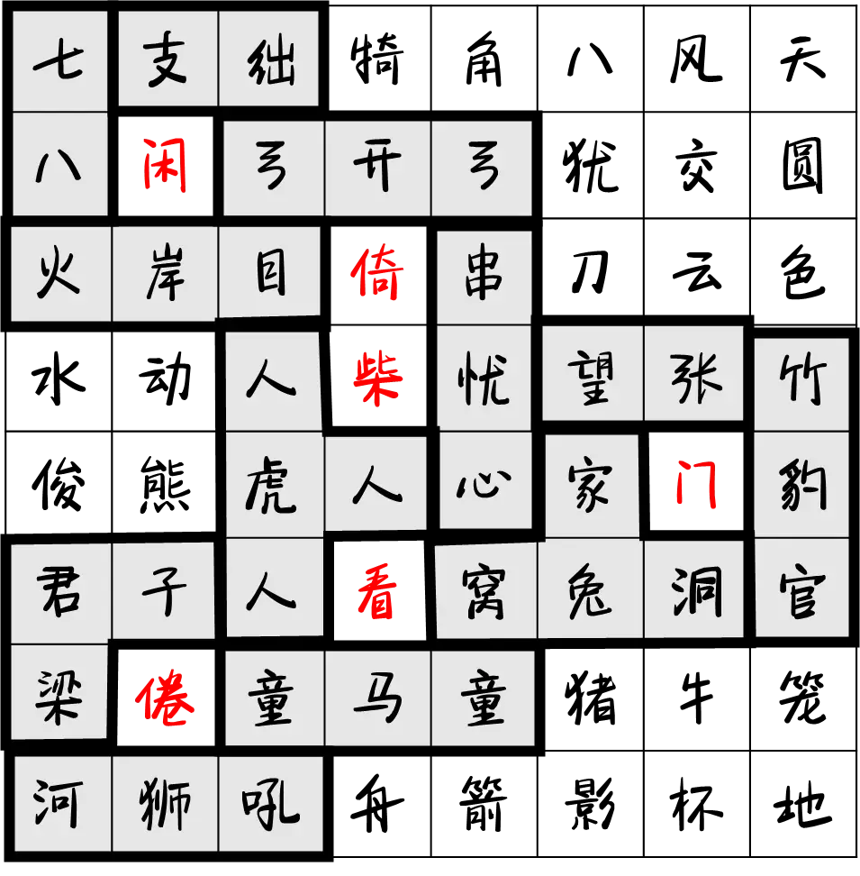

# 破碎的竹简

## 题面

:::info
[P&KU2：破碎的竹简](https://pnku2.pkupuzzle.art/#/game/miyu/prob_05)
:::

_洞里乾坤大。_

## 答案

闲倚柴门看倦

## 解析

题目的图里给出了左侧的一块汉字墙和右侧的十二块破碎的竹简。不难看出左侧其实有一些隐藏的成语（比如从“支绌”里可以靠语感和中文积累很快地意识到是“左支右绌”）。所以，其实左侧其实是汉字版本的 word search，不过搜索的是**能够从字面上表示成语的具有几何关系的汉字组合**，比如左支右绌就是左边的“支”和右边的“绌”。

接着可以发现，**其实找到的成语的释义里包含了右侧的竹简之一**。比如，“左支右绌”是“指力量不足，应付了这方面，那方面又出了问题”。所以，我们可以从左侧开始寻找，然后根据右侧进行检验，来确保自己寻找到的成语是正确的。

| 汉字墙上的汉字组合                   | 对应成语 | 对应的释义碎片 |
| ------------------------------------ | -------- | -------------- |
| 上面的**七**和下面的**八**           | 七上八下 | ……不安……       |
| 左边的**支**后右边的**绌**           | 左支右绌 | ……应付……       |
| 隔着**岸**的**火**和**目**           | 隔岸观火 | ……观望……       |
| **开**的左右各有一个**弓**           | 左右开弓 | ……同时……       |
| 里面是**忧**，外面包着**串心**（患） | 内忧外患 | ……纷扰……       |
| 三个**人**和一个**虎**               | 三人成虎 | ……谣言……       |
| 东边的**张**和西边的**望**           | 东张西望 | ……心神……       |
| 里面是**豹**，外面是**竹官**（管）   | 管中窥豹 | ……不全……       |
| **兔**有**家窝洞**三个窟             | 狡兔三窟 | ……藏身……       |
| **梁**上面有**君子**                 | 梁上君子 | ……小偷……       |
| 两个**童**和一个**马**               | 二童一马 | ……好友……       |
| **河**的东边是**狮吼**               | 河东狮吼 | ……妻子……       |

最后，根据题目的文案（flavor text）“洞里乾坤大”，可以发现其实找到的汉字组合们围成了几个洞。洞里的汉字 **“闲倚柴门看倦”** 就是答案。

## 作者

五月、Winfrid（设计）；Potto（美工）

## 附言

### Winfrid

我看到了小时候玩的“疯狂猜成语”之流的游戏之后发给五月，五月制作出来的结果。Potto 的美工让这道题变得非常高级，好评率也出乎预期得很高。赞美他们。

仔细一想，这道题从左侧入手，实际上是一个中文语境下的 word search，而且题目逻辑与中文本身深度绑定；从右侧入手，实际上是《中国成语大会》里的双音节猜词。这么一想，这道题又变强了不少。

### 五月

本次出题承接了非常多来自Winfrid的谜题订单（Winfrid提出点子，我来具体实现）。这是订单中的一道。这题我没啥想说的，正好列一下哪些是订单题：**竹简、写真一言、数回、文化自信、爱的明信片里面的答案小题、零分作文**；Winfrid太强了。

### Potto

为了贴近“竹简”，这道题一开始我打算用篆体的（
