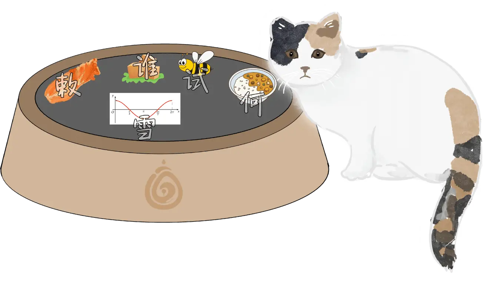
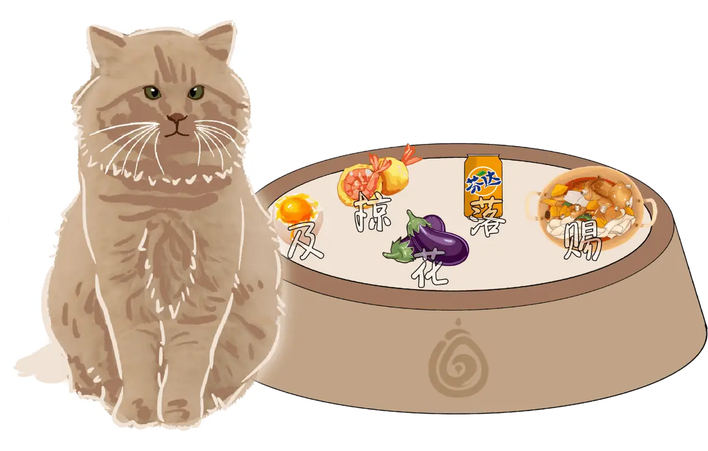
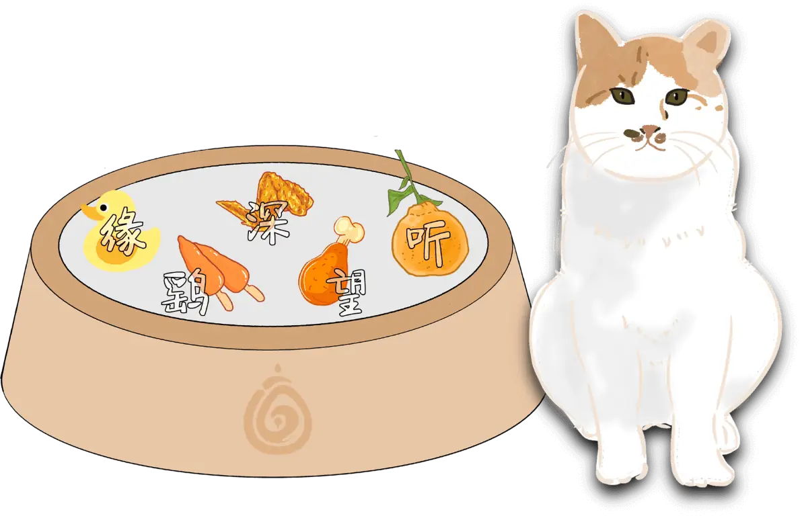
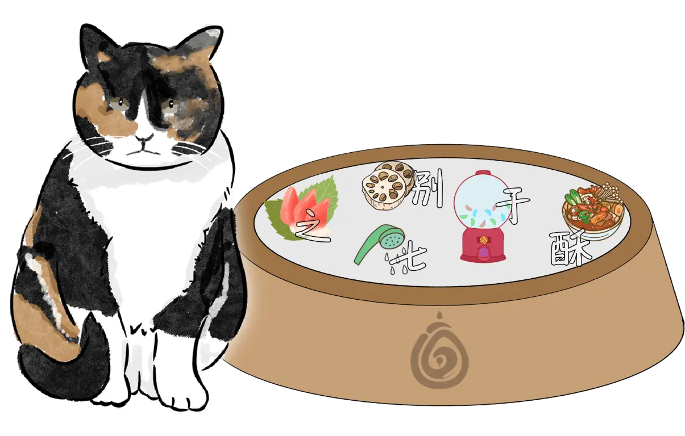
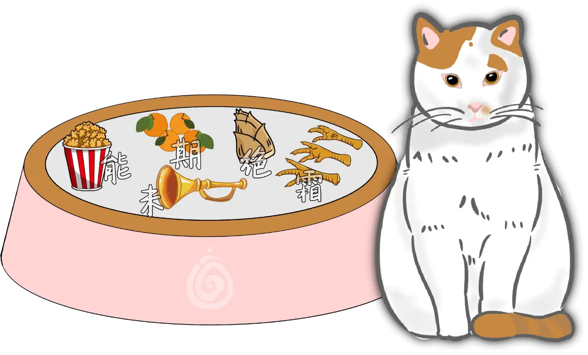
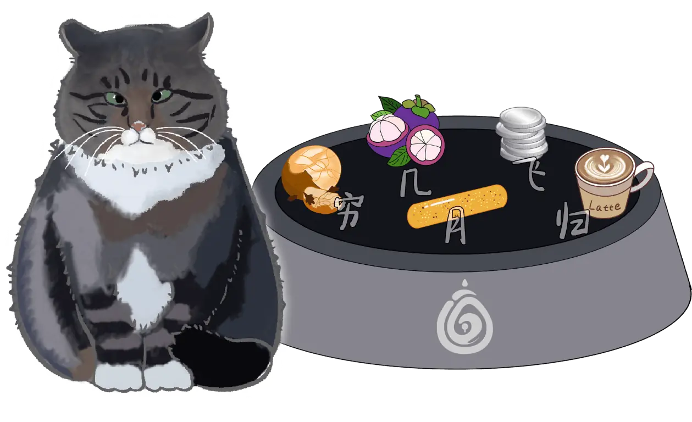
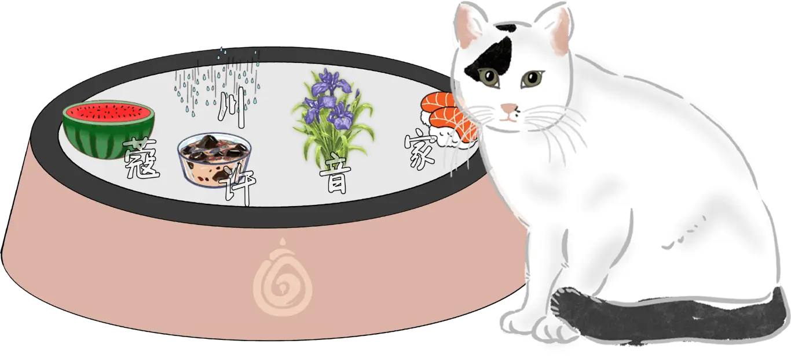
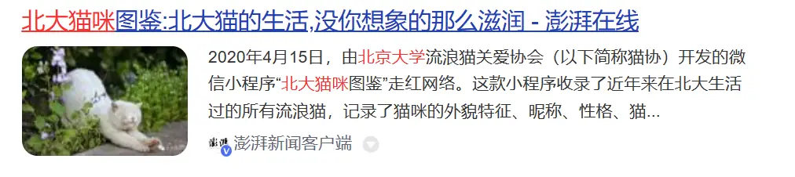

# 猫

## 题面
:::info
[P\&KU2：猫](https://pnku2.pkupuzzle.art/#/game/miyu/prob\_07)
:::

_咦？这些猫不应该在校园里吗……_ _怎么跑到这里来的？_

注：本题中的食物仅为谜题效果，请在给猫投喂的时候选择适宜的食物。

## 答案

敕赐深之能几许

## 解析

这些猫咪画的很真实，这往往暗示着你需要去搜索这些猫。就本题而言，题目描述（flavor text）暗示这些猫都来自北京大学的校园。

用搜索引擎搜索“北京大学 猫”，可以很轻松地搜到北京大学流浪猫关爱协会（猫协）开发过微信小程序“北大猫咪图鉴”的一则新闻。

于是前往微信小程序搜索，可以发现这七只猫的名字分别叫作**泡菜、大盘鸡、鸡翅、北极贝、鸡米花、山竹、仙草**。而有趣的是它们身旁的盆子里也有对应的食物！于是提取所对应食物旁边的汉字，可以得到答案 **“敕赐深之能几许”**。

## 作者

黄老九（设计与美工）

## 附言

### 黄老九

立志于产出简单凑数题，但是猫猫就是最可爱的！

### Winfrid

本质上是一道对于校内校外的朋友而言都是送分的校园文化题+美工题。老九的美工太强了。 其实 P\&KU2 有很多校园文化题的思路，但最后都被否定了（因为太难以平衡校内外人员的尤里卡时刻），留下来这么一道。

**而这道之所以摆在这个位置，其实是特地为这道题解锁的觅月区的题开路的（笑）。**

### 生煎

快乐吸猫和嘲笑猫名。
