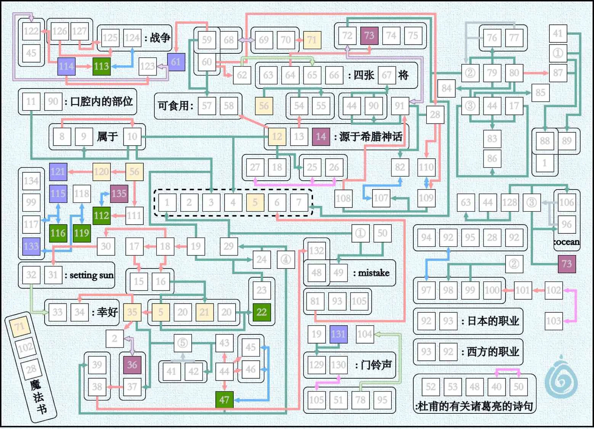
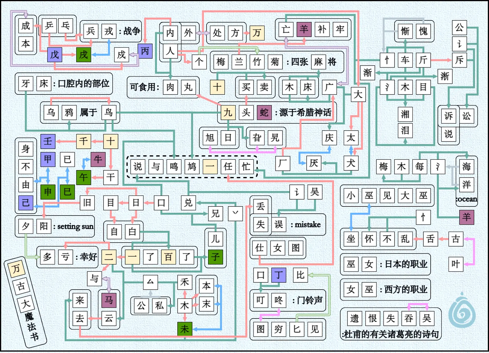

# 万古大魔法书

## 题面

:::info
[P\&KU2：万古大魔法书](https://pnku2.pkupuzzle.art/#/game/miyu/prob_09)
:::

_据说这是从远古时期流传下来的魔法书的某一页。_

_这些密密麻麻的管道，是什么药剂的合成路线吗？_

> 如下给出了 drawio 附件。您可以下载并前往 diagrams.net 打开文件进行操作。但无法访问也无关紧要——其中的内容和题目图片是完全一致的，仅仅是为了方便操作而存在。

- **你可以** [下载题目的 drawio 文件](https://pnku2.pkupuzzle.art/media/miyu/109_prob_09_WGDMFS/WGDMFS_File_2.drawio)

## 答案

说与鸣鸠一任忙

## 解析

题目的图上，给了若干个小正方形，以及它们中间的不同颜色的箭头。眼花缭乱，宛如一道极其复杂的化学元素推断题。注意到中间的1-7的格子是被一个特殊的虚线框框着，于是能够猜想到这就是答案。

解题的自由度很高，可以从任何一个地方开始并推进。如下给出了一种可能的解：

1. 首先，根据标题和图片左下角，我们知道 **“一格数字代表一个汉字”**，并填入71万102古28大。观察发现**“圆角矩形括起来的内容可以连成连贯的字词”**。另外**某些字底色特殊，推测为同一类字\*\***。
2. 看箭头特征我们推测：**青绿色箭头为多目运算，蓝灰色为双目运算，红色浅绿色为单目运算，紫色粉色蓝色为可反单目运算**。
3. 注意“杜甫有关诸葛亮的诗句”为五言，并且后两个字有特殊关系。搜索“杜甫 诸葛亮 五言”发现名篇《八阵图》中“遗恨失吞吴”一句符合条件，正确概率较大，填入52遗53恨48失40吞50吴。另知 **“粉色箭头为物件移位”**。（另推知103叶。无用。）
4. 注意“mistake”可以看出第一个字是失，第二个字是①+吴。青绿色箭头极其普遍，推测为两字直接拼接。则根据mistake的意思猜测这里是“失误”，填入49误①讠。另知 **“青绿色箭头为两字拼接”、“圈加数字代表偏旁等部件”**。
5. 注意“四张67将”处，猜测67为麻。观察下方箭头，发现91+44+44=麻，则91广44木90床。（另广大得82庆，广减笔得108厂，大添笔与厂得110太109犬107厌，但基本无用。）
6. 注意“ocean”处，两字拥有同一偏旁，并表示ocean。查找得“海洋”“汪洋”“沧海”三个符合条件的常用词。则知③氵。若96海，则73每，而难以解释“每”的底色，暂时排除。填入96洋73羊，另知 **“灰蓝色箭头为取相同部分”**。
7. 回到ocean附近，106-氵+木=63，而63为麻将牌。推出106海128每63梅。而由于四张麻将牌成词则有64 65 66为兰竹菊，另知 **“红色箭头运算为添一笔”**。
8. 注意左下角木处，可添一笔得到43 45 46 47，且45 46成词，45 46 47满足蓝色箭头运算。则知45 46为本末。观察猜测**蓝色箭头规则为“移动一笔画的位置”**，则有47未。
9. 中上60加一笔为大，则60人。人加一笔为62，则62个或及。而62与竹有字形关系（由目前已知关系均为字形关系猜测），则推测竹表示两个个字，及**绿色箭头“为原字双倍”**。
10. 注意“门铃声”，得“叮咚”或“叮铃”。铃字无法进行粉色箭头运算，则129叮130咚105图。
11. **女巫支线**：（这一条是现在开始任意时刻均可平行进行的支线，但难度略高可能无法立即完成。）推出101舌100乱，查询乱结尾的成语有坐怀不乱，填入97坐98怀99不②忄。推出92巫，得全词为“小巫见大巫”，填入94小95见。下方图51 78见得51穷78匕。78可进行绿色箭头操作，得104比，知“绿色箭头为两倍并列”。另根据右侧巫93和93巫的提示推出93女。由81女图得81仕，6任。
12. 注意右上角木处氵+木+17=83，则有“目”“斤”“公”“旦”四解（其他解均非常用字），而“木17”也成字，排除公旦。再注意左下17，知17去一笔也成字，排除斤。得17目83湘86泪18日19口，回到门铃声有131丁。
13. 132失中的132减一笔为38再减一笔为37，搜索词语知132丢38去37云。云分为两个部分，一个确定成字，则35二⑤厶。二去一笔有5一。另由“一”“二”“万”结合发现 **“数字为黄色背景”**。
14. （由setting sun联想到“阳”，发现30旧31阳符合条件。而32可进行绿色箭头运算，则32夕33多，再由“幸好”和“二”联想到34亏。不过这条路线没有太大用处。）
15. **惭愧支线：**（这一条是现在开始任意时刻均可平行进行的支线，但难度略高可能无法立即完成。）厶和多一笔的木成字，得42私43禾。私和同词语另一字有公共部件厶，得41公，右上角有89讼。常用词中另一字也为言字旁的词想到“诉讼”（笔者的文化水平只认识这个），得88诉87斥80斤85淅。查询诉的常用词语有“诉说”“诉讼”，得1说。“惭愧支线”完。（结合氵与忄可得79车76惭84渐77愧（或者怍，但不常用），回到中间有29兑24兄④丷23儿39来。但这段推理没有很多作用。）
16. 目日各加一笔变为一词，可得“自白”“自由”二解。而由+一无实际汉字，则15自16白21百。根据成语知20了，并推得22子。另由“子”“未”发现 **“地支为绿色背景”**。
17. 注意“源于希腊神话”处。日加一个数字汉字可得27日与25 26二词，且另三字均有该汉字与日组成。则有12九25旮26旯27旭。
18. 搜索九开头的希腊神话有关的动物（14底色与羊一致，猜测为动物），得九头蛇，填入13头14蛇，确定 **“生肖（至少动物）为紫色背景”**。头添笔有买，买加数字有同词另一字，则54买55卖56十。
19. 注意左侧“口腔内的部位”，猜测11牙。搜索牙字旁汉字只有鸦符合下面的短语，得8乌9鸦10鸟，则有3鸣4鸠。
20. 注意左侧十，加两笔得一地支，推得111土112丑，或者111干112午，而112又可以改变一笔位置得到一生肖，从而可知111干112午113牛。而120数字121天干（根据丁猜测），有120千121壬。确定“天干为薰衣草色背景”。
21. 解左侧与左上出天干地支，能够得出115己116巳117已，118甲119申，114戊115戌。戊加一笔得两个字形有关系的汉字，得122 123成戍。另知 **“紫色箭头为更改某位置笔画”**。（另得124戎125兵，126乒127乓，但没有太大意义。）
22. （61为可去一笔的天干，61丙59内，57肉58丸。万添一笔得70方，由组词想到68外69处。但没有太大意义。）
23. 左下紫色箭头得36马，与二共同得出2与。注意广紫色运算一次变为72，而72和羊构成成语，搜索得“亡羊补牢”，72亡74补75牢，7忙。

因此，答案为1-7代表的字是 **“说与鸣鸠一任忙”**。

## 作者

Winfrid、榆木华（设计）；Winfrid（美工）

## 附言

### Winfrid

这算是 P\&KU2 里关于汉字字形的收官之作。其综合了若干个基于汉字的 “wordplay”：增笔画、改笔画、移笔画、构件变换、交集与组合。又有许多非常有趣的汉字题材，例如“女巫-巫女”、“肉-内-丙-两”、“惭-渐-淅-湘”、“口-日-目-自白”、“乒乓-兵”、“戎-戊戌-戍-成”。随便拿一个都可以单独成题，而这里却塞到了一张图里，颇有一种展现题力强盛（炫技？）之感。

不过，依然还是有很多的未能涉及到的内容，比如“淋-潸”这种变换了结构的一组字，等等——总之，我觉得这样的题目可以替代 crosswords，成为未来中文 puzzlehunt 的常驻题型，以弥补这种遗憾。（有望成为下一个 hiddle，每个人都可以出！）

此外，这一题更有趣的地方在于，仅靠一点点基础信息，就可以得到各种各样的规则内容和信息；而探索的路程是完全由你自己决定的，没有空气墙也没有预定的路线，然而确实存在着一些相互纠缠的线索允许你攀附着前行——就像是一个类银河恶魔城游戏（比如 Ori），不断到各种地方学习技能和天赋，最终以任何一种可能达成全收集。**这种自由度和多样的探索可能性是传统 puzzlehunt 所缺少的。**

顺带一提，纵然这题难度看起来很大，但由于答案本身是一句诗，因此存在着很高的容错率，并不需要全部做出。——但是很遗憾地，这让这道题在正式放送的时候虽然评价很高但是讨论度却不怎么高。看来下次费了心思出的题还是不应该出得过于简单和可爆破啊。

### 榆木华

因为出题时候侧重的是答案而不是思路，所以这道题需要模拟玩家从零开始做题来测试是否可做，而这就是我负责的内容。

实际上绝大多数修改，都是因为做不动，比如标题给的“古”就是后期加的，不然“女巫”一直到“任”的整一条线都没法做。加完古之后发现“图穷匕见”好像还是挺难，于是又加上了“叮咚”作为中间提示。然后一开始题目里没有“海洋”部分的时候根本没有突破口，就想利用标题给出字作为起点开始推。结果海洋一出，“梅”、 “兰”和“木”都能在早期推出来了，于是标题只用来补一些鸡肋的地方：比如如果不给“万”的话，那块又难又对答案帮助不大，“大”那块虽然不难但是也没啥用，只是借谜题来展现汉字魅力的。

这题形式的灵感来源于五月转发的一张电路板似的密密麻麻的日谜，内容灵感来自于草佬。草佬一开始想出成化学推断题的文字部分那种风格而不是现在的风格，但是大家貌似都挺反对的，于是还是用图形风格出了下去。现在看来如果用之前的方式出成这种规模的话，我是绝对不会来测试做题思路的：文字看着就头疼，但是图形看着就舒服。

这题是我P\&KU2里最喜欢的一题。**喜欢的原因就是，我喜欢这种把类银河城游戏里的动作部分换成解谜的游戏（而且足够有新意），我享受里面的丰富内容与路线规划，以至于我写的解析就是按照我喜欢的密逃游戏攻略的风格写的，文件名甚至叫“攻略”。**

- PS：这里的汉字全是常用字我觉得挺好，感觉加上不常用字这题就没啥意义了。
- PSS：我们知道“个竹”“女巫是职业”“二与”这些地方的争议，但是也不是不能接受，于是懒得改了，只是通过加东西绕过他们。
- PPS：draw.io还蛮好用的。

### 生煎

豪华的题思路很难简洁（常见几个点子串起来的操作），一个概念贯穿的题又容易单薄，但觉得这题能做到又豪华又一气呵成。似乎之前也有很多变换汉字结构的小题，但我还没见过单独把“不同汉字结构的变换”这个抽象的东西单独拉出来总结图灵完备体系的hunt题。有广受欢迎并独立成可发售的小游戏的气质。
