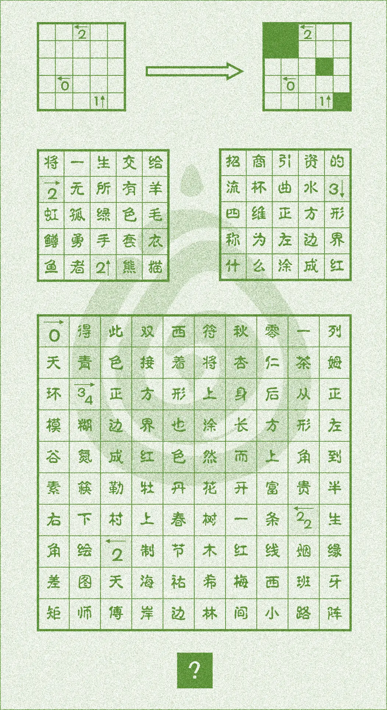
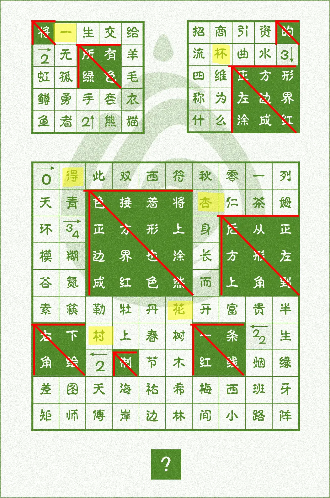

# 寻箭

## 题面

:::info
[P&KU2：寻箭](https://pnku2.pkupuzzle.art/#/game/miyu/prob_11)
:::

_这题啥规则？_

_不知道，反正他们说只有这一个答案。_

## 答案

一杯得杏花村

## 解析

这道题包含若干盘面。第一行示例，包含一个空白的题目、一个箭头和一个完成的题目。这表示在本题的规则下，空白的题目的答案就如右侧表示。因此，第一步的任务是根据这个示例，充分理解规则，并在这个规则下完成下面三个题目。

而联系“只有一个答案”的指示，可以理解规则：**在图中画上若干个绿色方块。每个带箭头的数字 X，表示箭头方向上能看到一个边长为 X 的绿色方块。而所有没有绿色方块的空白格子，可以组成一个完整的回路。**

涂完之后，根据最下方的要求读取绿色的内容，得到一句话：“将所有绿色的正方形左边界涂成红色，接着将正方形上边界也涂成红色，然后从正方形左上角到右下角绘制一条红线。”等这一要求也被完成之后，我们就会发现其实这些红线形成的是若干巨大的箭头，正好和标题的“寻箭”相对应。于是我们找到红色的箭头指向的汉字，得到 **“一杯得杏花村”**。

## 作者

五月（设计）；Winfrid（美工）

## 附言

### 五月

本题是对instructionless grid和らまぬなぞ２黄题的拙劣模仿，在加上一些微不足道甚至破坏题目结构的小设计，匿了匿了。

上面说的两个活动：

- instructionless grid是给例子不给规则文字说明的纸笔谜题游戏：[https://ig.logicpuzzle.app/](https://ig.logicpuzzle.app/)；
- らまぬなぞ２是一个365题的超长解谜游戏（需要会日语），黄题大多是原创规则的纸笔类：[https://twitter.com/3ganichi_nazo/status/1377544142453010433](https://twitter.com/3ganichi_nazo/status/1377544142453010433)。

这两个都值得一玩，有条件的可以去看看。

### 生煎

既然没给纸笔的名字，我就完全相信了例题能说明所有要用到的知识，但没有。不觉得白区能一笔连圈是什么常识，可能性太多了。数列找规律肯定不会只给两项；官方推送都说出盲文要提示黑暗呢。
