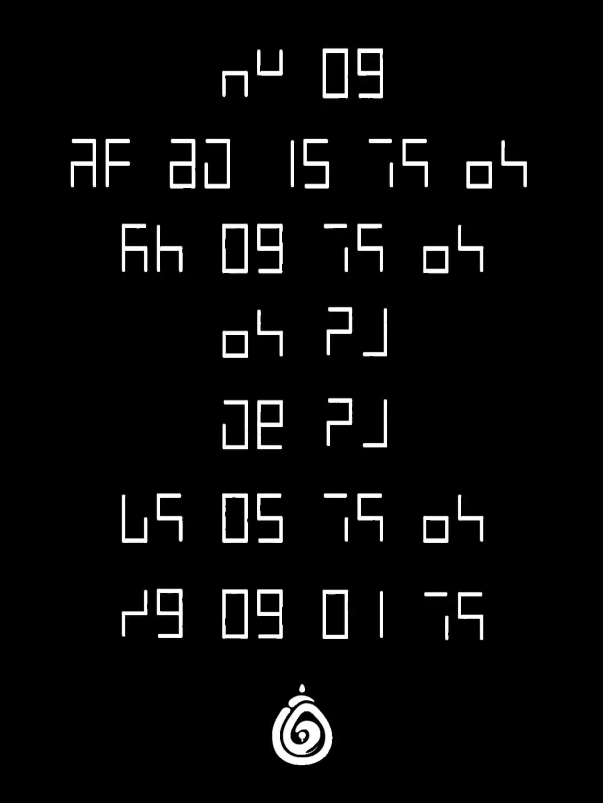

# 仿生盲人会梦见数码羊吗

## 题面

:::info
[P\&KU2：仿生盲人会梦见数码羊吗](https://pnku2.pkupuzzle.art/#/game/miyu/prob_15)
:::

_反正都是黑与白的二元世界……_

## 答案

一种清孤不等闲

## 解析

题目里给出了七行图案，每个图案都由两个“日”状七段数码管的一部分组成。

这题入手角度比较多。首先，从 “盲人” 和 “数码”，很轻松地可以猜出这里的七段数码管应该也和盲文有所关联，但是具体的关联暂且不清楚。

不过，我们可以先大概猜出 01、05、09、15 分别对应着第 1、5、9、15 位字母，也就是 A、E、I、O。接着，我们就可以从这些元音字母的位置判断出**每一行代表一个字的汉语拼音**。

接下来我们就可以从汉语拼音字母的规则入手，判断出最后一行的最后一个图案是 N，接着判断出第三行的最后一个图案是 G。从而第五行的第二个图案是 U。而第二行的第二个字母只能是 H。

进行到这里，我们已经确认了一些字母和它们的图案，就可以去再回到“盲人”和“数码”上，探索这种图案生成的机制。比较后不难发现，**每个字母的盲文里相邻的点连接得到的图案，和这个字母以A1Z26对应的数的数码管图案异或，就可以得到其表示的图案。**

知道了这一机理，我们就可以意识到这七行分别是 YI ZHONG QING GU BU DENG XIAN。搜索得到答案 **“一种清孤不等闲”**。

## 作者

五月（设计）；Winfrid（美工）

## 附言

### 五月

Winfrid 很敏锐地问及我本题的预设突破口，梳理后我说的是：第一步：拼音+显眼的 1a26z 部分，第二步意识到与盲文之间的关联。玩家们也确实大多按照这个流程解题。 我想说的是，在出题时，【预想中玩家解题的路线】是一件非常重要的事情。以这题举例，如果答案中没有可彼此验证的 ng，或者韵母在规则下也变成了奇怪的字符，这题大概率就是不成立的。轻描淡写一句“盲文和数字做 xor”，绝不是出题人该想到的全部。

### Winfrid

按木华的话而言，这道题有点 “试探谜题的共识的边界” 的意味：从谜题里一些心照不宣的规则入手，从而爆破与猜测也成为了一种预设的解题途径。非常有趣，并且看起来好像也有不小的接受度。

### 生煎

喜欢有题目设计新编码，觉得这套新编码本身的性质也挺适合出题，比如没有多对一，比如由于只用到 1-26，于是十位的 0 和 1 多次出现，容易发现蹊跷。不过当前没有啥题面设计，相当于想好 idea 后就放在那里等大家来破译，需要用到的提示就放在标题和ft里，不知道有没有更好的引导方法。
