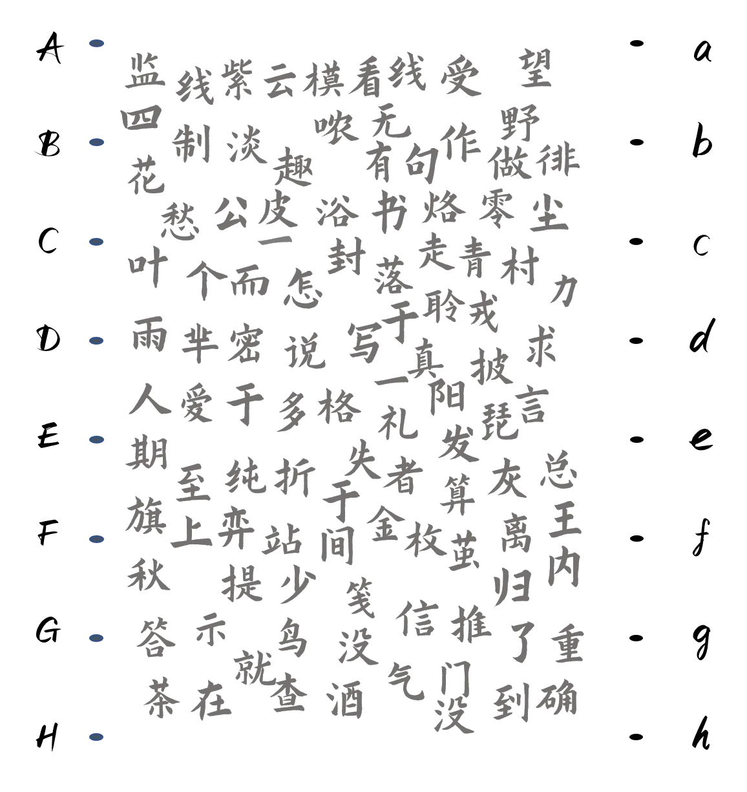
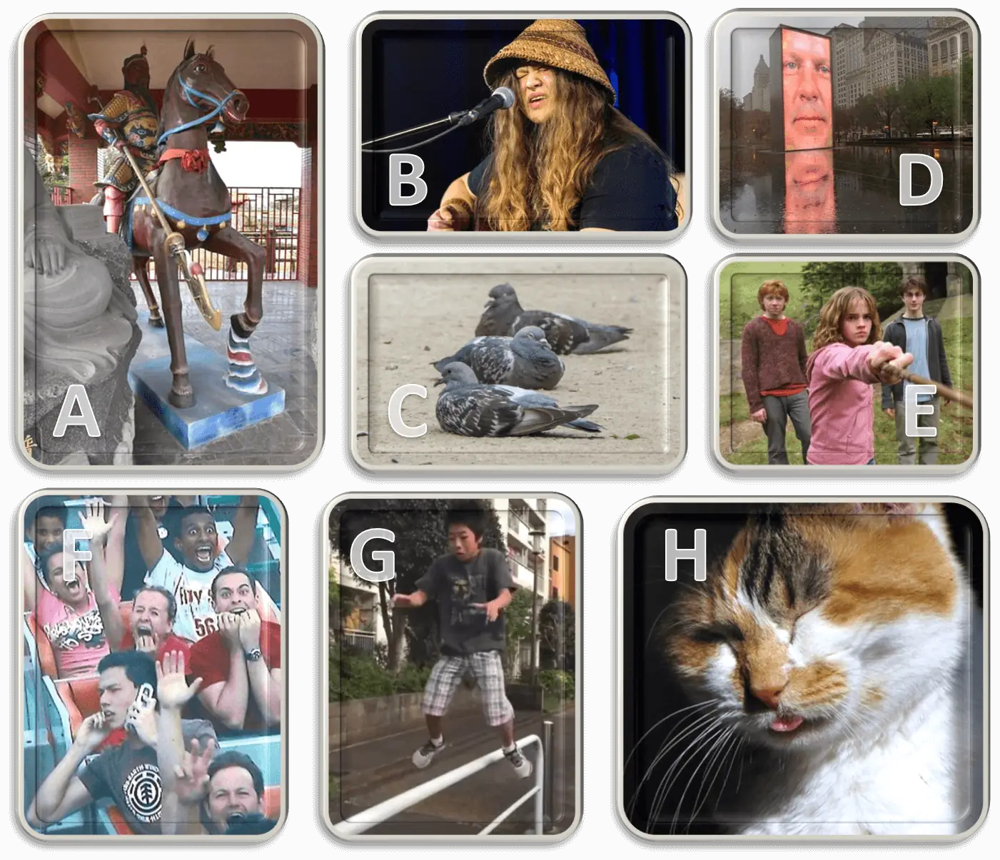

# 写真一言

## 题面

:::info
[P\&KU2：写真一言](https://pnku2.pkupuzzle.art/#/game/miyu/prob_16)
:::

_什么是写真一言？_
_就是为随便什么图写一句冷笑话。_
_希望你的笑点在线。_

a. ZOOM的系统好像出了一点问题。&#x20;

b. 突然被扣了一碗泡面。

c. 对，我居家办公呢！

d. 蛋疼！传送目的地又设置错了啊！

e. 哈。魔术师现在肯定很着急。

f. th——

g. 哪个天杀的扔的口香糖？

h. 家门钥匙巨大。

## 答案

琵琶拨尽四弦悲

## 解析

题目里给出了八张图片和八句话。它们本身都没有什么有趣之处，但一旦图片和句子匹配起来，它们就能构成一个冷笑话。正确的匹配如下：

- A-g（哪个天杀的扔的口香糖？）
- B-b（突然被扣了一碗泡面。）
- C-e（哈。魔术师现在肯定很着急。）
- D-a（ZOOM的系统好像出了一点问题。）
- E-h（家门钥匙巨大。）
- F-c（对，我居家办公呢！）
- G-d（蛋疼！传送目的地又设置错了啊！）
- H-f（th——）

于是，将它们两两连线后，交点处的汉字组成了一句话**“制作一个写真一言发至站内信”**，这也暗合了“笑点在线”的暗示。按照指示照做后，staff 就会给予答案“琵琶拨尽四弦悲”。

## 作者

五月、Winfrid（设计）；Winfrid（美工）

## 附言

### Winfrid

寒假那段时间看 IPPON 看疯了，于是很想用写真一言出道题。 其实这道题的另一个侧影还是非常有意思的：图和文字本身都没有什么乐趣，但是一旦匹配上就能够赋予彼此意义。这和 P\&KU2 最后的某个过程有异曲同工之妙。

### 五月

这题在比赛中带来的影响，让题目提升到了不属于它的高度。你永远不知道成就你的是什么，可能这就是人生吧。

### 生煎

测试时这题直接能提取答案，当时觉得快乐欣赏日式冷笑话，题本身不拖本题后腿即可。正赛后的事情大家就都知道了。
