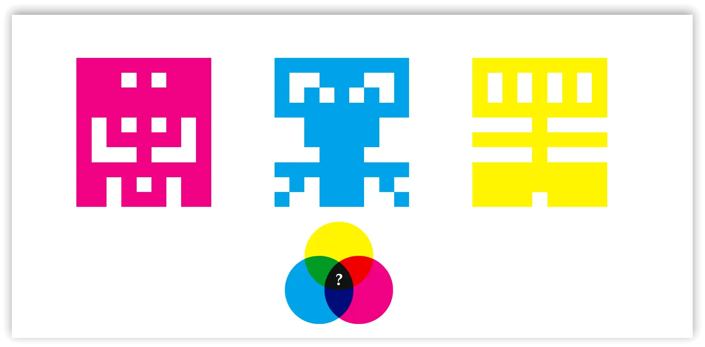
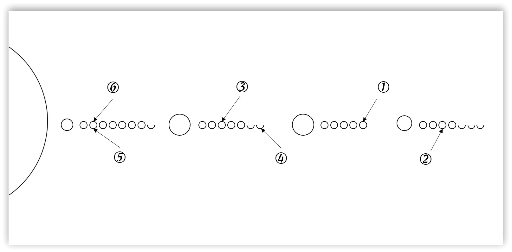
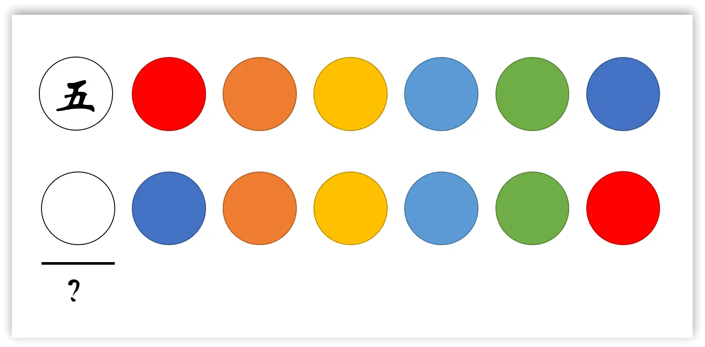
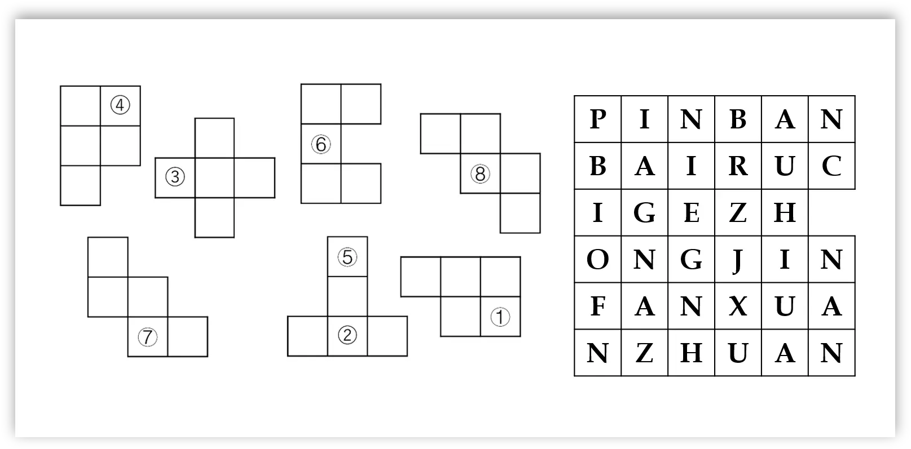
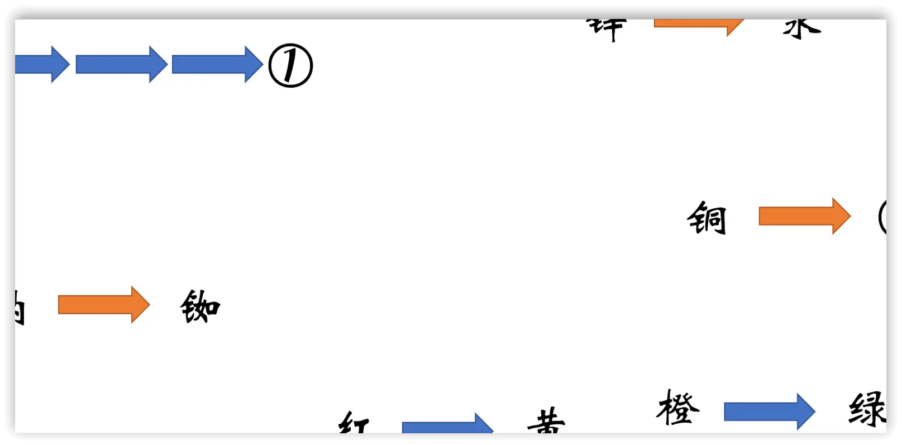
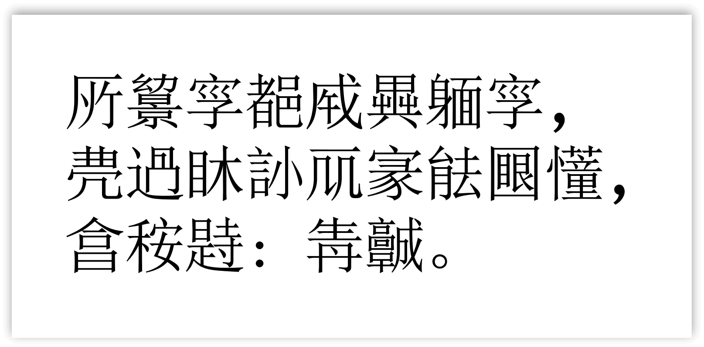
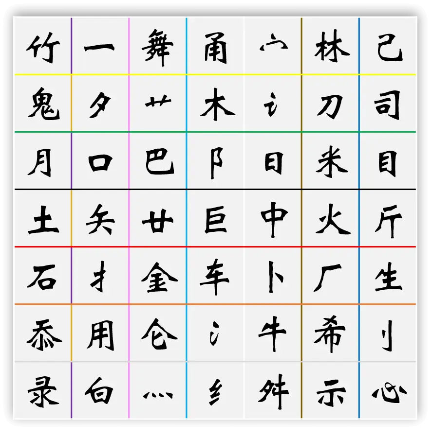

# 明信片

## 题面

:::info
[P&KU2：明信片](https://pnku2.pkupuzzle.art/#/game/miyu/prob_17)
:::

_旅游收集了很多明信片，_
_可惜都折掉了。_

## 答案

槐阴添绿

## 解析

题目给出了六张明信片和一张带有若干含有颜色的横纵线的汉字墙。前面六张明信片，每张明信片都是一个简单的谜题，答案分别是**黑、红河、黄、长白、紫金、青城。**

首先可以发现，这六个答案都可以都是某个“山”或“谷”的名称：黑山、红河谷、黄山、长白山、紫金山、青城山。接着，联系题目文案里的“折掉了”，可以联想到折纸中存在着峰谷线的说法。于是，找到最后的汉字墙上对应颜色的线，按照题目顺序，分别视作峰谷线，折叠后就可以得到“槐阴添绿”。

### 第一个小题

根据三原色，把三个字叠起来看黑色部分，发现正好是“黑”的像素字。

### 第二个小题

太阳系的前四大行星。每个行星后面的圈，上半部分填入英文翻译，下半部分对应拼音字母。提取就得到 HONGHE，也即“红河”。

### 第三个小题

相同颜色的圆圈代表同一个字。这句话是“五岳归来不看山，黄山归来不看岳”。所以是“黄”。

### 第四个小题

按照拼图板上的指示，无旋转地拼在一起后，按序号取对应的字母。得到 CHANGBAI，也即“长白”。

### 第五个小题

蓝色箭头代表红橙黄绿青蓝紫向右移动两格，因此能移动三个两格的应该是红到紫。

橙色箭头代表元素周期表下移两格，因此是金。答案是“紫金”。

### 第六个小题

这是一段异体字构成的话，其内容为：

所有字都成异体字，不过相信大家能看懂，答案是：**青城**。

## 作者

五月、Winfrid（设计）；Winfrid（美工）

## 附言

### 五月

【明信片】与【做题别买盗版书】是姊妹题，作者的话一并完成。

有很多的纸笔谜题，是两种基础规则加在一起形成一个变种题。那么，如果我把这两个规则放在两页纸上，并且把叠在一起看，不也是同样的效果？从上述的出发点入手，既然1、2页是一道题，那2、3页是不是也能是一题？这样2页的规则在两道题里都被使用了。到提取部分，我还是使用了我自己比较擅长的手法——在字阵里取字。既然已经确定主题是“纸太薄”，那最后一页全叠在一起提取没有被挡住的字，就很自然。

在讨论设计思路时，Winfrid提出了另一个想法——

> 一个 2n×n 的单面盘面，不可做，只有找到某个手段折两道痕迹，这样正反两面就都有 n×n，各自可做。

这点子最后没采用，不过“折纸”给了我一些启发。我立刻联想到通过折纸能得到答案的一种思路，即【明信片】的最后一步。

讨论到这个阶段的时候，其实两个中谜都已经很成熟了，于是一不做二不休干脆都出。那配合折纸的小谜应该是什么样的呢？就是现在大家看的这样了，一些小题，答案都是能添加山/谷且带颜色的词。

### 生煎

喜欢做着做着发现要做手工了的题，感觉一下子色彩丰富了。觉得这题的结构谜之像“韭”这个字，底下一个meta，上面峰的有几题，谷的有几题。
