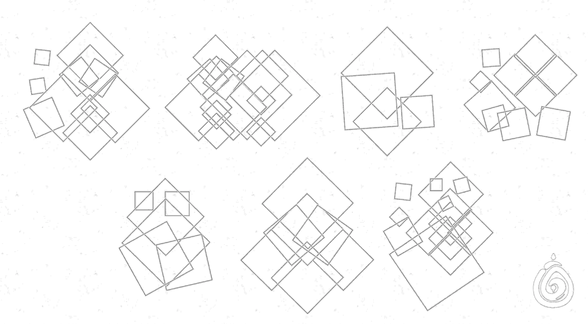
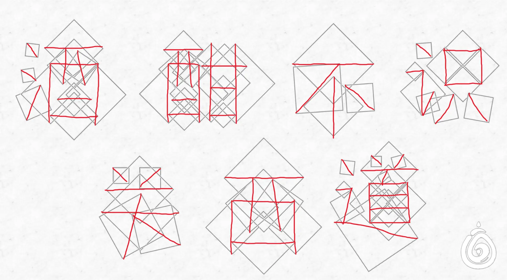

# 雕刻艺术

## 题面

:::info
[P&KU2：雕刻艺术](https://pnku2.pkupuzzle.art/#/game/miyu/prob_20)
:::

_能别在大理石上乱刻乱画吗？_

## 答案

酒酣不识关西道

## 解析

这些实际上都是以构成汉字的各个线段为对角线而绘制出来的正方形。如下图所示，而其中第一个字的三点水是最重要的突破口。因此答案为**“酒酣不识关西道”**。

## 作者

Winfrid（设计与美工）

## 附言

### Winfrid

创作这题的时候已经是2月下旬。当时我总感觉 P&KU2 还缺了点什么。于是逛了各大公众号才意识到，这种精炼的、纯粹依靠辨识能力的题目确实还不存在。于是就有了这道题。

汉字的象形也是分很多流派的。比如《字帖》里四条规则就是把汉字视作一个 png 图形，而《明信片》的第一个 subpuzzle 是把汉字视作像素图案，这里实际上是把汉字抽象为若干连线组成的矢量图。

### 生煎

长得漂亮的小点心，比起倒水绳串更中式美学、学院气息一点，但思路没有倒水绳串精妙浓缩：如果题目成分为纯idea，做题只靠尤里卡时刻，感觉最吸引人的是描述idea的时候能用最少的字表达最多的信息、用最日常的操作体现最复杂的设计（一类“清华博士也做不出”的网络流行题似乎就主打这个爽感），而这题idea的描述还是需要像好学生一样理解一下的，稍微削弱了效果。
