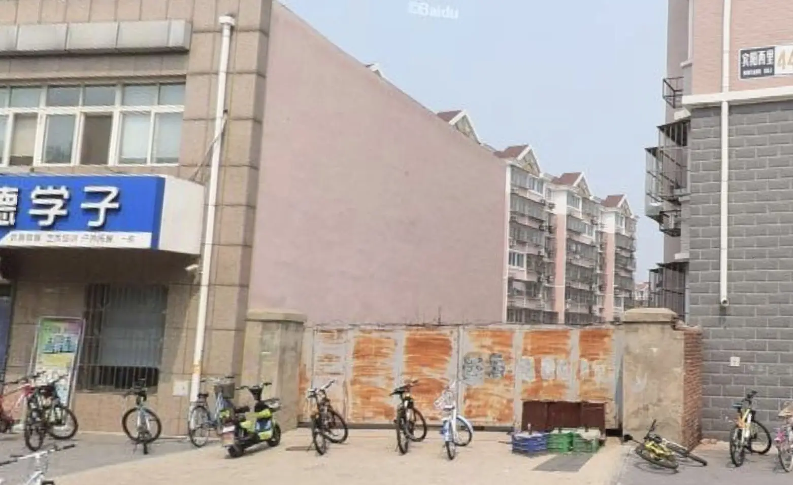
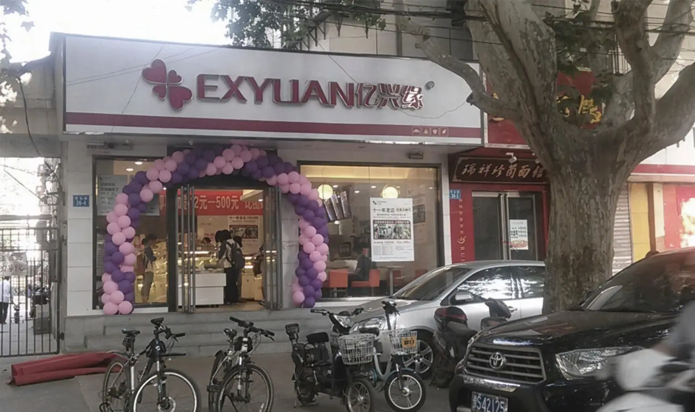
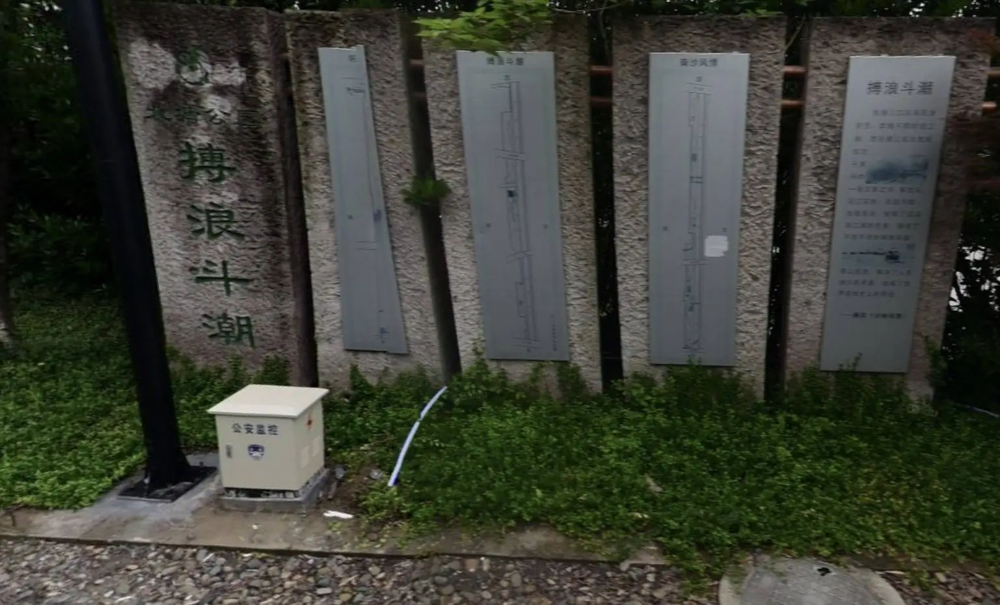
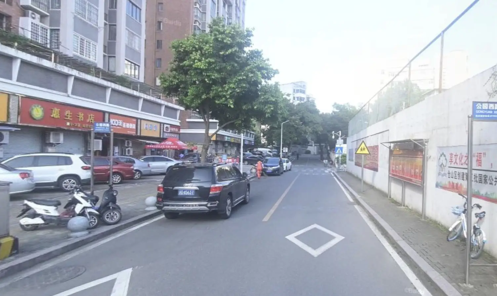
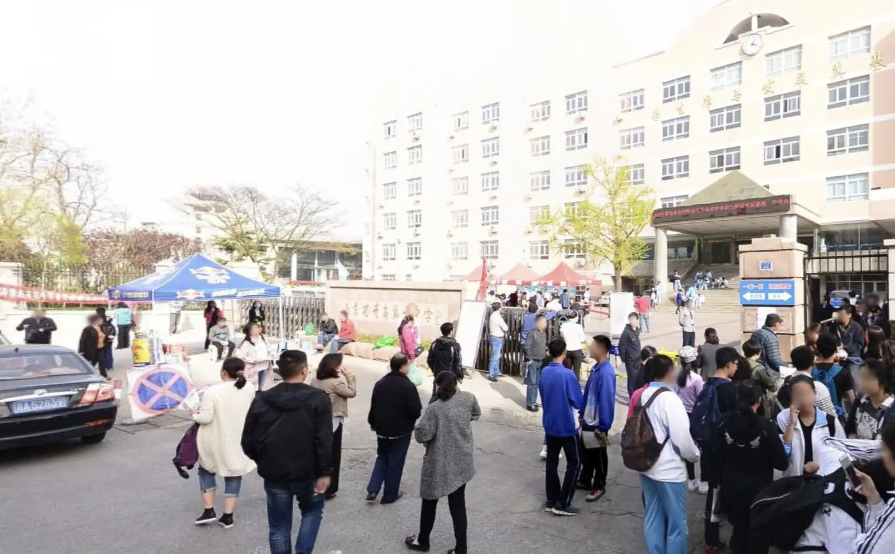
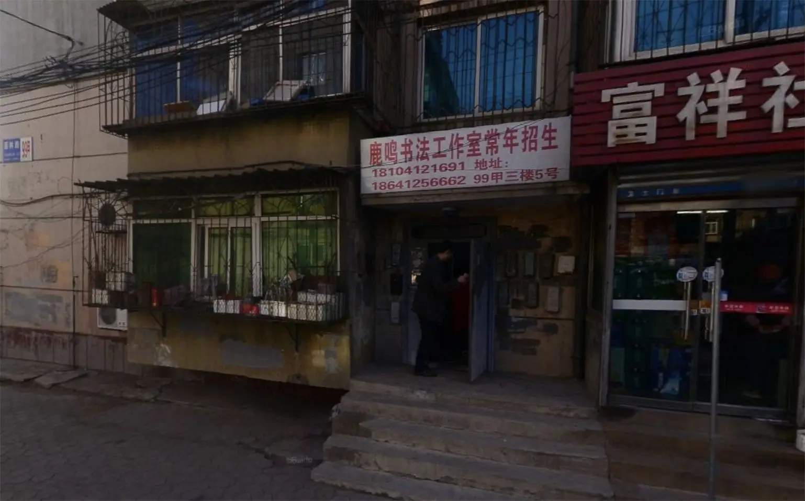

# 走在城间的小路上

## 题面

:::info
[P\&KU2：走在城间的小路上](https://pnku2.pkupuzzle.art/#/game/miyu/prob_22)
:::

_太阳当空照，花儿对我笑……_

## 答案

一笑相欢

## 解析

题目给出了六张实景图片，那么第一步就是要进行赛博寻踪，找到照片的地点。找到地点后，会发现照片位置附近都有一所中学，而这和题目文案里的“太阳当空照，花儿对我笑”（《上学歌》）相呼应：

- 第一张图，看出照片右侧的“宾阳西里”就可以确认是北京市密云区第三中学附近。
- 第二张图，直接搜店名，得到郑州八中附近。
- 第三张图，直接搜“搏浪斗潮”，就可以知道是杭州萧山第五高中附近。
- 第四张图，先看到照片右侧有“仓山区”，再搜书店名称，可知是福州十六中附近。
- 第五张图，图上就有答案“山东省青岛第一中学”。
- 第六张图，先从手机判断地区，然后搜索右侧的社区名，即可得到鞍山九中。

这六张图的高中都带有数字，转字母得到 chepai，也即“车牌”。

这个时候我们会发现，这六张照片的车牌处没有打码，且车牌的位点和所处的地理位置格格不入，从而可以知道车牌有重要信息。用每个车牌里面的数字提取城市对应拼音，得到十五个字母 yixia oxian ghuan，也就是答案**一笑相欢**。

## 作者

榆木华、五月（设计）；榆木华（美工）

## 附言

### 五月

开车上班的时候看着前车的车牌，突然想到了车牌第二步的点子。大家要多多观察生活呀。

### 榆木华

一开始是五月抛了个纯车牌的点子上来，后面就一直是我在搞了。当时确实也是在说“还没有一道街景题啊”，所以因为我觉得车牌和街景可能相性蛮好，就想了想街景部分的点子然后开始找图了。但是这期间调整了很久衔接的形式，一直达不到好效果。学校导致里程碑写不了多少东西，无法提示太多。

车牌一开始就会呈现出来，所以得用一些奇怪的方法尽可能让玩家别太跳步（包括使车牌在糊和不糊的边缘，图片与车牌不一一对应等方法），然后等玩家做出“chepai”之后才有下一步的信心。

然而避免跳步的选择带来的又是街景信息冗余带来的思路杂乱，只能说两者衔接的方案太差了……但是找了一整晚上的东西又不想重新找，只能等提示来补全这题的生命了，有点难受的。（这题的跳步与卡卡颂的不同，卡卡颂的是分开了两批人群，是有目的的。这题如果都跳步了的话还不如不出了。）
