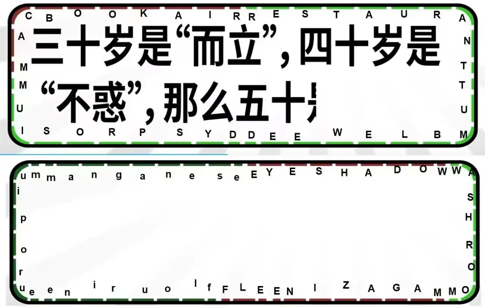

# 下饭秀

## 题面

:::info
[P\&KU2：下饭秀](https://pnku2.pkupuzzle.art/#/game/miyue/winter_05)
:::

_有请，下一位挑战者！_

**5-1、6-6、7-3、7-2、5-2、6-4、6-3、7-8、7-7、7-1、5-6**

## 答案

FINAL OR SEMI

## 解析

这是一道视频题，在视频里，出演者饰演了智力问答的答题者，旁白饰演了主持人，呈现了一出喜剧。在过程中，两人先进行了一段四道题的练习题环节，然后进入了八道题的正赛环节。但是，正赛的最后三道题的题面是同时给出的，因此玩家无法听出其题面，需要找到别的方式得到其答案。

值得一提的是，答题者每回答一道题的时候，答题框的周围的一部分就会变色。经过确认，我们就可以意识到如下内容：

- 边框上每个标准长度的短线都代表了一个字母。
- 每两道题的答案在边框上的形态首尾相接，并且首尾均是半个标准长度的短线。
- 与上一条对应的是，相邻两道题的答案本身的字母就是首尾相接的。

所以，我们可以从这些信息推断出，六七八三题的答案，分别是 f???????、????????、????????e，并且它们都是化学元素，且首尾相接。从而，我们可以知道这三题的答案分别是 flourine、europium、manganese。

最后，题面上给出了若干 “?-?” 的记号，每个记号表示要从第几个答案提取第几个字母。如此操作之后，得到答案 **FINAL OR SEMI**。

## 作者

五月（设计）；刘帅（出演）；榆木华（视频制作）

## 附言

### 五月

本题改编自謎解き日本一決定戦决赛（B站能找到视频）的一题。我们几乎复刻了全部的题目结构和笑点。原本的短剧表演者是阵内智则，这个喜剧演员也是有点东西的，B站也有账号，可以去乐呵乐呵。

最后，统一回答一下：为什么50是MacBook Air？答：妈妈生的。

### 榆木华

做视频有趣。过。
